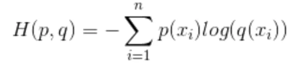
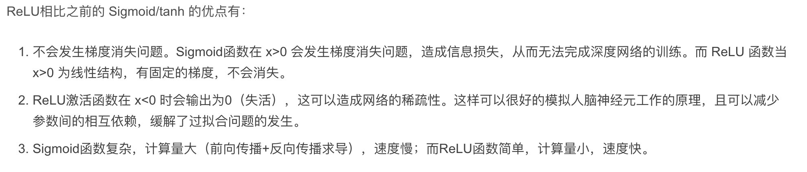
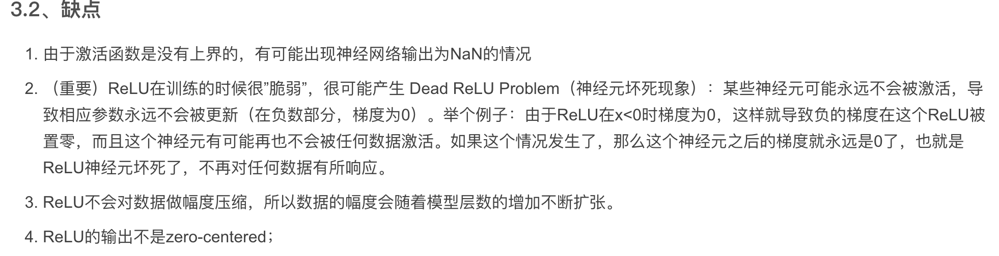

# 熵和损失函数和激活函数

[[TOC]]

## 0.资料网址：

- 

## 1. MSE与交叉熵

https://blog.csdn.net/rtygbwwwerr/article/details/50778098

- 参考网站https://www.cnblogs.com/lemonzhang/p/13229884.html
- https://zhuanlan.zhihu.com/p/61944055
- 最大似然估计和最小二乘法怎么理解？ - bsdelf的回答 - 知乎 https://www.zhihu.com/question/20447622/answer/25186207
- https://zhuanlan.zhihu.com/p/84431551
- 逻辑回归的一些东西https://blog.csdn.net/qxqsunshine/article/details/87911443
- https://blog.csdn.net/u014313009/article/details/51043064

- 交叉熵
  - 
  - 二分类交叉熵损失:
    - $$Loss = -\frac{1}{N}\sum_{i=1}^N [y_i*log(pred_i)+(1-y_i)*log(1-pred_i)]$$​
  - 多分类交叉熵损失$Loss =\frac{1}{N}\sum_{i=1}^N - log(p_i(c)) $​​
    - 即第i个样本属于其正确类别C的概率
- MSE
- 两个的区别：
  - MSE是数据符合高斯分布的时候的对数似然推导得来
  - 而交叉熵损失其实是数据符合二项分布的时候的对数似然推导得来
  - 在分类的问题时，我们更关心的是是否分类正确，而不是实际的概率的差
  - https://zhuanlan.zhihu.com/p/99923080 交叉熵在误差较大的时候，导数也较大，有较大的学习速率

## 2. KL散度

https://zhuanlan.zhihu.com/p/56638625

## 3. sigmoid和交叉熵

- 是凸函数
  - 凸函数：二阶可微的时候，海森矩阵是半正定的。（一元函数则是二阶导数大于等于0）
- sigmoid是fx，则导数是f(x)(1-f(x))

## 4. 求导

https://zhuanlan.zhihu.com/p/372651054

## 5.激活函数

- 饱和激活函数容易导致梯度消失
  - 因为在饱和区，其导数非常的小，接近0
  - 比如sigmoid是fx，则导数是f(x)(1-f(x)),饱和区f(x) = 0/1，因此导数为0

### relu

https://proceedings.mlr.press/v15/glorot11a/glorot11a.pdf

### leaky relu

- 解决某些神经元永远不会被激活的现象

https://blog.csdn.net/hy592070616/article/details/120617996

https://blog.csdn.net/Joejwu/article/details/118029884

## 6. 不平衡问题

- focal loss https://blog.csdn.net/m0_70813473/article/details/131432473
  - pt很小，样本难分。pt很大，样本容易分，降低权重。
