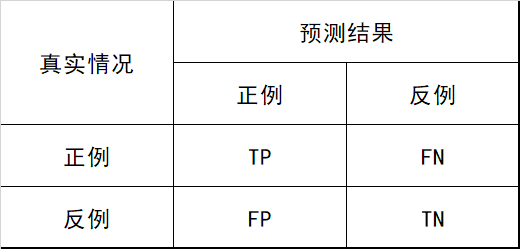
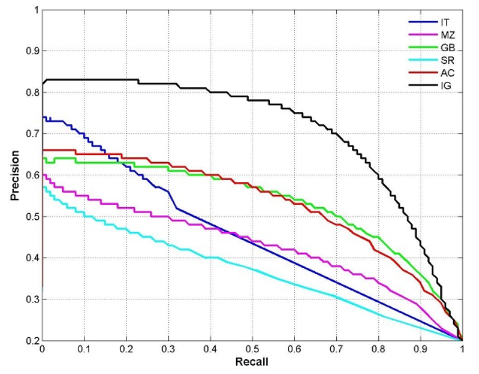
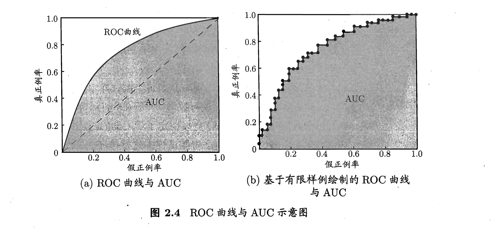
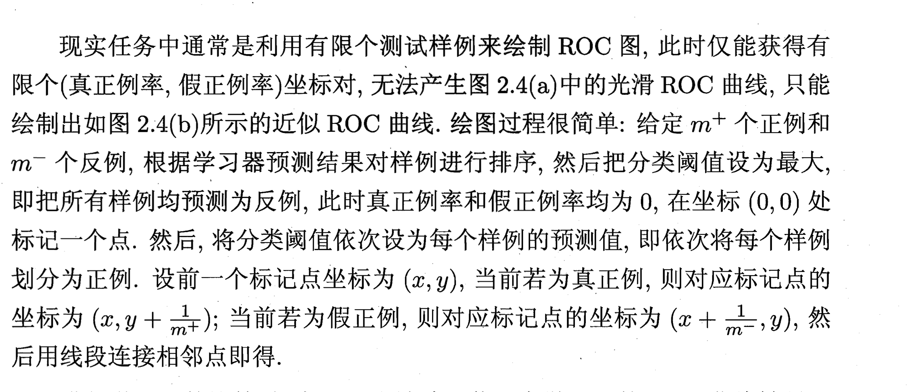
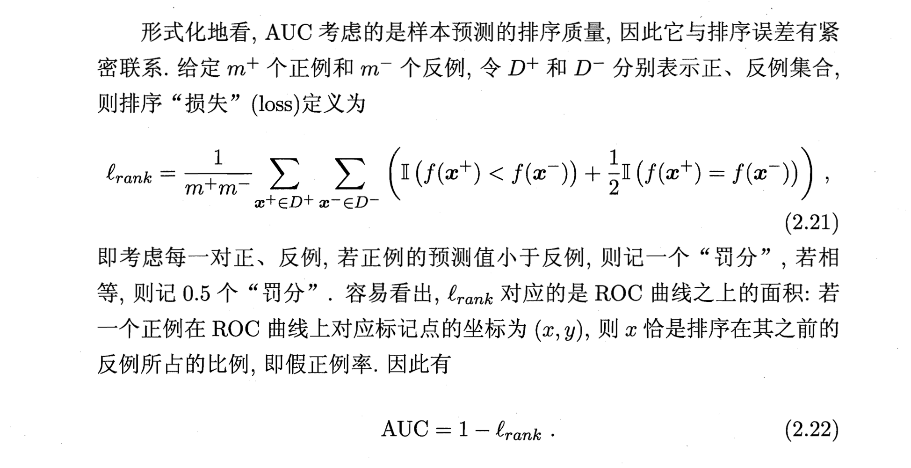

# 评价指标

[[TOC]]

## 0.参考资料：

- [飞桨文档](https://paddlepedia.readthedocs.io/en/latest/index.html)
- [Deep Learning Book](https://www.deeplearningbook.org/)
- [参考视频--可视化数学非常好的教学](https://www.youtube.com/c/3blue1brown)
- 《机器学习》-周志华
- 《百面机器学习》-诸葛越

## 1. accuracy/precision/recall/f1(分类模型评价指标)

### 1.1 accuracy

- 精度的计算公式为：$ACC=\frac{correct}{total}$​​
- 当样本不平衡时，占比大的样本会在计算精度时影响较大。(如负样本占比99%则无脑把所有样本分为负类)

### 1.2 TP/FP/TN/FN

对于二分类问题，我们可以有真正例、假正例、真反例、假反例

### 1.3 precision

- 可以理解为查准率
- 即模型预测的正例中有多少确实为正的
- $precision = \frac{TP}{TP+FP}$

### 1.4 recall

- 可以理解为查全率
- 即对于样本中所有的正类，模型正确的预测到了多少
- $recall = \frac{TP}{TP+FN}$

### 1.5 f1

- F1是precision和recall的调和平均
  - 调和平均相对于算术平均$\frac{a+b}{2}$和几何平均$\sqrt{a*b}$更重视较小值
- $F1=\frac{2*precision*recall}{precision+recall}$​
- 也可以对precision和recall加上权重，来调整指标的重要性

#### 多分类的F1

- **Macro**
  - 对于多分类，两两构成正负类，生成混淆矩阵
  - 计算所有混淆矩阵每一个的P和R
  - Macro-P是每个混淆矩阵P的平均
  - Macro-R是每个混淆矩阵R的平均
  - 而后Macro-F1是Macro-P和Macro-R计算的
- **Micro**
  - 对于多分类，两两构成正负类，生成混淆矩阵
  - 计算所有混淆矩阵每一个的TP/FP/TN/FN，而后平均
  - Micro-P是平均的TP和TP+FP计算
  - Micro-R是平均的TP和TP+FN计算
  - 而后Micro-F1是Micro-P和Micro-R计算的

## 2. P-R/ROC/AUC(二分类曲线)

### 2.1 P-R曲线(比较排序模型，竖P横R)

- **纵轴为P，横轴为R**
- **绘制方式：**对二分类的**排序模型**，输出是一堆样本的排序。
  - 则将每个得分高的样本，逐一把它和它之前的看成是正类，这样就有了阈值，在每个阈值下计算得出当前阈值下的P和R，绘制而成
- 解读：当召回率接近0的时候，即只选取得分最高的作为正样本的时候，如果模型的precision也不为1的话，说明模型在样本得分较高的情况下还存在着分类错误的情况
  - 如果模型A的曲线能完全包住B，则模型A的性能优于B
- **BEP(break-event-point)：**precision=recall的点，希望用于比较不同模型
- 代码：https://github.com/scikit-learn/scikit-learn/blob/80598905e/sklearn/metrics/_ranking.py#L786
- **更关注正样本，正负样本比例悬殊时表现不好**

### 2.2 ROC(Recevier  Operating Characteristic)曲线(比较实值模型，竖TPR横FPR)

- 对于非排序的模型，而是对**每个样本产生实值或者概率的模型**，需要ROC曲线
  - 模型在不同的阈值，比如0.4或者0.5下，性能指标是不一样的
- ROC曲线**表征了模型在不同的阈值下的泛化能力**

#### TPR/FPR

- $TPR=\frac{TP}{TP+FN}=recall$​
- $FPR=\frac{FP}{TN+FP}$​，误把负的预测为正的，占所有负的比率
- ROC曲线的纵轴是TPR，横轴是FPR

#### 绘制方法与代码

- 即把所有样本大到小排序，而阈值从1开始，往每个样本上面降
- 一开始(x,y)=(0,0)
- 阈值到了某个样本，这个样本预测为正
  - 如果这个样本也为正，则(x,y) = (x,y+$\frac{1}{m^+}$​)
  - 否则，(x,y) = (x+$\frac{1}{m^-},y$​)
- 其中$m^+$和$m^-$是可以直接由样本标签计算的​

- 使用numpy从0写代码：https://towardsdatascience.com/roc-curve-and-auc-from-scratch-in-numpy-visualized-2612bb9459ab

### 2.3 AUC(area under ROC curve)

- 如果模型A的ROC曲线包住B，则模型A好
- 如果发生了交叉，则需要比较AUC
- **AUC=ROC曲线下的面积**，估算为:$AUC=\sum_{i=1}^{N-1}\{(x_{i+1}-x_{i})*\frac{(y_{i+1}+y_{i})}{2}\}$​
- 物理意义：随机给出一个正样本和一个负样本,正样本预测概率大于负样本预测概率的程度

#### AUC的解释

### 2.4 对比ROC和P-R

- P-R曲线会受数据集正负样本分布的影响
- 当数据集的正负样本比例剧烈变化时，P-R曲线也会剧烈变化，而ROC则不会
- ROC可以更聚焦于模型本身，降低测试集带来的干扰

- 想测试相同类别分布下，分类器的性能可以用P-R
- 不同类别分布下比较分类器，用ROC
- 因为数据分布改变会导致PR曲线的剧烈抖动

## 3. RMSE/MAPE(回归模型评价指标)

### 3.1 RMSE(均方根误差)

$RMSE=\sqrt\frac{\sum_{i=1}^N{(y_i-\hat{y_i})}^2}{N}$

### 3.2 MAPE(平均绝对百分比误差)

$MAPE=(\sum_{i=1}^N\frac{|y_i-\hat{y_i}|}{y_i})*\frac{100}{N}$​

### 比较

- 如果存在离群点的话，RMSE会变得很差
- 而MAPE会把每个点的误差进行归一化，减少离群点对最终误差的影响

## 4. 模型的评估方法

### 4.1留出法

### 4.2交叉验证

### 4.3自助法(bootstrapping)

- $\lim_{n\rarr\infty }{(1-\frac{1}{n})^n}=\frac{1}{e}$
- $\lim_{n\rarr\infty }{(1+\frac{1}{n})^n}=e$​​​

- 对数据集总数为n的样本，有放回采样，连续采n次，最终会有n*0.368的样本不会出现在采样的数据集中。
- 适合样本量少的学习和评估

## 5.过拟合与欠拟合

### 5.1原因

- 过拟合
  - 模型能力太强
  - 训练集测试集的分布不一致
  - 噪声
- 欠拟合
  - 模型能力太弱
  - 数据量不足

### 5.2解决方案

- 过拟合
  - 集成学习，降低单一模型过拟合的风险
  - 正则化，降低模型复杂度
  - 降低噪声
  - 获得更高质量的数据
- 欠拟合
  - 增多数据量
  - 使用更强大的模型

## 6.A|B测试

#### TBD

## 7.假设检验

#### TBD

## 8.偏差方差

- 偏差：期望误差与真实结果的偏离程度，刻画了算法本身的拟合能力
- 方差：同样大小的不同数据集变动会造成性能的改变，刻画了数据扰动所造成的影响
- 噪声：当前任务上任何算法期望泛化误差的下界
