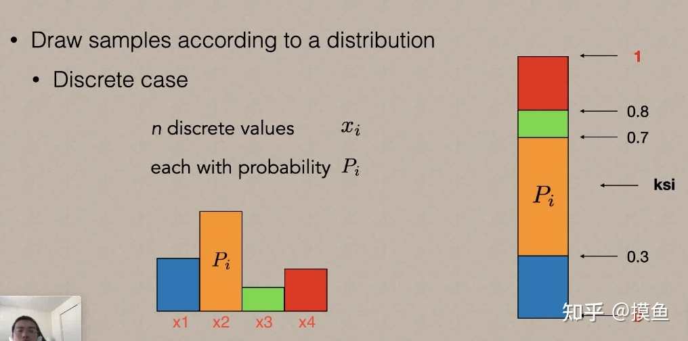
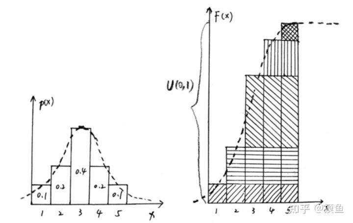
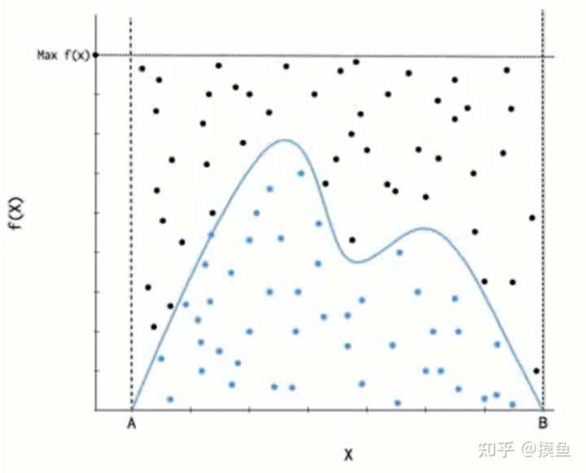

# 采样直观思想

[[TOC]]

## 0.资料网址：

- [讲的非常的好](https://zhuanlan.zhihu.com/p/396618080)

## 0. 对离散变量的采样

- 先从0~1均匀分布采样，而后看这个数落在哪个区间内
- 每个x在0~1所在的对应区间是由累积概率密度函数决定的
- 落在哪个区间内就输出哪个数
- 重复N次

## 1. 逆变换采样

- 逆变换采样也正是利用了这样的思想
- 先从0~1均匀分布进行采样一个u，我要看这个u落在0~1的哪个区间
- 这个u对应的区间对应的数是什么呢？
  - 从累积概率密度函数f 可以知道 给定x，我知道x应该在0~1的哪个区间y
  - 那我已知u即已知了y，那我找到x即可，因此$x = f^{-1}(y)$
- 所以逆变换采样即：
  - 求得累积概率密度函数的逆$f^{-1}$
  - 执行以下N次：
  - 从0-1均匀分布采样u
  - 真正输出的数是$x=f^{-1}(u)$

## 2. 拒绝采样

思想就是：

- 如果一个奇怪的空间，我采样不了，但是我能判断落点是否在这个空间中。
- 那我就可以均匀的生成空间中的点，同时拒绝不在目标空间中的点

因此，拒绝采样的思想就是，有一个能包裹p(x)的分布cq(x)

- 先从 [A,B]均匀分布中采样一个x
- 而后从 [0,cq(x)]中采样一个u。如果u是小于p(x)的，那么就在可接受范围之内，我们接受这个采样
- 因此，输出一次这个x

## 3. 重要性采样

- 重要性采样可以用来计算均值或者积分
- 

## 4. MCMC采样

- 构建马尔科夫链，使得其平稳分布是需要采样的分布
- 那么可以从初始状态出发，进行随机游走，采样到一批样本，服从需要采样的分布

