# 线性模型

[[TOC]]

## 0.参考资料：

- 
- ROC可以更聚焦于模型本身，降低测试集带来的干扰
- 生成式模型和判别式模型的区别https://www.zhihu.com/question/20446337/answer/1661760071

---

## 00 补充数学知识：

### 1. 什么是方差的无偏估计

参考：

- [为什么样本方差（sample variance）的分母是 n-1](https://www.zhihu.com/question/20099757/answer/26586088)
- 

#### 随机变量期望已知时，计算方差

TBD 需要补充中心极限定理

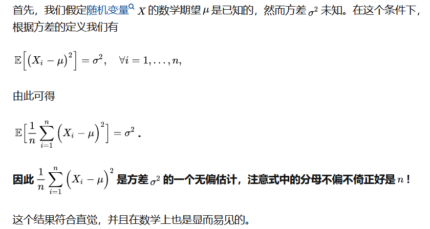

#### 随机变量期望未知时，方差的有偏估计

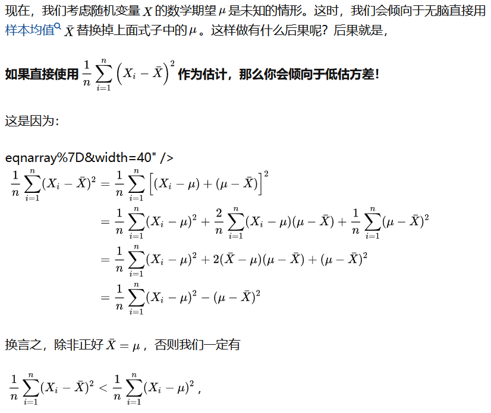

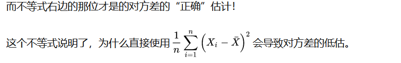

#### 方差无偏估计

[参考为什么样本方差（sample variance）的分母是 n-1？ - 马同学的回答 - 知乎]( https://www.zhihu.com/question/20099757/answer/312670291)

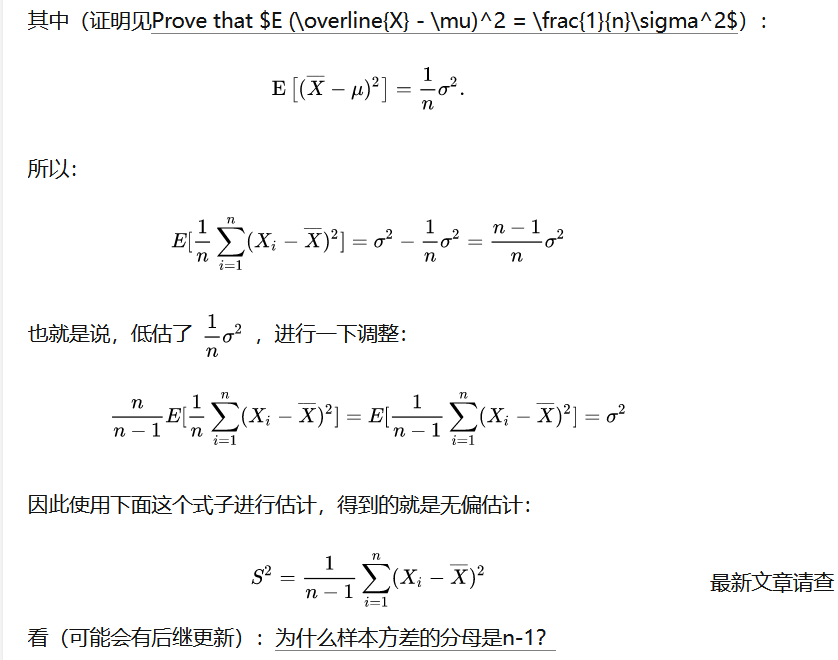

### 2. 先验后验

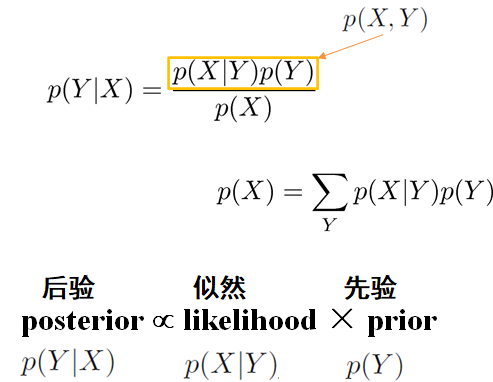

### 3. 概率分布

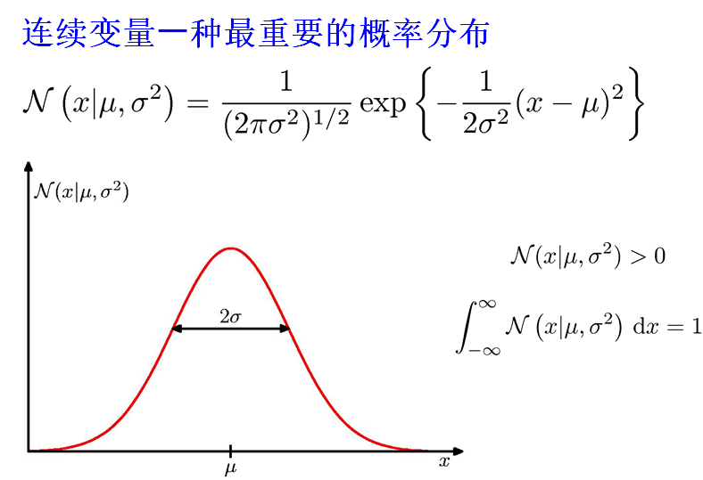

### 4. 为什么要最大化似然函数

- 极大似然估计就是构造一个似然函数，这个似然函数就是样本（所观测到的事件）发生的概率，我们需要做的就是使这个样本发生的概率最大，也就是对未知参数求导，使似然函数取极值。因为只有这样时，样本发生的概率最大。
- 线性回归的似然函数是高斯函数。均值为线性模型的输出，方差为高斯白噪声的方差。
- 逻辑回归的

---

## 1. 线性回归

### 1.1 视角1：直接选择均方误差为损失函数，最小化损失(最小二乘法)

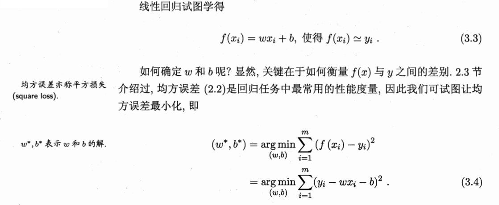

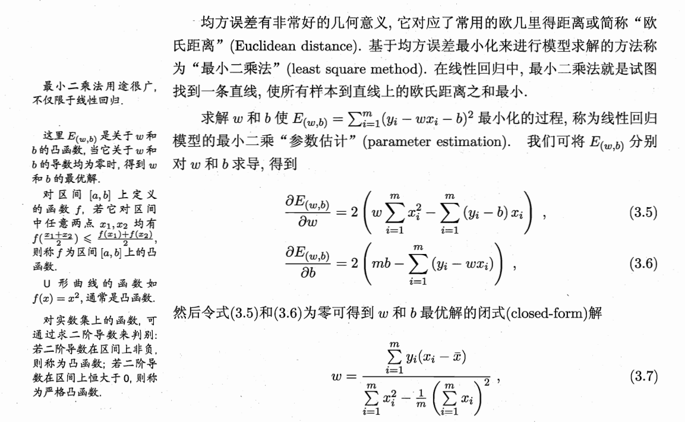

### 1.2 视角2：假定模型输出含有高斯白噪声，高斯函数分布为似然函数，极大似然估计

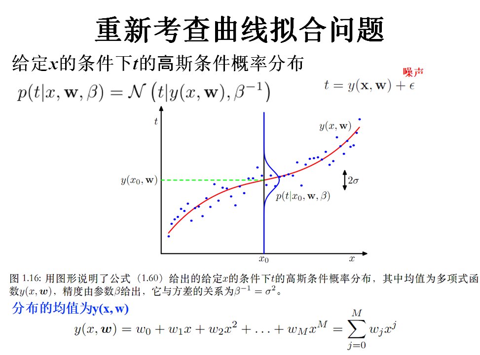

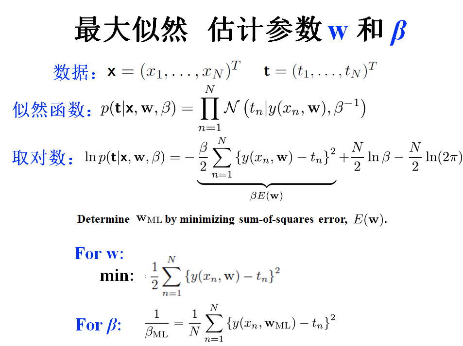

### 1.3 正则化其实是对模型参数的最大后验

- L1正则化：参数先验是拉普拉斯分布
- L2正则化：参数先验是高斯分布

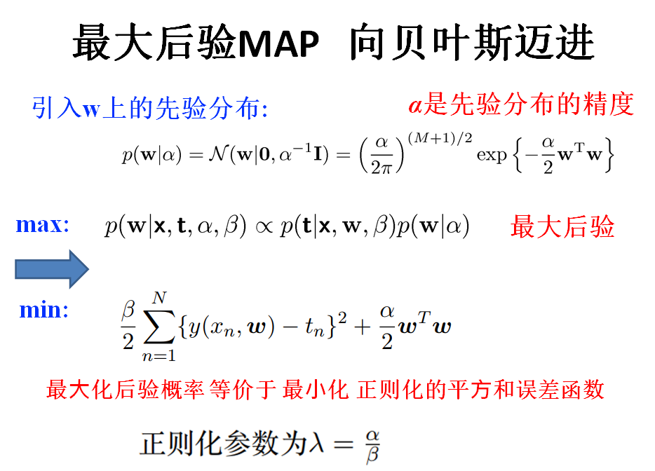

## 2. 逻辑回归--对数几率函数为输出，极大似然法

**核心在于，如何从对数几率函数推导出似然函数，再推导出损失函数与导数**

- 逻辑回归其实是想用线性模型去完成一个分类任务
- 是对数几率函数的线性模型
- 因此，选择对数几率函数（sigmoid是形似S的函数，对数几率函数是代表）作为模型的输出，就可以起到二分类的作用
- 详细的推导见《机器学习》--周志华

### 2.1 模型的输出
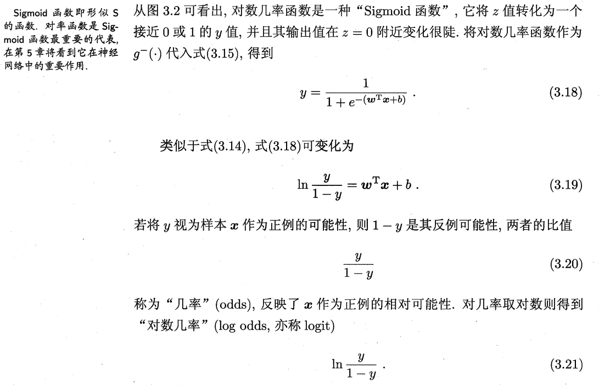

**把式子中的y视为类别概率的话，我们就可以得出模型的似然函数**

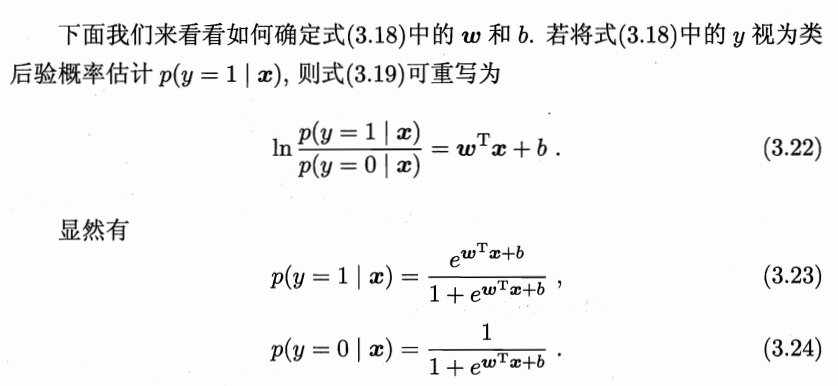

### 2.2 模型的损失函数及梯度

**使用极大似然法，最大化模型的对数似然**

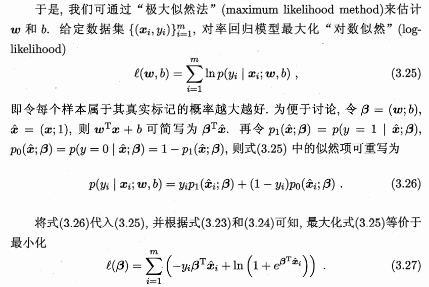

而后求出导数就行了

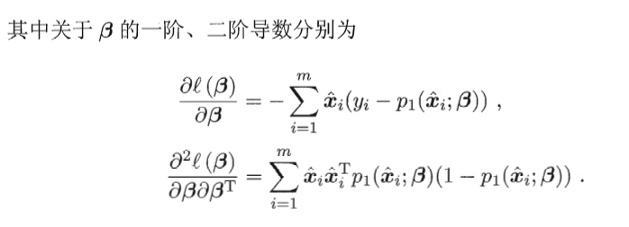

## 3. 逻辑回归、线性回归与极大似然法

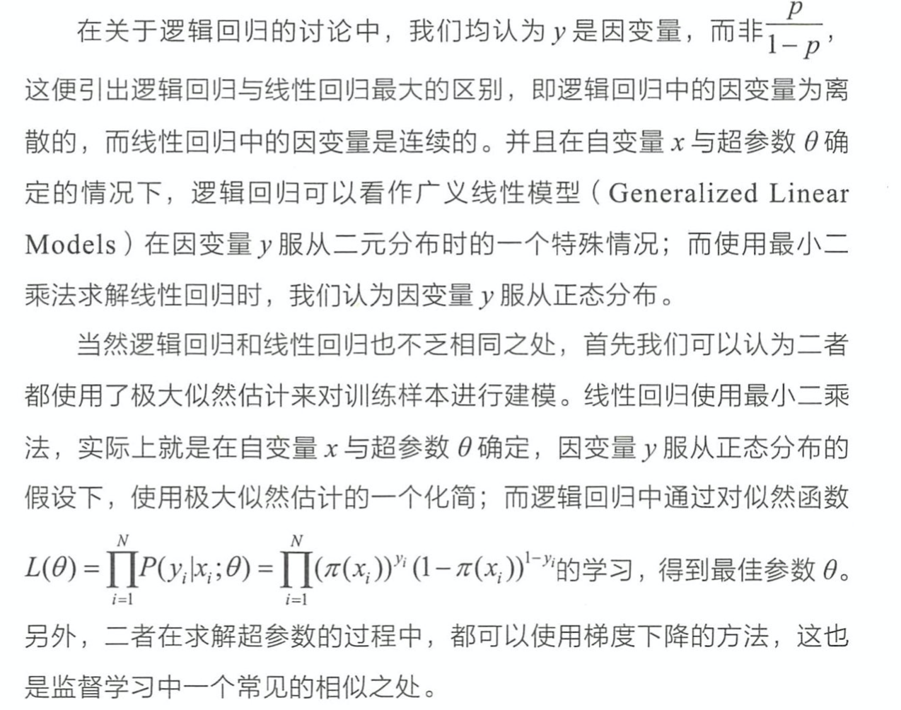
