# 支持向量机

[[TOC]]

## 0.参考资料：

- [回答对偶](http://www.4k8k.xyz/article/qq_34069667/106793766#6SVM_44)
- [有详细的数学解释](https://zhuanlan.zhihu.com/p/76946313)
- 李航《统计学习方法》

## 1. 基础

### 1.1 点到平面的距离公式

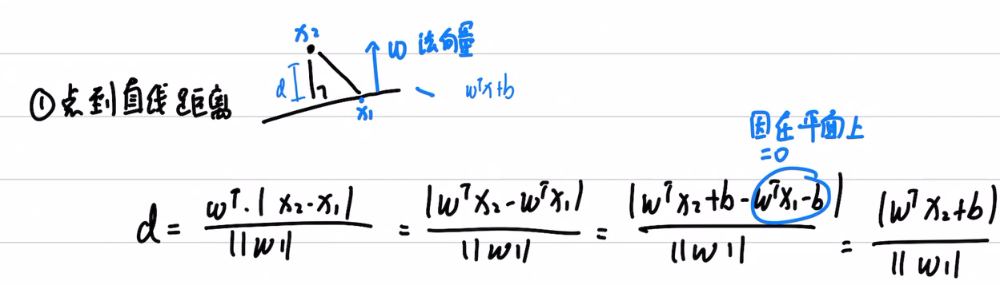

### 1.2 SVM的基本问题推导

原始形式

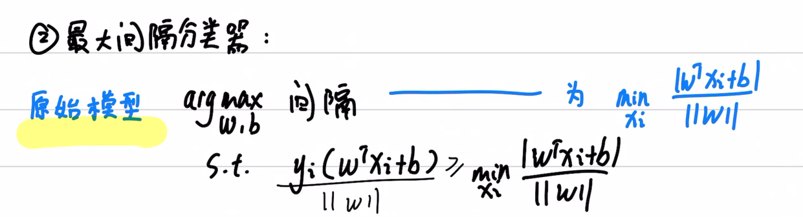

缩放后

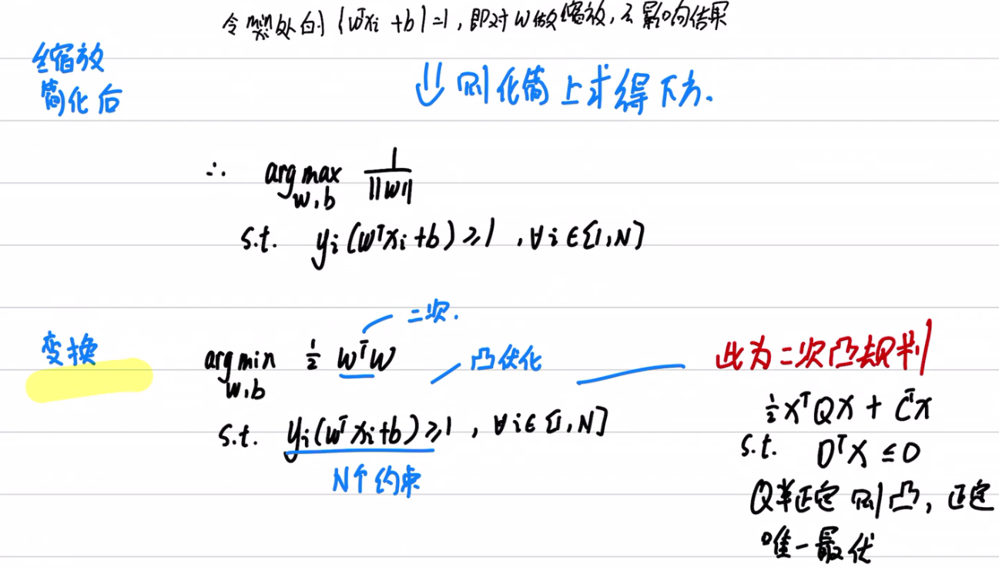

### 1.3 SVM是凸二次规划问题

- 凸函数：
  - 如果函数二阶可微，若海森矩阵半正定，则函数凸
- 凸规划：
  - 可行集凸，目标函数凸；局部最优就是全局最优
  - 如果目标函数严格凸（海森矩阵正定），则唯一最优解

### 1.4  KKT条件之于SVM

- KKT条件
  - 条件本身：线性、互补、非负
- 因为SVM是凸二次规划，KT条件其实可以直接帮助解析的算出最优解
- 如果要转化为对偶问题：
  - 拉格朗日的极小极大问题，可以转化成极大极小问题
  - 如果两个问题都有最优解，则最优解的值一样
  - 一个点是问题的解的充要条件是这个点是KT点

## 2.延伸

### 2.1 对偶问题

**为什么能转化为对偶问题：是因为凸优化下有强对偶性。**

- 如果对偶问题更容易求解，转化为对偶问题容易求解
- 转化为对偶问题后，方便引入核函数

对偶问题：

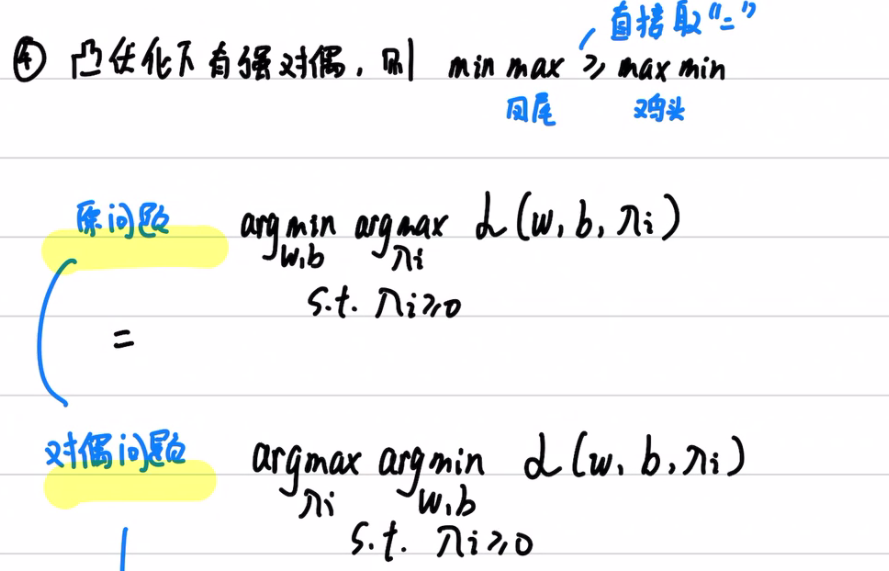

转化后其实更容易看出支持向量的意义：

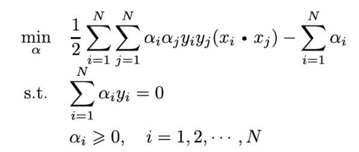

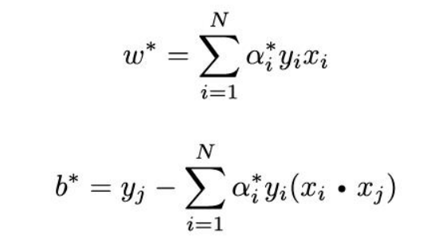

- 分离超平面和输入以及样本的点积有关：
  - 因此要引入非线性的分离超平面，即可在点积处引入非线性性

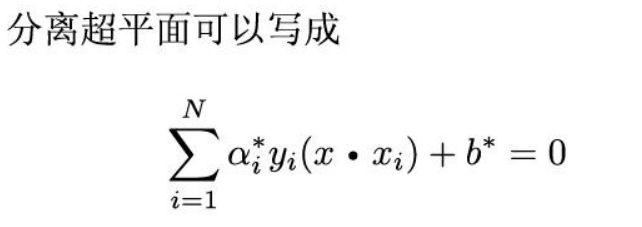

### 2.2 核技巧

- 对于非线性性，想要引入映射函数F(x)替代x。但由此引发的F(x)*F(x)的点积复杂度可能会上升。

- 因此，想要引入核函数，使得K(x,x) = F(x)*F(x)。

  - 我们可以在不知道F(x)的情况下，就定义K(x,x)。

  - 但什么样的函数才能成为合格的核函数？

    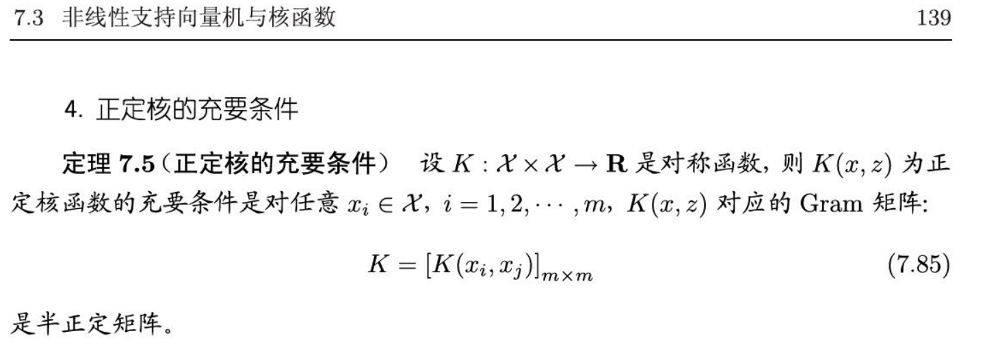

### 2.3 SMO算法

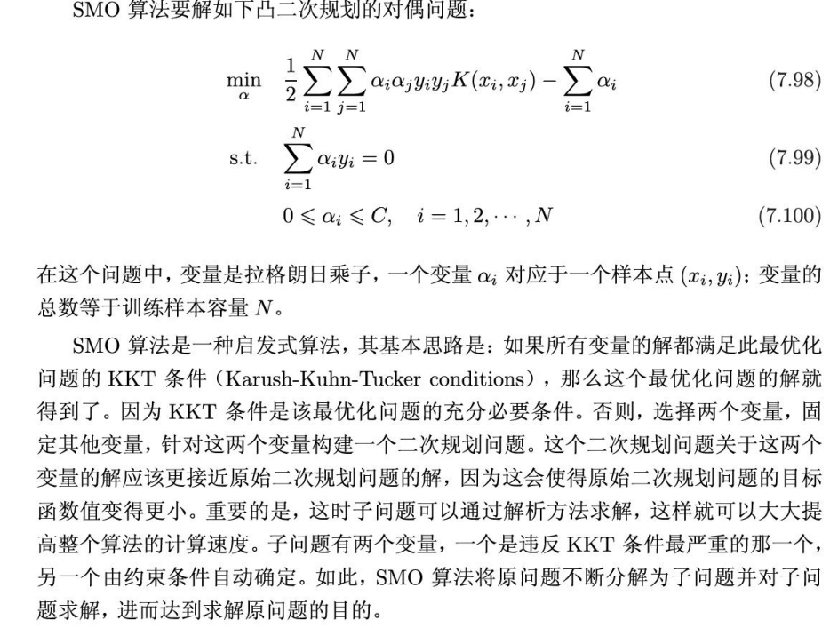

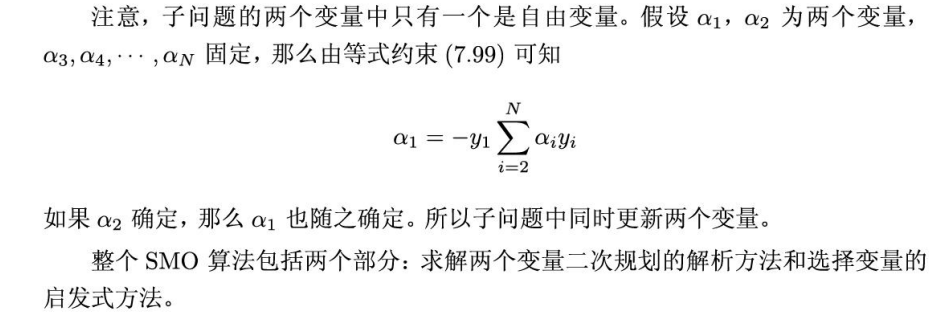

### 2.4软间隔支持向量机

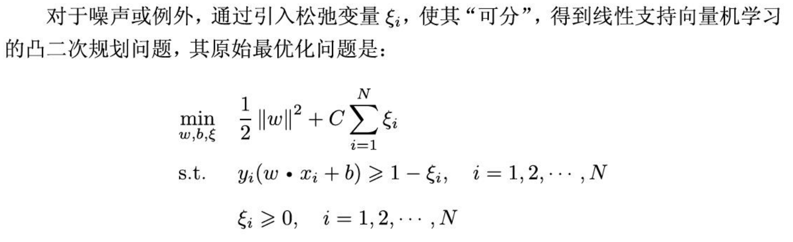
