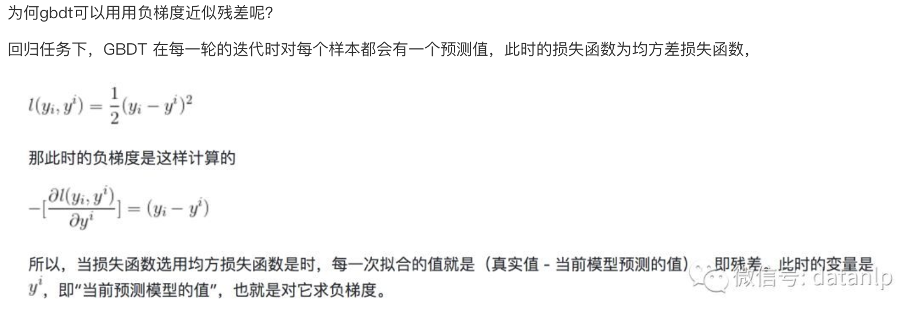

# 集成学习

[[TOC]]

## 0.资料网址：

- [tqchen的PPT](https://web.njit.edu/~usman/courses/cs675_fall16/BoostedTree.pdf)
- [csdn博文](https://blog.csdn.net/v_JULY_v/article/details/81410574)
- [知乎博客](https://zhuanlan.zhihu.com/p/82122013)
- [好用的刷题网站](https://www.julyedu.com/question/big/kp_id/23/ques_id/2590)
- [github代码+知识点集合](https://github.com/NLP-LOVE/ML-NLP)
- [简短一点的博文](https://www.cnblogs.com/mantch/p/11164221.html)

系列

- 
- 
- 
- [adaboost](https://zhuanlan.zhihu.com/p/41536315)

## 1. boosting和bagging从方差和偏差的角度对比

参考《百面机器学习》

**什么是方差和偏差**

- 方差和偏差
  - 从整体数据集中采样N次，每次生成样本量为m的数据集，训练出N个模型
  - 偏差：计算这N个模型输出的均值和真实模型输出的diff--就是偏差
  - 方差：这N个模型输出的方差
- 偏差大：有可能是对模型或者学习算法作出了错误的假设
- 方差大：模型对于数据集的变化较为敏感，对数据集有过拟合的倾向

**boosting减少偏差，bagging减少方差**

- 从数学的角度解释：bagging减少方差
  - bagging是训练的时候对样本进行不同的采样，希望降低不同分类器的相关性。又比如在随机森林的时候，随机选择可选特征的不同子集来进行节点分裂

- 而boosting的本质还是在不断的优化损失函数，因此其实是在降低偏差，难以起到降低方差的作用s

## 2. bagging方法

目标：需要训练多个尽可能独立的基学习器

### 1. 自助法

- 直接基于自助采样法。
  - 每训练一个学习器，都是从全体样本里自助采样一些样本。

### 2. 随机森林

- 传统的决策树在决定节点如何split的时候，会使用所有的特征（举例如年龄、性别等）
  - 而随机森林在split的时候，会先随机选出一部分特征（即全体特征的子集），而后再进行决策树的计算

## 3. 常见的boosting方法

### 1. adaboost

具体看《机器学习》-周志华

- 核心思想是：
  - 学习器的权重：为学习器的错误率决定
  - 样本的权重：由该样本是否被分类正确以及学习器的错误率决定。
    - 若分类正确则减少权重，同时错误率越低减少的越多。
    - 若被分类错误则增加权重，同时学习器的错误率越高，增加的越多。

### 2. GBDT树

- 要训练一系列的学习器。
- 给定当前所有的学习器输出，我们希望降低损失函数。
  - 分类器的输出是自变量，那在当前分类器输出的这个点上，降低损失函数的最快方向就是当前点的负梯度方向。
  - 因此，下一个分类器的输出，应该就是损失函数在之前所有分类器输出这个点上的负梯度。
  - 

- 如果损失函数是均方误差损失函数，
  - 则负梯度正好是残差
  - 

- 优点：
  - 预测的时候不同的树可以并行计算
  - 使用决策树作为基学习器，可解释性好
- 缺点：
  - 训练的时候不同的树是串行的
  - 稀疏数据可能应对起来较为困难

### 3.CART树

CART树是二叉树，划分准则是 是与否。

- 对于回归树，特征选择是平方误差最小化
  - 对于平方误差函数来说，输出值就是变量的均值
- 对于分类树，是基尼系数最小化。
  - 基尼系数：有放回抽样两次，两次抽样抽到的样本不属于同一类别的概率。
  - 

- 每次特征选择时，要找最好的切分变量以及最好的切分点。

### 4. xgboost

- 特点：
  - 在损失函数使用二阶泰勒展开
  - 在损失函数加入了正则化项
  - 分裂的准则是：最大化损失函数提升的增益（而不像cart树的基尼系数或者均方误差）
    - 
  - 对缺失值有处理策略
  - 对训练有并行化的优化策略

### 5. lightGBM

### 6. catboost 

- https://catboost.ai/en/docs/concepts/fstr
- 因为这个特征的分割造成的左右子树的值的方差的加权求和
