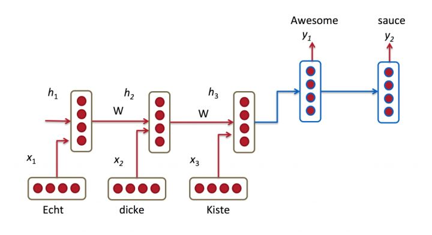
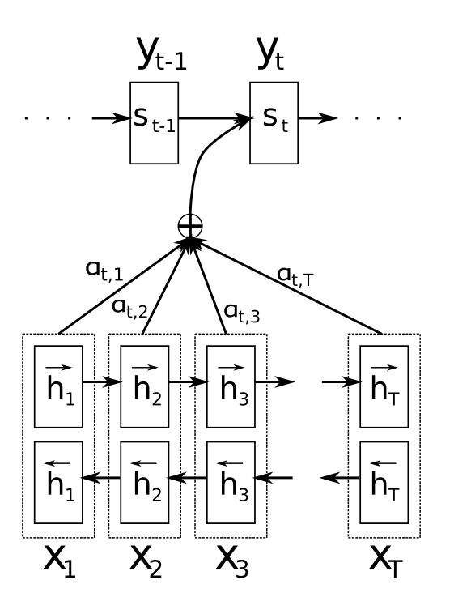
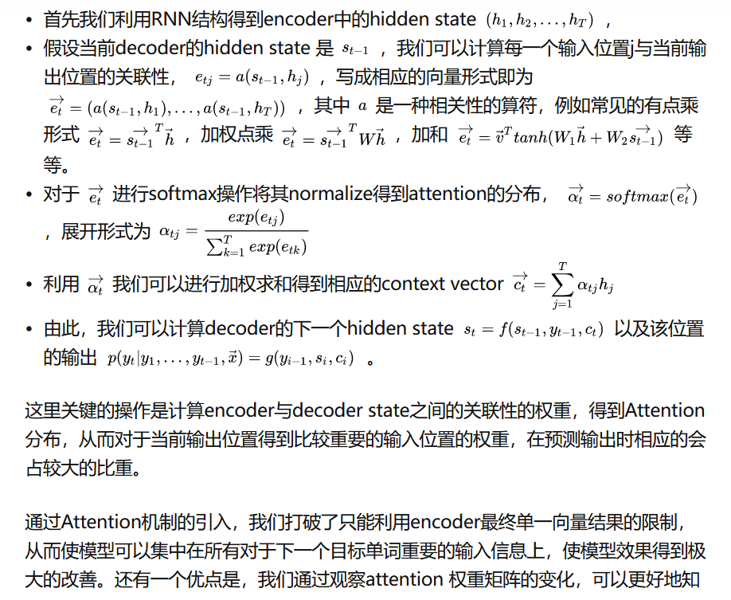

# Attention

[[TOC]]

## 0.资料网址：

- [知乎好的博文](https://zhuanlan.zhihu.com/p/47063917)

- [一个非常好的NLP学习资料库](https://slds-lmu.github.io/seminar_nlp_ss20/attention-and-self-attention-for-nlp.html)

- [面经](面试官如何判断面试者的机器学习水平？ - 包包大人的回答 - 知乎 https://www.zhihu.com/question/62482926/answer/2317840159)

  

## 1. attention

- 在原始的seq2seq中，decoder模型只能利用encoder的最后一个Hidden state作为上一hidden state
  - 
  - 随着序列的边长，所有的信息都压缩到了一个向量中，序列增长信息丢失严重
- 因此，使用attention机制
  - 
  - 

总结：

- 在Decoder端，隐状态由 上一隐状态、上一输出、输入序列每个隐状态的加权和 决定
  - 输出由 当前隐状态 和 上一输出 决定
  - 为了计算 输入序列每个隐状态的加权和 ， 我们需要计算 上一隐状态 和 输入序列的所有隐状态的 相关性，而后softmax得到一个归一化的加权
- 的

|      |      |      |
| ---- | ---- | ---- |
|      |      |      |
|      |      |      |
|      |      |      |

