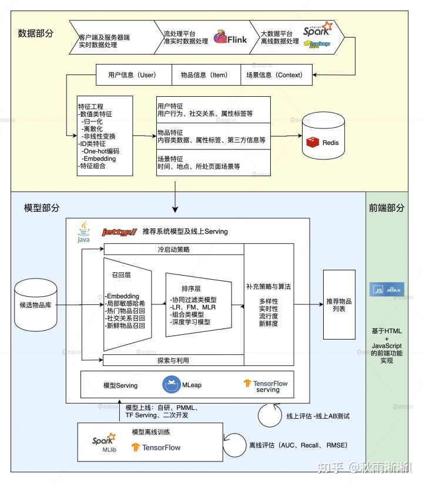
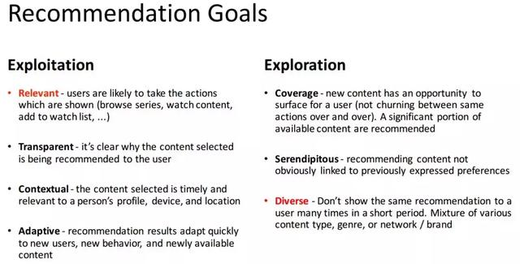
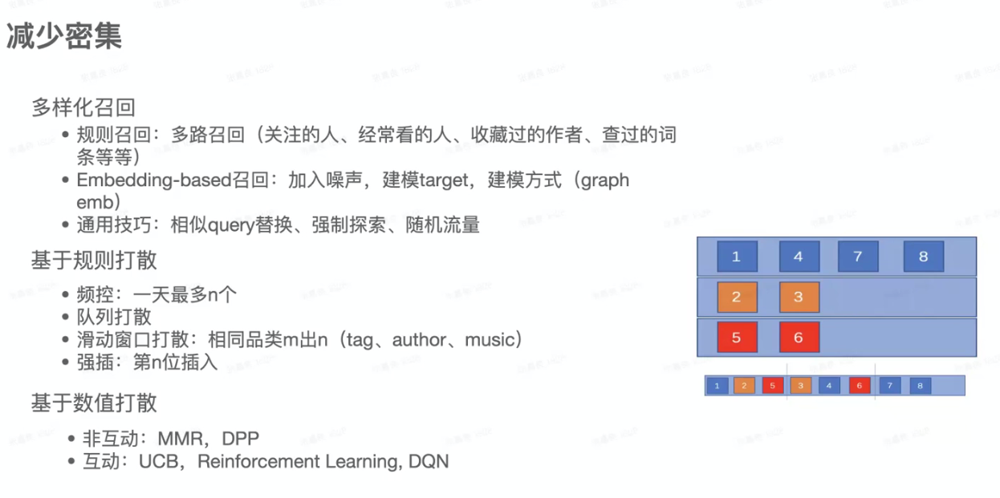
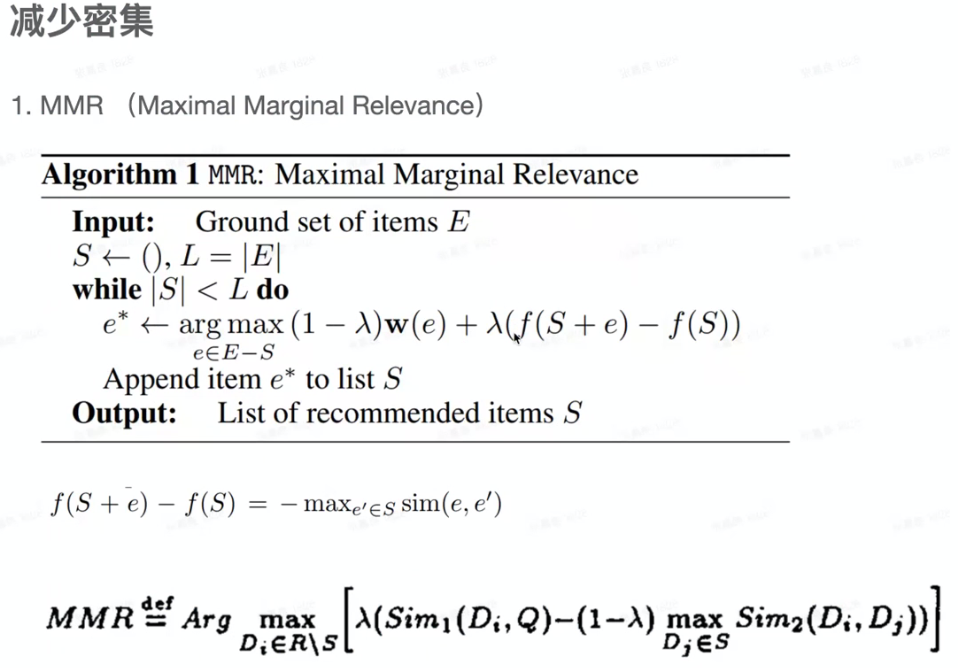
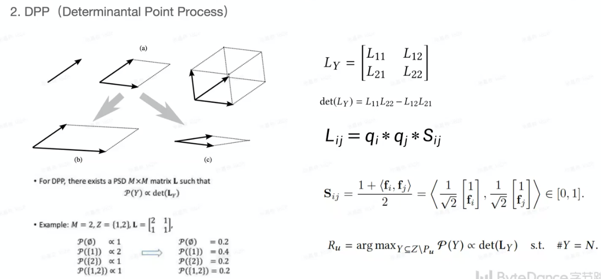
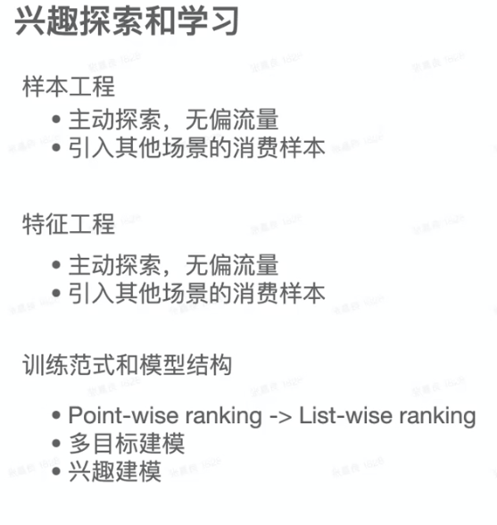
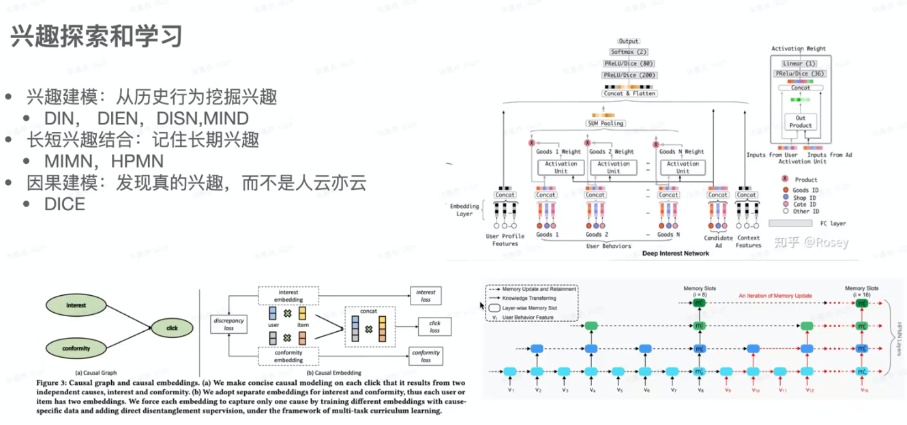
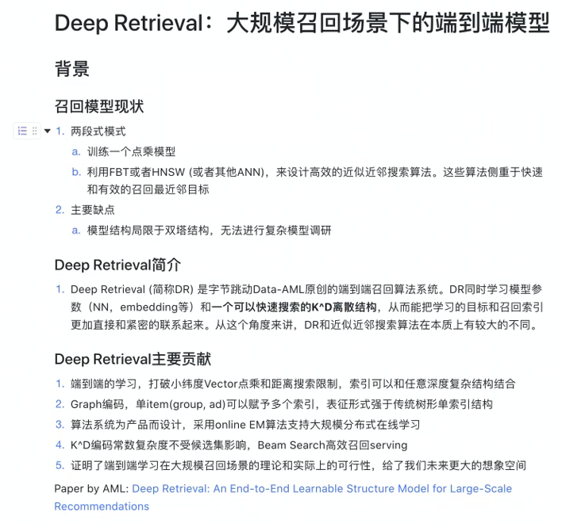
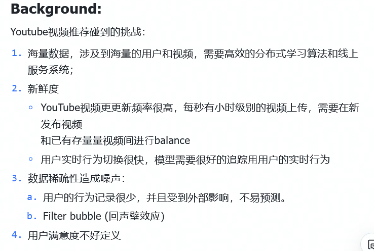
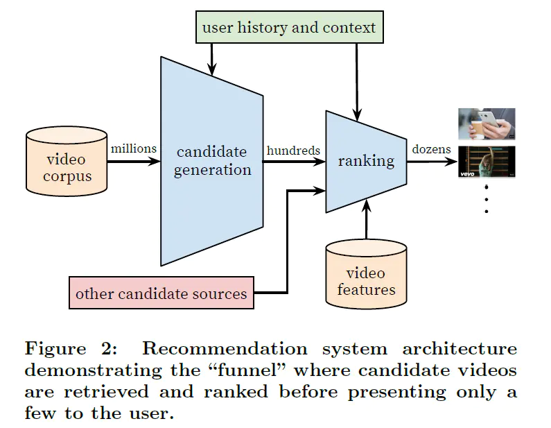

# 推荐系统

[[TOC]]

## 0.资料网址：

- 《推荐系统实践》-- 项量

推荐系统流程：

三大模块

- 召回
- 粗排
- 精排

## 1. 基于邻域的算法

### 1.1 基于用户的协同过滤

- 找和用户兴趣相似的别的用户
- 把别的用户感兴趣的物品(行为相似度)也推给他
- 使用 物品-用户倒排表避免相似度计算
- 用户对热门商品的共同兴趣的权重应该比对冷门商品的低

### 1.2 基于物品的协同过滤

- 基于物品的相似度进行推荐
- 相似度并不完全取决于物品，而是取决于用户的行为，如果多位用户购买A的同时也买B，认为A和B相似
- 也需要惩罚不热门的物品

## 2. 推荐系统的冷启动问题

### 2.1 物品的冷启动

- 利用物品的内容信息衡量物品的相似度

### 2.2 用户的冷启动

- 让新注册的用户填写一些信息
- 如果用户用关联账户注册，可以分享用户画像

## 3. 多样性

### 3.1 多样性

- 对用户：
  - 同质化的内容可能会让用户看腻了，多样性可以降低用户疲劳
  - 多样性也可以更全面的发掘用户的兴趣，提高用户粘性
- 对产品：
  - 多样性有利于长尾的视频和作者

### 3.2 多样性的定义

- 用户视角
  - 推荐的物品差异性大
  - 覆盖用户的不同兴趣
- 平台视角
  - 能够推荐到长尾的物品，以及发掘出新的作者

### 3.3 如何做多样化

- 用户侧
  - 减少密集推荐同质化内容
  - 多探索用户的不同兴趣
- 平台
  - 促进平台内容的多样化

### 3.4 用指标衡量多样性

- ILAD指标
  - 先对每个用户的每次推荐的物品的相似度求平均
  - 再对所有用户的相似度求平均
  - 1-
- ILMD指标
  - 求出推荐给用户的物品的最小相似度
  - 再对所有用户的相似度求平均
  - 1-

统计类指标：

- 覆盖率、渗透率
  - 人均看过的tag数目
- 推荐密集的比例
  - 来自相同作者等的比例>0.3
- 系统指标
  - 不同召回的来源占比
  - 不同粉丝、视频长度等占比

### 3.5 提升用户推荐多样性的手段

#### 减少密集推荐

- MMR
  - 用超参调节 物品与用户的相关度 以及 物品之间的相似度
  - 
- DPP
  - 最大化行列式
  - 
- 

#### 兴趣探索和学习

## 4. 召回部分

## 5. YouTube推荐

### 5.1 背景

### 5.2 系统架构

- 候选集生成(召回）：从百万级的视频中快速精确的找到数百的视频
  - 指标：采用recall等，因为AUC是衡量排序的
- 粗排（optional): 轻巧的精排，改精排做预删除，减少精排的压力。
  - 指标：AUC、跟精排的一致性
- 排序：对这数百个视频进行精排序，最后将排名靠前的呈现为用户。
- 问题：各自的主要模型指标是什么？AUC?

DPP 论文：https://proceedings.neurips.cc/paper/2018/file/dbbf603ff0e99629dda5d75b6f75f966-Paper.pdf

Deepretival: https://arxiv.org/pdf/2007.07203.pdf

## 6. 推荐系统模型

- 因子分解机 https://zhuanlan.zhihu.com/p/144346116 https://zhuanlan.zhihu.com/p/383217999
