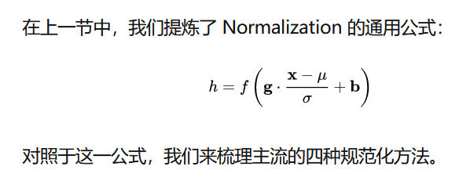
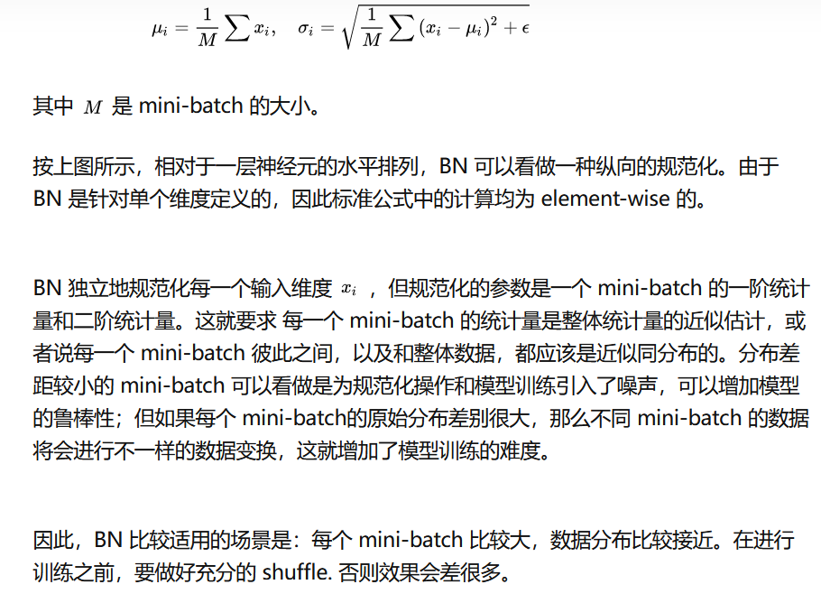
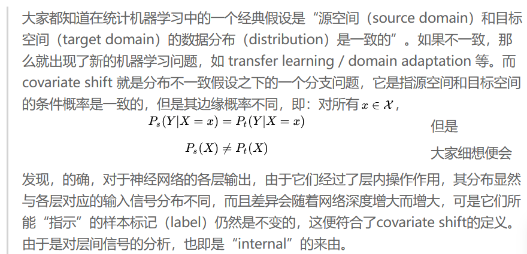
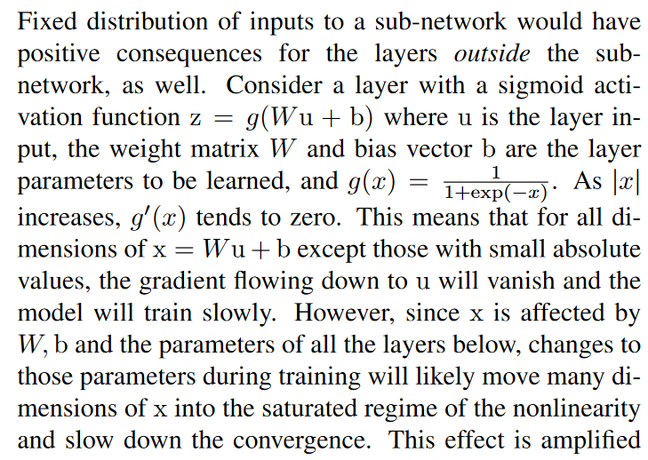
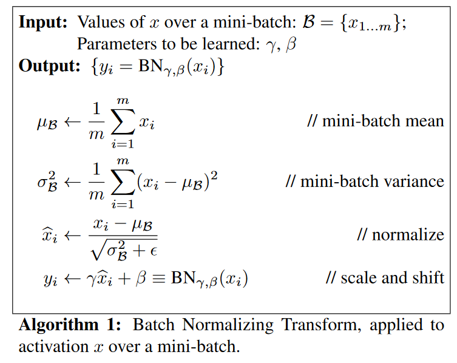
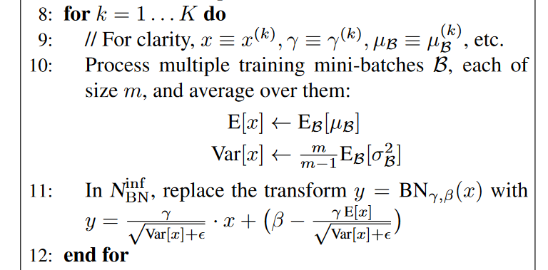
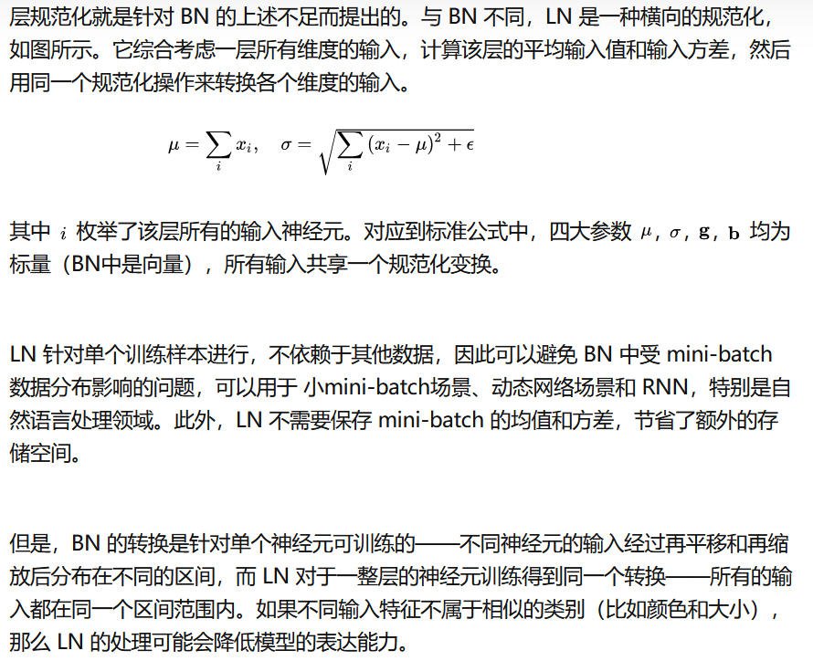
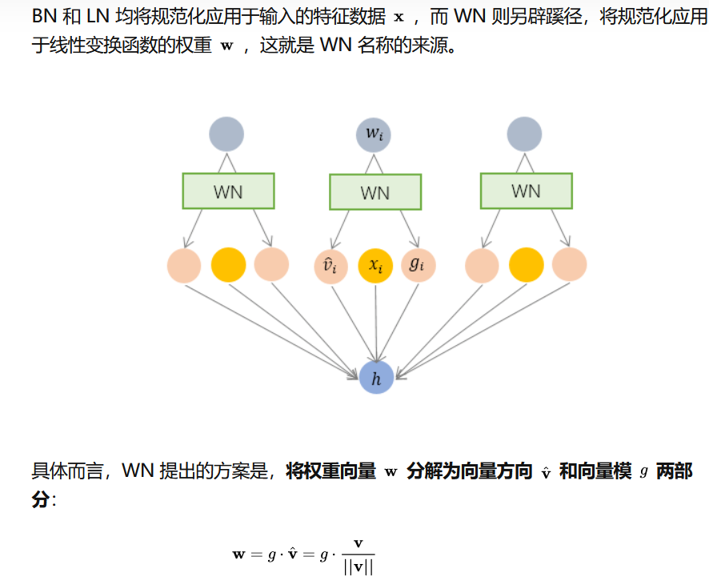
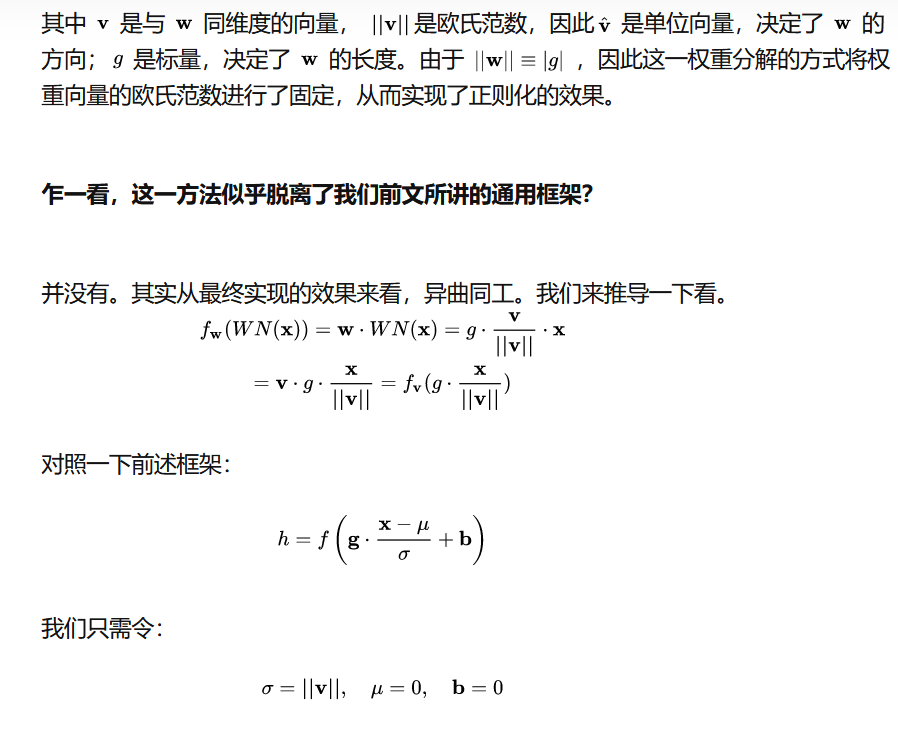
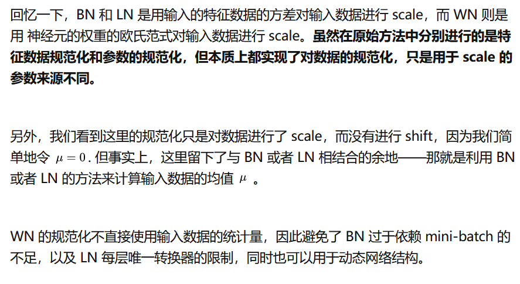

# 基础神经网络--Layer Norm

[[TOC]]

## 0.资料网址：

- [知乎关于norm的好专题文章](https://zhuanlan.zhihu.com/p/33173246)

## 归一化的通用框架

## 1. BN -- 一个batch进行scale

- [论文Batch Normalization: Accelerating Deep Network Training by Reducing Internal Covariate Shift](http://proceedings.mlr.press/v37/ioffe15.pdf)
- [好的阅读笔记](https://blog.csdn.net/happynear/article/details/44238541)
- [论文Understanding Batch Normalization](https://proceedings.neurips.cc/paper/2018/file/36072923bfc3cf47745d704feb489480-Paper.pdf)

### 1.1 为什么需要BN

- BN是对于每个激活函数的操作(可能在激活函数之前，也可能在激活函数之后)

- 需要BN的原因是所谓的Internal Covariate Shift

  - 
  - ICS导致了如下的问题：
    - 其一，上层参数需要不断适应新的输入数据分布，降低学习速度。
    - 其二，下层输入的变化可能趋向于变大或者变小，导致上层落入饱和区，使得学习过早停止。
      - 
    - 其三，每层的更新都会影响到其它层，因此每层的参数更新策略需要尽可能的谨慎。

  

### 1.2 BN的算法

  

  - 即对每个激活函数的输入/输出x，将x先Z归一化成y，而后把y替换掉x。
  - 而这个归一化，是使用一个batch内x的均值和方差来进行的，因此叫batch norm
  - 而为了给网络更大的能力，设置了两个可学习的函数，把Z归一化后的y再scale和bias，成为最终的替代

### 1.3 评估的时候

- 在训练的最后一个epoch，需要记录下所有mini-batch的每个的mean和Var
- 最后统计得出这个激活函数对整个epoch的mean和Var。在评估过程中，使用整体mean和Var进行归一化

## 2. Layer Norm -- 一层scale

- [论文Layer Normalization](https://arxiv.org/pdf/1607.06450.pdf)

## 3. Weight Norm -- 使用权重对数据scale

