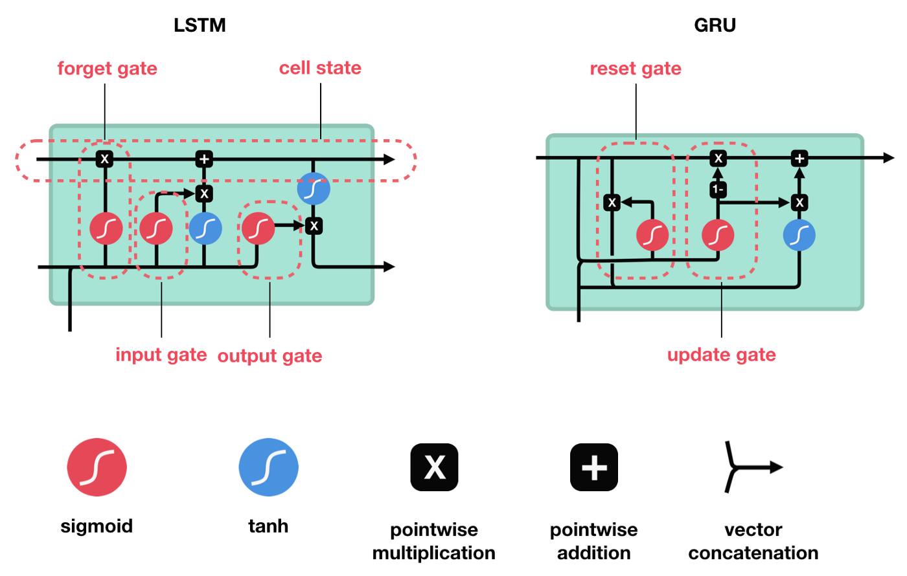

# 神经网络--RNN|LSTM|GRU

[[TOC]]

## 0.资料网址：

- [核心机器之心的post](https://www.jiqizhixin.com/articles/2018-12-18-12)
- [三个神经网络的动图解释](https://towardsdatascience.com/illustrated-guide-to-lstms-and-gru-s-a-step-by-step-explanation-44e9eb85bf21)
- [飞桨文档](https://paddlepedia.readthedocs.io/en/latest/index.html)
- [Deep Learning Book](https://www.deeplearningbook.org/)
- [参考视频--可视化数学非常好的教学](https://www.youtube.com/c/3blue1brown)
- [SVD分解的图解视频](https://www.youtube.com/watch?v=CpD9XlTu3ys)
- [介绍LSTM](https://easyai.tech/ai-definition/lstm/)

## 1. RNN

### 1.1 RNN的动机

- 需要处理变长的序列
- 要学习到输入的时间的依赖关系

### 1.2 RNN的结构和公式

#### 结构

- 上述结构图参考(https://stanford.edu/~shervine/teaching/cs-230/cheatsheet-recurrent-neural-networks#architecture)

#### 公式

#### 总结

- __RNN由输入、隐藏层、输出组成__
- __输入是逐个输入__
- __隐藏层--与当前输入、上一个隐藏层 有关__，使用的激活函数为tanh
  - __使用tanh__是因为在级联的时候，如果有一个输入值特别大，而没有tanh归一化[-1,1]的效果的话，连乘下去这个值到最后将会非常大，那么别的比较小的数就没有任何意义了
- __输出--只与当前隐藏层有关__

### 1.3 RNN的优点、缺点

| 优点:| 缺点：   |
| ---- | ---- |
|模型大小不随输入长度的增加| 计算缓慢 |
|可以处理任意长序列 | 存在梯度消失和梯度爆炸的问题 |
|考虑了时间的依赖 | |
|参数随时间共享 |      |

### 1.4 ==RNN中的梯度消失和爆炸==

- __梯度爆炸：学习到的参数矩阵的最大奇异值大于1__
  - 可以使用梯度裁剪解决(clipping)
- __梯度消失：学习到的参数矩阵的最大奇异值小于1__
  - 当最大奇异值小于1的时候，往前传播的时候，随着t越来越大，梯度越来越小，越往前神经网络越不更新，削弱了RNN捕获长距离的能力

## 2.LSTM

### 2.1 LSTM的动机

__有选择性的输入__以缓解梯度消失的问题

### 2.2 LSTM的结构和公式

#### 结构

#### 公式--注意，公式中激活函数内的相加不是相加，而是向量拼接

#### 总结--3门3态

- __门__：
  - 都与 当前输入 和 上一时刻隐藏层 相关
  - 都使用sigmoid作为激活函数
  - 都有可学习参数
- 输入门
  - 用于 细胞态 中调控 暂态 的输入
- 遗忘门
  - 用于 细胞态 中调控 上一时刻 细胞态 的输入
- 输出门
  - 用于从 细胞态 生成 当前时刻的 隐藏层

- __态__：
- 暂态

  - 与 当前输入 和 上一时刻隐藏层 相关
  - 使用tanh作为激活函数
  - 有可学习参数
- 细胞态

  - 由 暂态 与 上一时刻细胞态 决定
  - 由 输入门 和 遗忘门 调控输入
  - 无激活函数
  - 无可学习参数
- 隐藏层

  - 直接由 细胞态 经过 tanh 后经由 输出门 调控生成
  - 使用tanh作为激活函数
  - 无可学习参数

## 3.GRU

### 3.1 GRU的动机

### 3.2 GRU的结构和公式

#### 结构

#### 公式--注意，公式中激活函数内的相加不是相加，而是向量拼接

#### 总结--2门2态

- __门__：
  - 都与当前输入和上一时刻的隐藏层有关，对于 当前输入 和 上一时刻隐藏层 都有可学习参数
  - 都使用sigmoid激活函数进行逐个元素相乘，相当于门控
- 重置门

  - 负责在 暂态 中遗忘 上一时刻的隐藏层 
- 更新门
  - 负责在 隐藏层 中调控 暂态 和 上一时刻隐藏层 的比例

- __态__：

  - GRU只有暂态和隐藏层
- 暂态

  - 和RNN的隐藏层类似，只是 参数$*$​​​上一时刻隐藏层 需要经 重置门 调控
  - tanh为激活函数
  - 有可学习参数
- 隐藏层

  - 由 暂态 和 上一时刻隐藏层 经由 更新门 调控输入比例
  - 无激活函数
  - 无可学习参数

## 4. 其他

### 4.0 比较

#### LSTM与GRU

- LSTM能够解决循环神经网络因长期依赖带来的梯度消失和梯度爆炸问题，但是LSTM有三个不同的门，参数较多，训练起来比较困难。

- GRU只含有两个门控结构，且在超参数全部调优的情况下，二者性能相当，但是GRU结构更为简单，训练样本较少，易实现。

- 

  

### 4.1 常使用激活函数

 

#### 为何非门控单元的可学习参数，选择tanh而不也是sigmoid

- 在输入为0附近，tanh的梯度比sigmoid更大，学习收敛更快

#### 可否使用RELU作为激活函数

- 使用RELU作为激活函数，则失去了tanh的约束，会引发梯度的消失和爆炸
- 如果可学习参数初始化在单位阵附近，则可能可以使用

### 4.2 参数量的计算

参考pytorch中的计算：https://pytorch.org/docs/stable/generated/torch.nn.LSTM.html?highlight=lstm#torch.nn.LSTM

### 4.3 代码的书写

- [官方代码](https://pytorch.org/docs/stable/_modules/torch/nn/modules/rnn.html#LSTM)

### 4.4 不同的整合方式：

https://stanford.edu/~shervine/teaching/cs-230/cheatsheet-recurrent-neural-networks#overview

## 5. 长期依赖以及梯度消失解决

https://www.cnblogs.com/bonelee/p/10475453.html

https://zhuanlan.zhihu.com/p/47780305

https://www.zhihu.com/question/317594964

LSTM为什么能解决梯度消失：https://zhuanlan.zhihu.com/p/451018380

