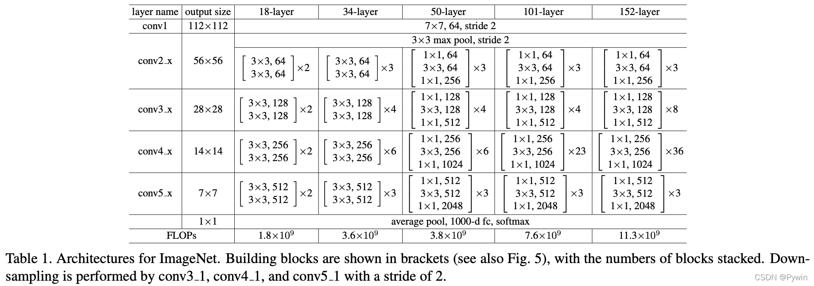

# 基础神经网络--卷积神经网络

[[TOC]]

## 0.资料网址：

- [博客](https://blog.csdn.net/qq_36076233/article/details/122881833)
- [d2l](https://zh.d2l.ai/chapter_convolutional-neural-networks/index.html)

## 1. 基础

## 2. ResNet

