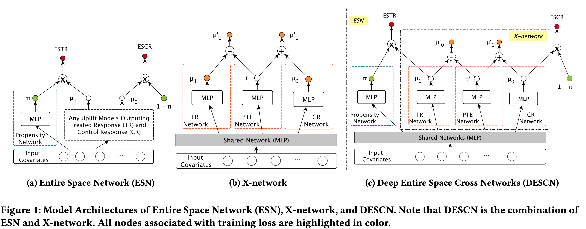
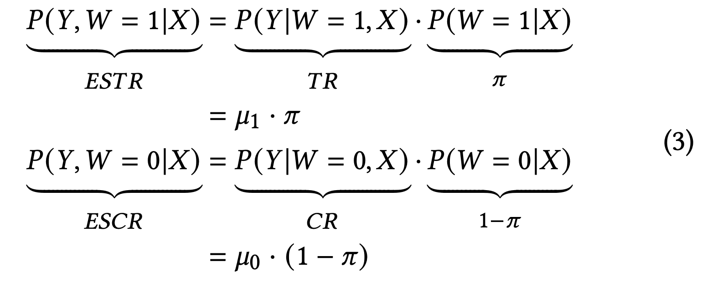
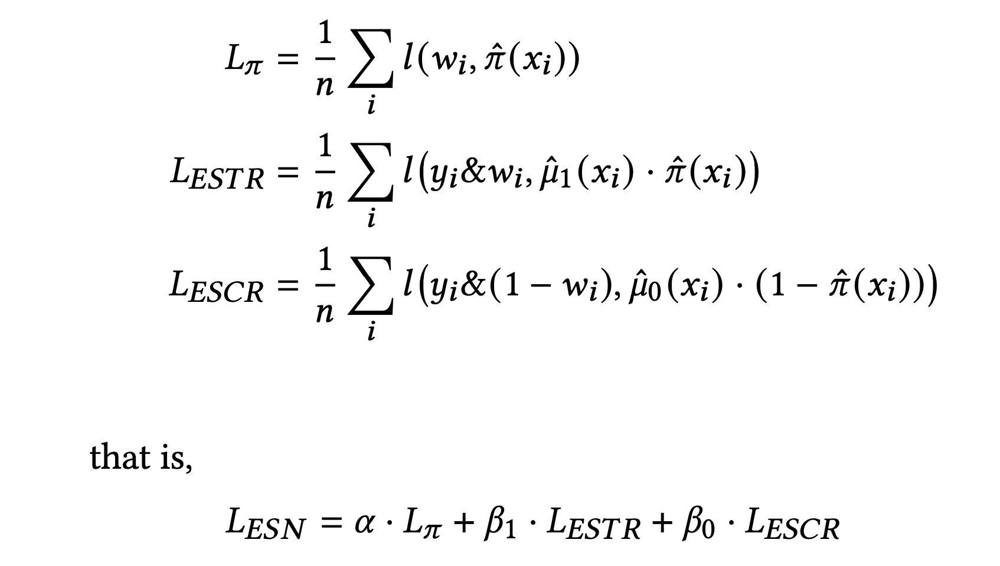
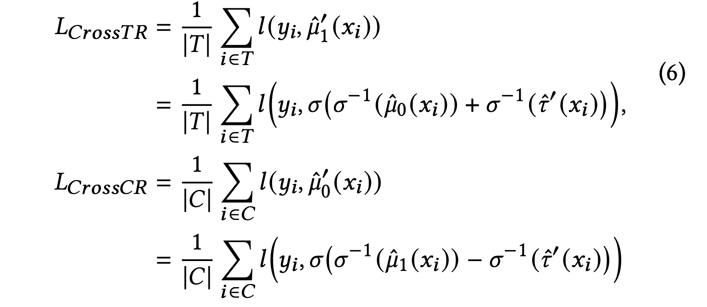
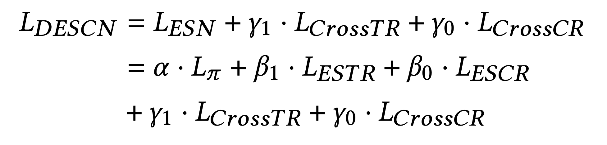
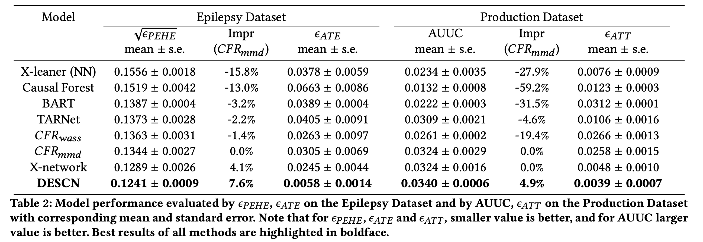
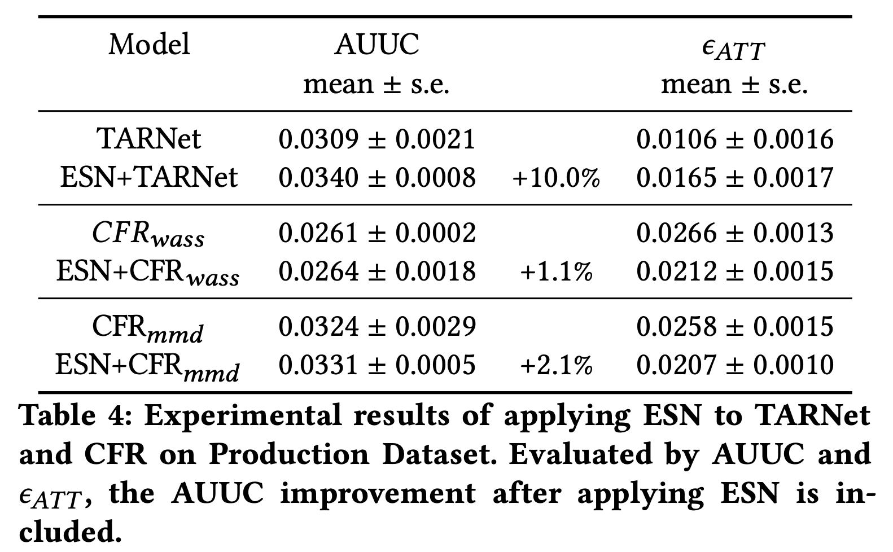

# Uplift系列论文

[[TOC]]


# DESCN

DESCN: Deep Entire Space Cross Networks for Individual Treatment Effect Estimation

- 背景

  - 计算Individual Treatment Effect(ITE)

- 挑战

  - treatment bias

    - 即treat和control group中的人的分布不一致。比如电商平台中，为了促活，对不活跃用户发券。那么被发券的大部分都是不活跃的用户。

    - > Take the E-commerce voucher distribution scenario as an example, a certain discount of- fer (a.k.a voucher) could only be provided to inactive users with the aim to improve the customer retention rate. The active users, nevertheless, are not given vouchers for cost-saving purposes.
      >
      > As a result, the users in the control group tend to be more active than those in the treated group. 

  - sample imbalance

    - 一个策略可能生效的人群占总体的极少部分，比如对不活跃用户发券。

    - 在sample imbalance下，如果分开两个模型，一个去学treat group的样本，一个去学control group的样本，那么两个模型的训练样本数目不一致。可能一个模型学的好、一个学的没那么好，且两个模型都没有利用上所有的样本。

    - > the sample size between the treated and control group could vary significantly in practice

- 贡献：提出了DESCN网络，end2end的同时解决这两个问题。

  - Entire Space Network (ESN)：主要为了解决treatment bias
    - 参考了ESMM，从entire-space即全量的样本集去学TR和CR
    - 
  - X-network：主要为了解决sample imbalance
    - 三塔架构，帮助模型充分利用全量样本的信息。
    - shared structure to learn the hidden pseudo treatment effect


## 模型结构



## ESN思路详解

### PS消偏



- $\pi$ 是propensity score $\pi(X)$
  - 大部分文献用$e(X)$表示
  - 倾向性得分。给定一个X， $\pi(X)$代表它在观测到的全样本空间中被treat的概率。
- W：是否给予treatment的指示符号。
  - 部分文献用$T$表示。
- ESTR：观测到的全样本空间中，属于treat 组且为正样本
- TR：为想要学的无偏估计。（当对一个用户打分时，如果treat一个个体，他的Y=1的概率）
  - 也是模型中的$\mu_1$
- ESCR：观测到的全样本空间中，属于control组且为正样本
- CR：为想要学的无偏估计（当对一个用户打分时，如果control(不treat)一个个体，他的Y=1的概率）
  - 也是模型中的$\mu_0$
- TR、CR、$\mu_1$和$\mu_0$，大部分文献用Y表示

### 原理是啥?

propensity score +  Inverse Probability Weighting(IPW)

> 推导参考https://www2.stat.duke.edu/~fl35/teaching/640/Chap3.4_observational_weighting.pdf

- $\mathbb{E}[\frac{WY}{e(X)} - \frac{(1-W)Y}{1-e(X)}] = \tau^{ATE}$

- $\tau^{ATE} = \mathbb{E}(Y(1)) - \mathbb{E}(Y(0))$
- $\mathbb{E}[\frac{WY}{e(X)}] = \mathbb{E}[\frac{1}{e(X)}\mathbb{E}[WY|X]] = \mathbb{E}[\frac{\mathbb{E}[W|X]}{e(X)}\mathbb{E}[Y|X]] = \mathbb{E}[\mathbb{E}[Y|X]] = \mathbb{E}[Y] = \mathbb{E}[Y(1)]$

而联系ESN模型：

- WY即我们的ESTR，(1-W)(1-Y)即ESCR。
- 而Y(1)和Y(0)是我们想要学的无偏估计。
- 因此 $\mu_1 = \frac{Y(1)}{e(X)}$


- 人话：对观测的样本，使用propensity score的倒数进行加权，可以平衡treat和control组的样本分布实现消偏 。因此，ESN能end2end的解决treatment bias。

  - 

  - > IPW creates a weighted population (i.e. target population) – a population that the study sample is representative of
    >
    > in this weighted population, the covariates distributions between two groups are balanced


### 最终loss



- 辅助loss：学一个好的PS。
  - 即给定用户特征，判断这个用户是倾向于被treat还是倾向于被control。
  - Label = 1 ==  is_treat=1
    - 该用户在观测到的样本空间中到底是被treat还是被control了
- 核心loss：学ESTR和ESCR
  - ESTR：label = 1 == is_treat=1 and Y = 1
  - ESCR：label = 1 == is_treat=0 and Y = 1


## X-network

- CrossCR = $\mu_0' = \sigma(\sigma^{-1}(\mu_{1}) - \sigma^{-1}(\tau'))$
  - 代码中，上面这一段的伪代码为

```python
miu_0_hat = sigmoid(miu_1_logit - tau_logit)
```


思想：

- $\mu_0' = \mu_{1} - \tau'$
- $\mu_1' = \mu_0 + \tau'$
- $\tau'$理想状态下就为个体因果效应的值，也即为uplift分
- 代码的废弃注释中有使用tanh激活函数的版本，可能是效果不好，才改成了上述





## 全部的loss




## 评估





