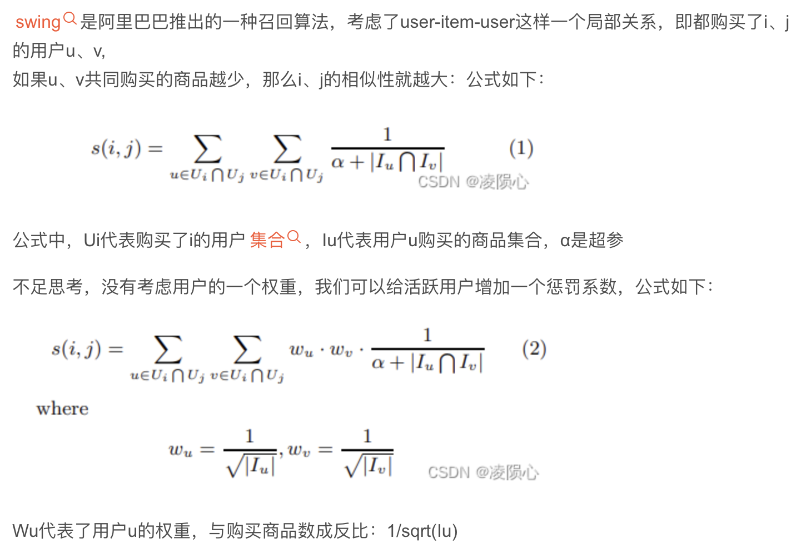
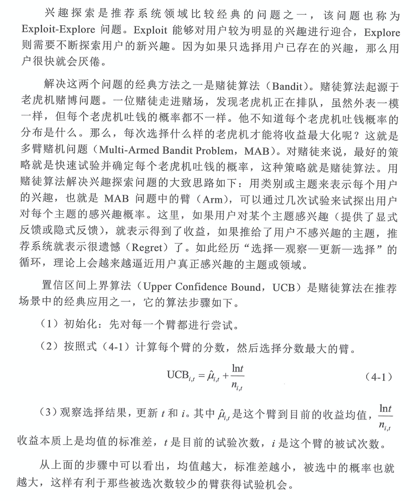
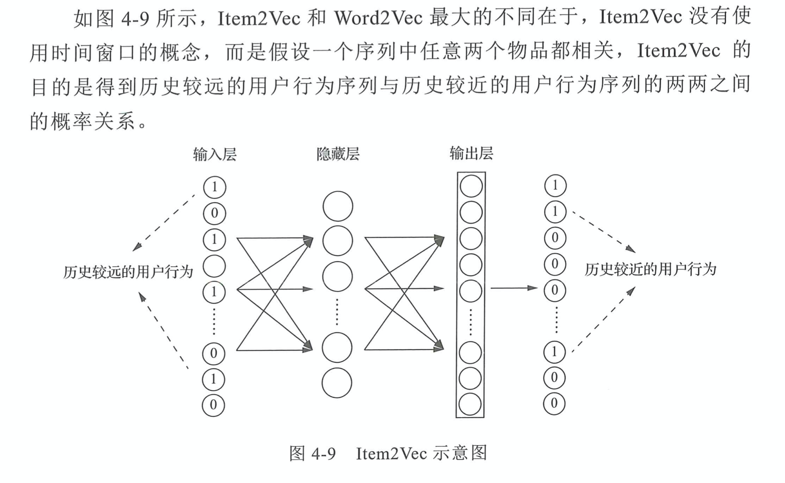
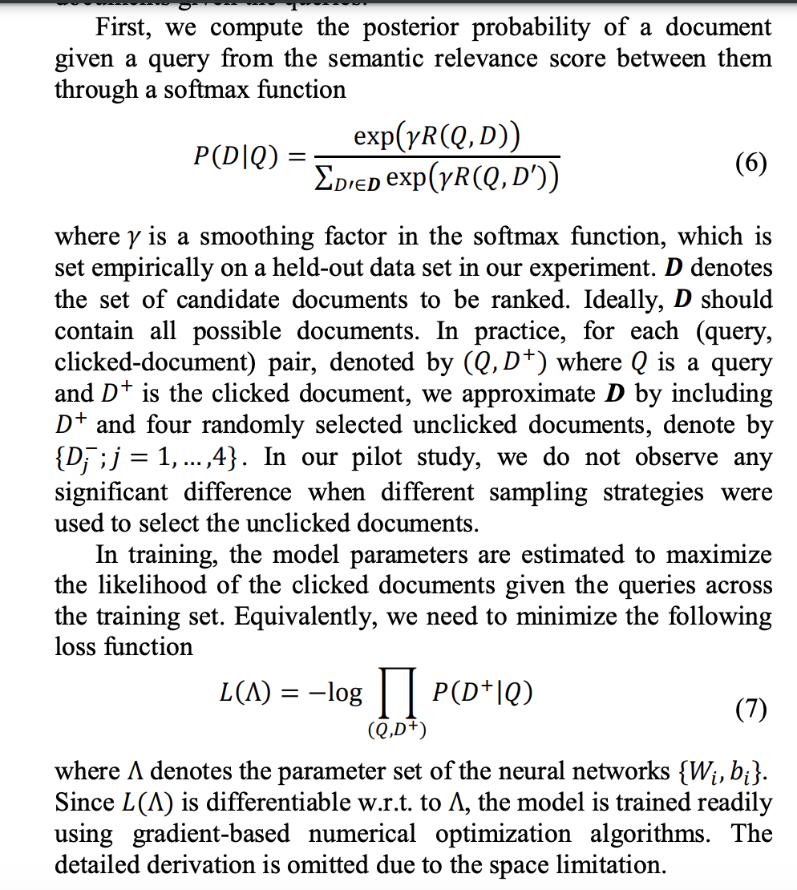

# 召回

[[TOC]]

## 0.资料网址：

- 

系列

- 

## 1. 内容召回

- 基于标签/主题的召回
  - 优点：物品不需要有用户的历史行为数据，有利于物品的冷启动
  - 缺点：依赖人为设计的标签体系
- 基于标签和主题还能有每个标签/主题的热门榜单，以及全局的热门榜单
  - 需要依赖别的用户的

## 2. 协同过滤

### i2i

- 根据用户喜欢的物品，推荐与之相似的物品

- Item-CF

  - 两个物品的相似度喜欢两个物品的群体决定：交集越大，相似度越高

  - 但因为热门物品可能很多人喜欢，因此需要分母来打压热门物品的相似度

  - $$
    s(i,j) = \frac{U_i\cap U_j}{\sqrt{U_i}\sqrt{U_j}}
    $$

    

- Swing

  - 是一种u-i-u的结构。
    - 对所有共同喜欢这两个物品的人构建pair，每一个pair计算用户相似性分数，为用户共同喜欢物品数目的倒数。相似性分数求和得到swing分数。
  - 

### u2i

- 根据两个用户的相似程度推荐内容

### 探索性召回--赌徒算法

## 3. 向量召回

### item2vec

### DSSM

- 原始论文：Learning Deep Structured Semantic Models for Web Search using Clickthrough Data
  - https://www.microsoft.com/en-us/research/wp-content/uploads/2016/02/cikm2013_DSSM_fullversion.pdf
- 是一个pair-wise的loss
  - 其实就和对比学习一样，拉近正样本的距离，拉远负样本的距离。
  - 只是这里是随机选取4个未被点击的文档
    - 在推荐中，可能需要构造难负样本。比如batch内负采样。因为热门（特征内容丰富的）物品是少的，全局均匀采样可能很多内容都是特征不怎么丰富的。
  - 

### 负样本构造

http://www.taodudu.cc/news/show-3146042.html?action=onClick

- 展示未曝光的不一定是不感兴趣的
- 简单负样本：全局均匀采样
- 困难负样本：召回后被截断的、粗排后被截断的、精排后排序靠后难以展出的
