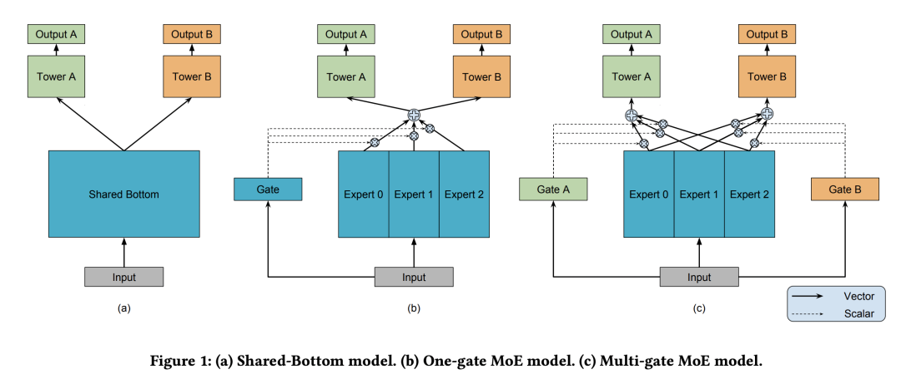
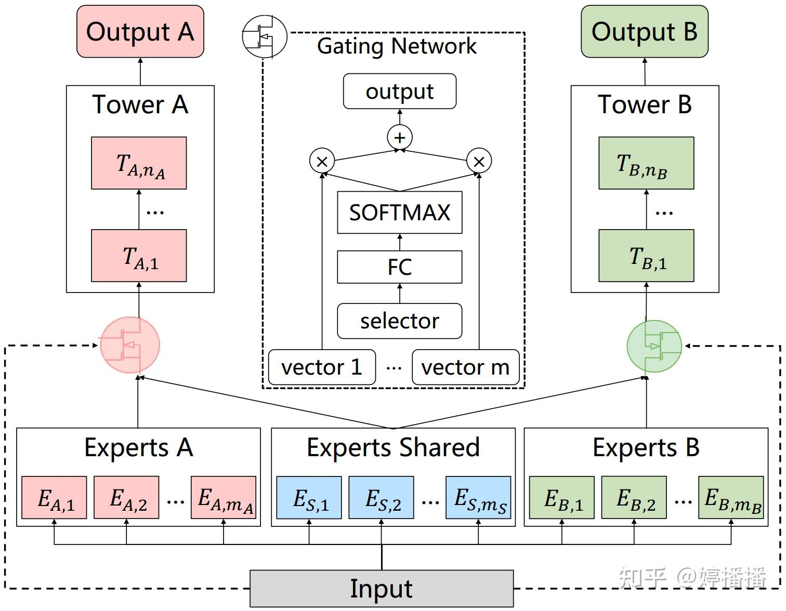

# 多任务模型

[[TOC]]

## 0.资料网址：

- https://zhuanlan.zhihu.com/p/530636262
- https://mp.weixin.qq.com/s/C-F0YCkjvFV3g15Em6GedQ
- https://blog.csdn.net/Kaiyuan_sjtu/article/details/125230479
- https://baijiahao.baidu.com/s?id=1721069482082659137&wfr=spider&for=pc
- 

系列

- 

- share bottom：

  - embedding 层share，每个任务一个塔

- MMOE

  - 多个专家网络，门控单元输出
  - 

- PLE

  - embedding层也分为共享的和专有的
  - embedding层可以叠加：共享的输入来自前面的所有；而独享的输入来自共享和独有，这样独有层可以专注于自己任务的学习
  - 

- ESMM

  - 用两个模型，一个学习ctr，一个学习cvr，但是是在展示空间学习
  - share bottom
  - 挺好的文章：https://zhuanlan.zhihu.com/p/597004211
    - 稀疏的数据和不稀疏的模型去共享embedding的查找表
  
  
  
  
  
- PPnet
  
  - https://zhuanlan.zhihu.com/p/635364011
  - 加入了两组gating unit
  - 一组领域gate，是 正常特征+domain 产生gate，对正常特征的产生进行过滤
  - 另一组是个性化的gate，一般由user\author\itemID特征构成，作用在MLP层的产出中
    - 个性化gate不影响share-embedding的梯度
  
  
  
