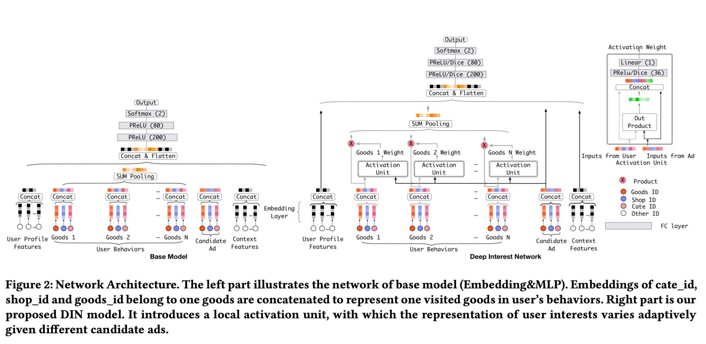

# 序列处理相关论文

  [[TOC]]

  ## 0.资料网址：

  - 

  系列

  - 

  

## 1. DIN

[Deep Interest Network for Click-Through Rate Prediction](https://arxiv.org/abs/1706.06978)

### 动机

- 之前的工作对于序列的处理都是各种sum或者self-attention

### 核心

- **Target attention**：By introducing a local activation unit, DIN pays attentions to the related user interests by soft-searching for relevant parts of historical behaviors and takes a weighted sum pooling to obtain the representation of user interests with respect to the candidate ad.

面试的几句话：

- 是Target attention，可以根据当前的物品对历史物品进行soft-search。序列特征根据target attention的值进行weighted sum。
- Target attention是根据当前的物品以及历史物品，生成一个out product，同时concate两个物品，过非线性层后输出一个值，这个值作为atten分数。这个分数是不归一化的。
  - 原因是：However different from traditional attention method, the constraint of 􏲢权重求和为1 is relaxed in Eq.(3), aiming to reserve the intensity of user interests. That is, normalization with softmax on the output of a(·) is aban- doned.
- 同时还提出了：
  - 

## 2.DIEN

### 动机

### 核心

- 双层GRU
  - 第一层GRU是预测下一个物品，有辅助loss进行训练
  - 第二层GRU是AUGRU,使用attention去影响更新门
  - AUGRU最后时刻的输出作为embedding

## 3. MIND

## 4. SIM

- https://zhuanlan.zhihu.com/p/623584204
- 有GSU和ESU两个模块
  - GSU是一个相关性检索：从历史序列中检索出和当前相关的模块
  - ESU就是正常的multi-head建模
