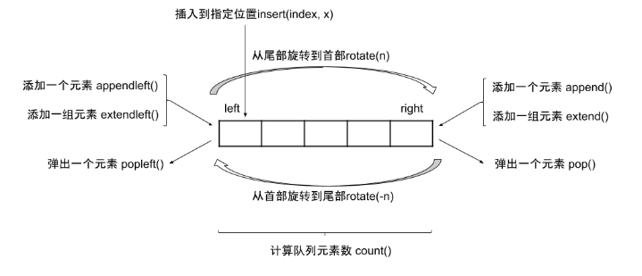

# 写题常用python技法

[[TOC]]

## 随机数

- 随机函数 random.randint()，左闭右闭

## 双端队列

- collections.deque
- 构建双端队列 a = deque()



## 堆

**heapq库，是小顶堆**

- heapq.heapify([])，将列表堆化
  - heapq.heapify([(), ()])，将列表堆化
  - 将元素为元组，元组的第一个元素是排序的key就行
- heapq.heapqpush([], value)
- heapq.heapqpop([])

## 快读快写

```python
import sys

input = lambda: sys.stdin.readline().strip()
write = lambda x: sys.stdout.write(x + "\n")

write = lambda x: sys.stdout.write("{:.5}".format(x) + "\n") # 格式化输出
```


## list注意

- 可以使用reverse进行原地翻转，切片后reverse进行部分原地翻转
- 如果是全排列这种回溯法，list去掉尾部记得pop，才能对传入的变量进行操作。

## 排序自定义比较函数

- 原地排序是sort
- 返回对象是sorted

- python2中可能可以使用cmp参数，左边小返回-1，左边大返回1
- 统一使用cmp_to_key，也是定义一个函数

```python
from functools import cmp_to_key

def my_cmp(x, y):
    if x > y:
        return 1
    else:
        return -1
bb.sort(key=cmp_to_key(my_cmp))
```

## 二分查找和插入

```python
bisect.bisect(array, item) # 找插入位置，插入到相同值的右边
bisect.bisect_left(array, item) # 找插入位置，插入到相同值的左边
bisect.bisect_right(array, item)
bisect.insort(array, item)
bisect.insort_left(array, item)
```

## 乘方开方

```python
pow(数字，次方)
x ** n # 也行
```


## 带默认值字典

```python
from collections import defaultdict
defaultdict(int)
defaultdict(lambda: 1) # 指定其他默认值
```


## 其他

- 注意除法是否是整除
- 可以使用pypy2，速度快些
