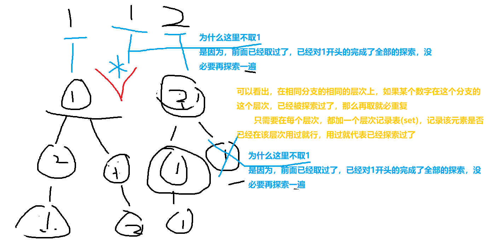

# 回溯法学习

- 此处非常感谢[插件](https://vuepress-theme-hope.github.io/v2/md-enhance/zh/)提供的对vuepress-next的公式支持！

[[TOC]]

## 回溯法基础

- 注意事项res一定要用copy.deepcopy()
- 状态变量一定要用append()和pop()，不能用[]，因为[]是浅拷贝会出问题


## 题目演练：组合数学
### 46.全排列

[传送门](https://leetcode.cn/problems/permutations/)

- [无敌参考题解](https://leetcode.cn/problems/permutations/solution/hui-su-suan-fa-python-dai-ma-java-dai-ma-by-liweiw/)
- 回溯法有个核心是需要用变量保存**我当前找过什么**，对应于这一题就是path
- 所以，在递归的过程中，
  - 进入递归前，把当前已经探索的加上
  - 递归出来后，把上次探索的除掉
- 递归函数要决定什么时候return，这一题就是没有数字可以继续取的时候return
- 我们需要used的帮助，来使得下一次取不会取到之前用过的

```python
from turtle import left
from typing import List

from matplotlib.style import use
from sqlalchemy import false

# # 如果省略了used的话，每次查找都要遍历一次path，会增多一次O的时间复杂度
# class Solution:
#     def permute(self, nums: List[int]) -> List[List[int]]:
#         res = []  
#         def DFS(res, path, nums):
#             flag = 0
#             for indexx in range(len(nums)):
#                 if nums[indexx] not in path:
#                     path.append(nums[indexx]) #状态加入
#                     DFS(res, path, nums) # DFS继续
#                     path.pop() #回退
#                     flag = 1
#             if flag == 0:
#                 res.append(path.copy()) # 如果不copy的话，path因为传的是引用，之后会被改掉
#                 return 
#         path = [] # 定义这个状态变量
#         DFS(res, path, nums)    
#         return res
            
# 下面这个是有used的版本        
class Solution:
    def permute(self, nums: List[int]) -> List[List[int]]:
        res = []  
        def DFS(res, path, used, nums):
            flag = 0
            for indexx in range(len(used)):
                if used[indexx] == 0:
                    used[indexx] = 1
                    path.append(nums[indexx])
                    DFS(res, path, used, nums)
                    path.pop()
                    used[indexx] = 0
                    flag = 1
            if flag == 0:
                res.append(path.copy())
                return 
        used = [ 0 for j in nums] # 用于看看哪些用了，用来对搜索空间剪枝。不然我们已经用过2了后面还用2就很麻烦。
        path = []
        DFS(res, path, used, nums)    
        return res        

if __name__ == '__main__':
    nums = [1, 2, 3]
    solution = Solution()
    res = solution.permute(nums)
    print(res)
```


 ### 47.全排列II

[传送门](https://leetcode.cn/problems/permutations-ii/)

- 画图解释如何处理多个数：
  - 首先，多个相同的数字在排列中是可以多次使用的
  - 但是211和211这个排列是重复的，如何避免？
  - 
- 的

```python
class Solution(object):
    def permuteUnique(self, nums):
        """
        :type nums: List[int]
        :rtype: List[List[int]]
        """
        res = []  
        def DFS(res, path, used, nums):
            flag = 0
            layer_used = dict([( j , 0 ) for j in set(nums)]) 
            # 画图就可以知道，对于每一层，如果想用的元素和开头的元素相等，那不用想，肯定已经在之前探索过了
            # 所以我们可以用layer_used来保存每一层的探索已经用过的那些元素，之后就可以不用再去探索了
            for indexx in range(len(used)):
                if used[indexx] == 0 and layer_used[nums[indexx]] == 0:
                    used[indexx] = 1
                    layer_used[nums[indexx]] = 1
                    path.append(nums[indexx])
                    DFS(res, path, used, nums)
                    path.pop()
                    used[indexx] = 0
                    flag = 1
            if flag == 0:
                res.append(path.copy())
                return 
        used = [ 0 for j in nums] # 用于看看哪些用了
        path = []
        DFS(res, path, used, nums)    
        return res        

if __name__ == '__main__':
    nums = [1, 2, 3]
    solution = Solution()
    res = solution.permuteUnique(nums)
    print(res)

```

### 子集

```python
class Solution(object):
    def core(self, nums, state, res):
        if len(nums) == 0:
            return
        else:
            for (index, value) in enumerate(nums):
                state.append(value)
                res.append(copy.deepcopy(list(state)))
                self.core(nums[index + 1:], state, res)
                state.pop()

        

    def subsets(self, nums):
        """
        :type nums: List[int]
        :rtype: List[List[int]]
        """
        if len(nums) == 0:
            return nums
        nums = sorted(nums)
        res = []
        res.append([])
        for (index, value) in enumerate(nums):
            state = deque()
            state.append(value)
            res.append(copy.deepcopy(list(state)))
            self.core(nums[index + 1:], state, res)
        return res
```

