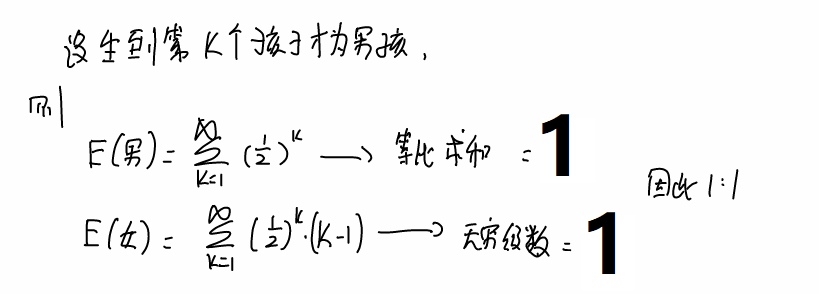
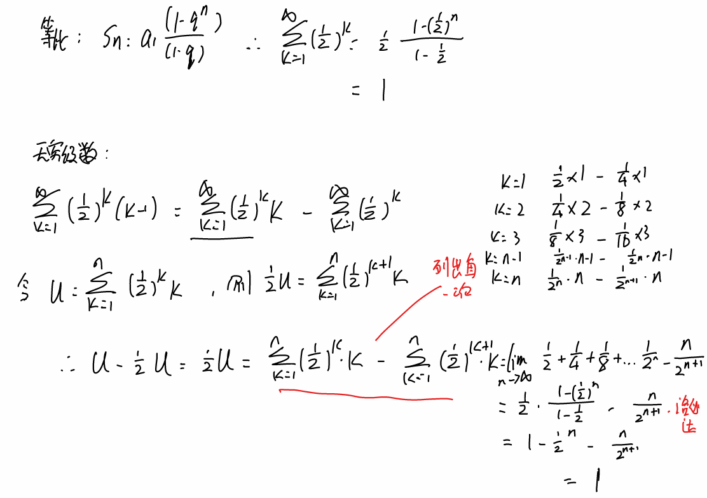
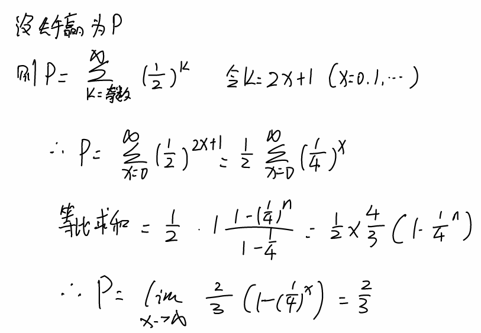

# 概率题


## 1. 非编程类概率

### 1.1 生孩子

**等比数列求和、错位相减法求无穷级数**

一个地区重男轻女，生男孩女孩概率为0.5，每个人一定要生出男孩才停止生孩子。问男女比例？





### 1.2 先手赢的概率

甲和乙扔硬币，先扔出正面的赢。问先手赢的概率？



## 2.编程类概率

### 2.1 三十万抽十万

https://blog.csdn.net/u014618114/article/details/108662834

核心

- rand7生成rand5
- 洗牌算法-高德纳洗牌(https://www.jianshu.com/p/043046eb4fd6)

### 2.2 lc808. 分汤

- https://leetcode.cn/problems/soup-servings/description/
- 技法：记忆化搜索
  - 同时去预估极限值

```python
class Solution(object):
    def soupServings(self, n):
        """
        :type n: int
        :rtype: float
        """
        n = ceil(n / 25.0)
        if n >= 179:
            return 1.0
        @cache
        def DFS(a, b):
            if a <= 0 and b <= 0:
                return 0.5
            elif a <= 0:
                return 1.0
            elif b <= 0:
                return 0.0
            res = 1.0 / 4.0 *(DFS(a - 4, b) + DFS(a - 3, b - 1) + DFS(a- 2, b - 2) + DFS(a - 1, b - 3))
            return res
        return DFS(n,n)
```

### 2.3 lc1227. 飞机座位分配概率

https://leetcode.cn/problems/airplane-seat-assignment-probability/solutions/664495/fei-ji-zuo-wei-fen-pei-gai-lu-by-leetcod-gyw4/

- dp[i]就是i个人遵循这个规则，第i个人能坐到自己位置的概率
- 第一位乘客选自己座位，后面都能选自己座位
- 第一位乘客选第N位，n直接坐不下
- 第一位乘客选第i位，则第2~i-1都能坐自己的座位，后面剩下第1个位置和i+1 ~ N 的位置，剩下 n - i + 1个人。因此问题规模就减小为n-i+1个人：第i+1个人可以随机选位置，选到1号位不影响其他人，选到N直接G，选到其他，迭代这一步。

### 2.4 LCP 11. 期望个数统计

https://leetcode.cn/problems/qi-wang-ge-shu-tong-ji/description/

- 其实就是问一个list，经过全排列后，某个位置元素还在原位的概率

