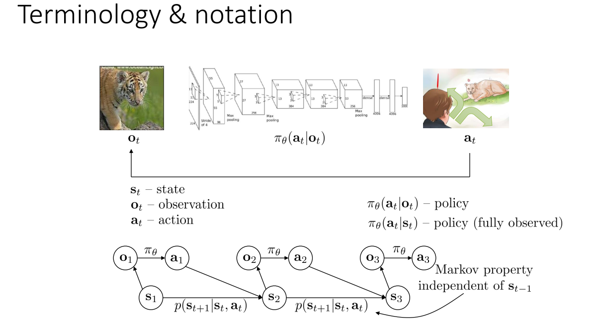
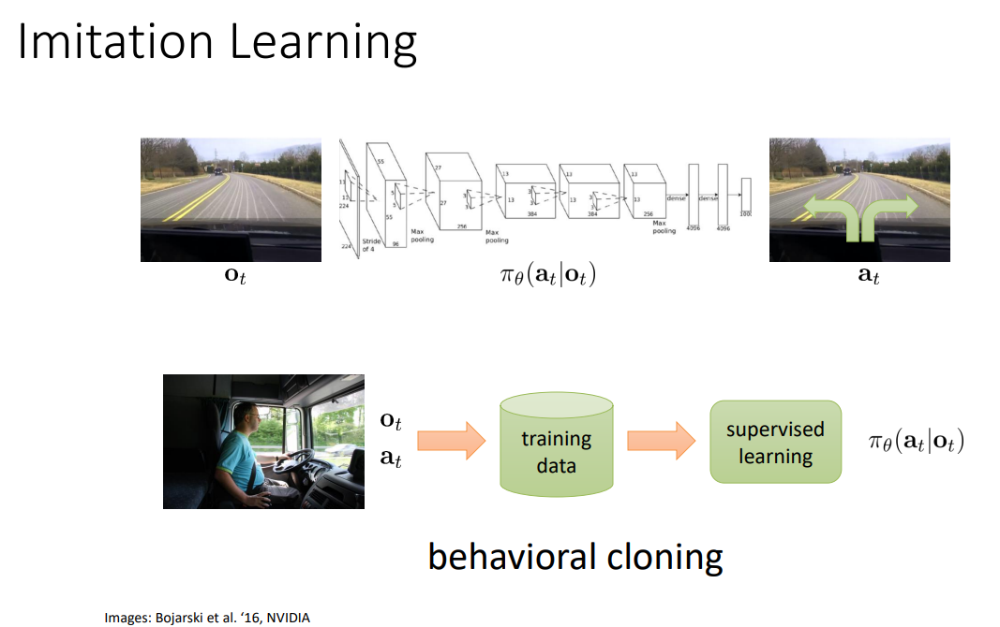
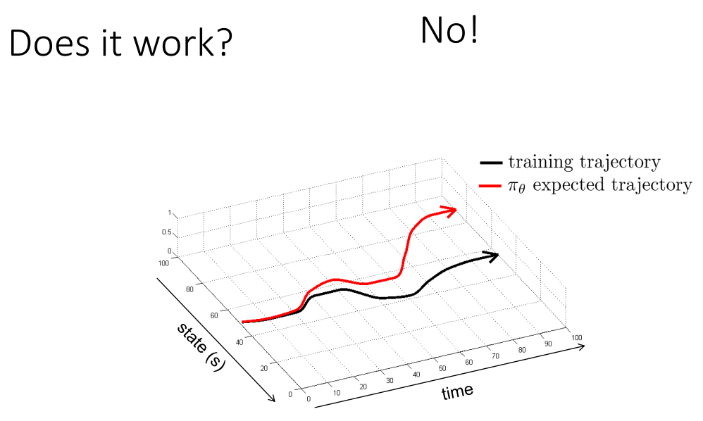
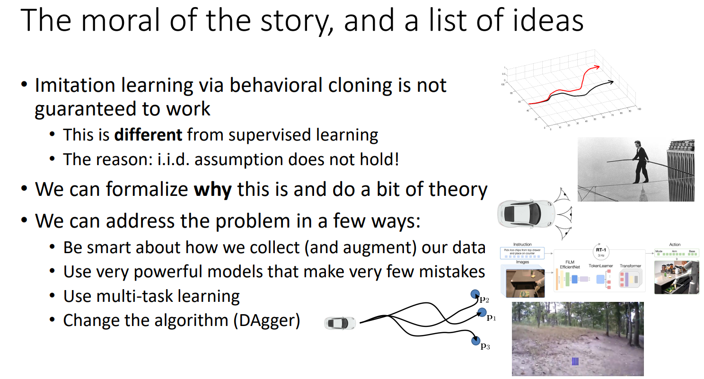
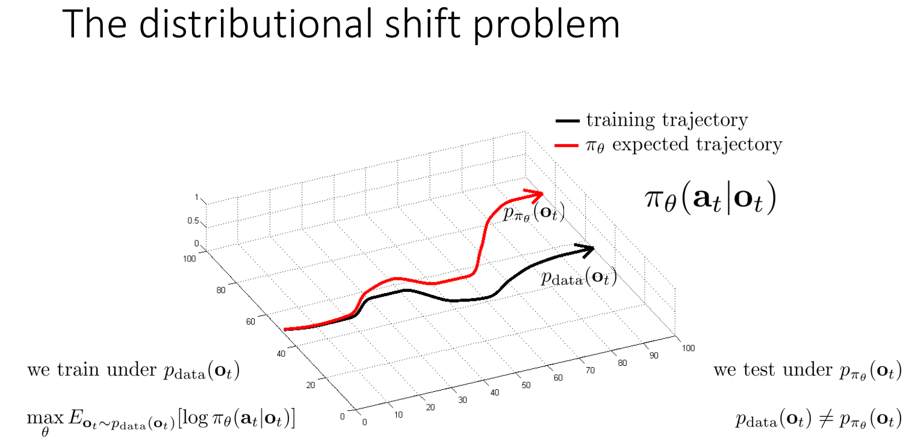
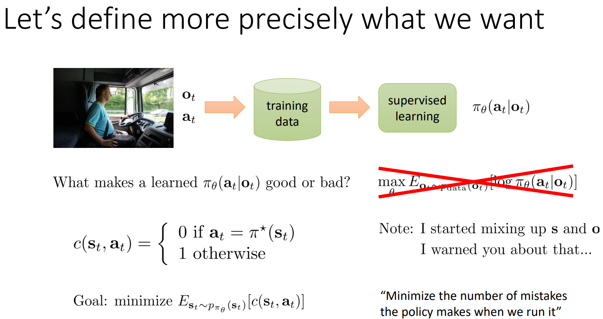
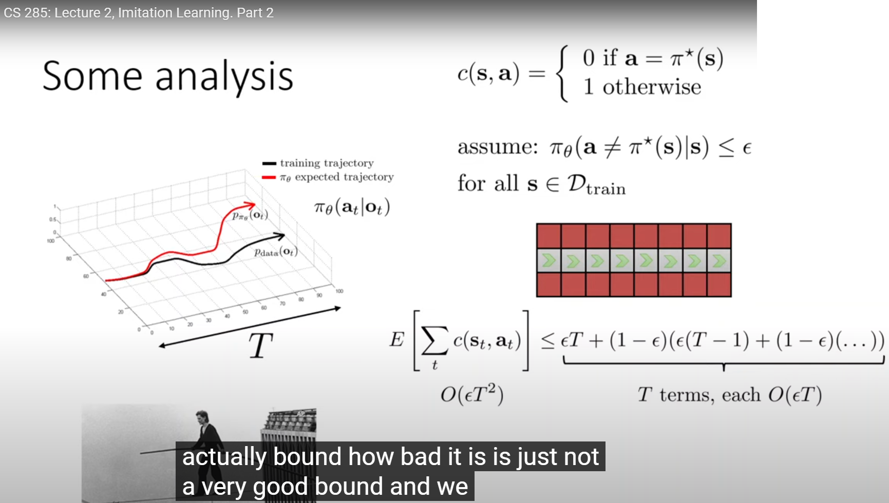
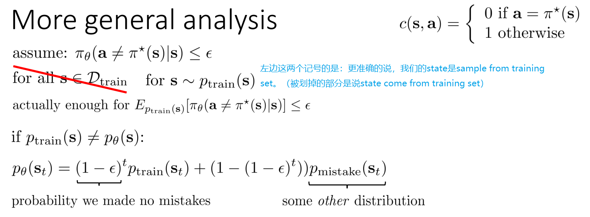

# [Lecture 2: Supervised Learning of Behaviors](https://rail.eecs.berkeley.edu/deeprlcourse/deeprlcourse/static/slides/lec-2.pdf)

[[TOC]]

Links:

- [本笔记README](./README.md)
- [video p1](https://www.youtube.com/watch?v=tbLaFtYpWWU&list=PL_iWQOsE6TfVYGEGiAOMaOzzv41Jfm_Ps&index=4)
- [video p2](https://www.youtube.com/watch?v=YivJ9KDjn-o&list=PL_iWQOsE6TfVYGEGiAOMaOzzv41Jfm_Ps&index=5)
- [slide](https://rail.eecs.berkeley.edu/deeprlcourse/deeprlcourse/static/slides/lec-2.pdf)

---

## 符号说明

- 解释了什么是state、action和observation和马尔科夫性质
  - 提到了有些算法可以处理非马尔科夫的state

## Imitation Learning

- 这里展示的是Imitation Learning的一种。
- 为什么叫behavioral cloning是因为它在模仿人类（或者其他专家）的行为

- 直接使用有可能不work，是因为DNN在学习的时候有可能make an error，但是后续的state会取决于前面的state，因此，这些小的error就会造成累积误差

## 处理behavioral cloning不work的四种方法

- 课程中用自动驾驶的例子讲述了behavioral cloning可能不work
  - 提到了三个摄像机的trick，左和右相机收集到的数据让模型知道了如果发生错误如何去correct。
  - 因此，如果collect data时包含这些correct的过程；或者我们有一个厉害的feedback Model去指示DNN进行correct，那么就可能work
- 为什么不work是因为测试数据和训练数据不是同分布的
  - 然后举出了四个方法处理这个问题

### why fail-问题的核心

Why does behavioral cloning fail? A bit of theory

- 课程把上面DNN可能犯错的问题，又进一步引申为：distributional shift
  - 这个问题是由于训练过程中policy和理想的有细微的差别，而累积错误造成的

- 定义了cost，为policy犯错的次数

$E\left[\sum_{t}c(\mathbf{s}_{t},\mathbf{a}_{t})\right]\leq\underbrace{\epsilon T+(1-\epsilon)(\epsilon(T-1)+(1-\epsilon)(\ldots))}_{T\text{ terms, each }O(\epsilon T)}\\总共为O(\epsilon T^{2})$​

- 给了一个走钢丝的极端例子，如果在某一步掉下去了，那么这个错误就会累积到最后（因为掉下去之后没法拯救）
- 那么就推出来上面的bound，是$O(\epsilon T^{2})$​
- 课程提到对这个简单模型的分析有助于我们分析其他的RL问题

$\begin{aligned}
&\mathrm{if~}p_{\mathrm{train}}(\mathbf{s})\neq p_{\theta}(\mathbf{s})\text{:} \\
&p_{\theta}(\mathbf{s}_{t})=\underbrace{(1-\epsilon)^{t}}_{不犯错的概率}p_{\mathrm{train}}(\mathbf{s}_{t})+(1-(1-\epsilon)^{t}))\underbrace{p_{\mathrm{mistake}}(\mathbf{s}_{t})}_{other\ distribution}
\end{aligned}$​

- 这里假设了犯错之后导致的distribution为一个记号，因为这个会比较复杂

### 更好的收集数据

