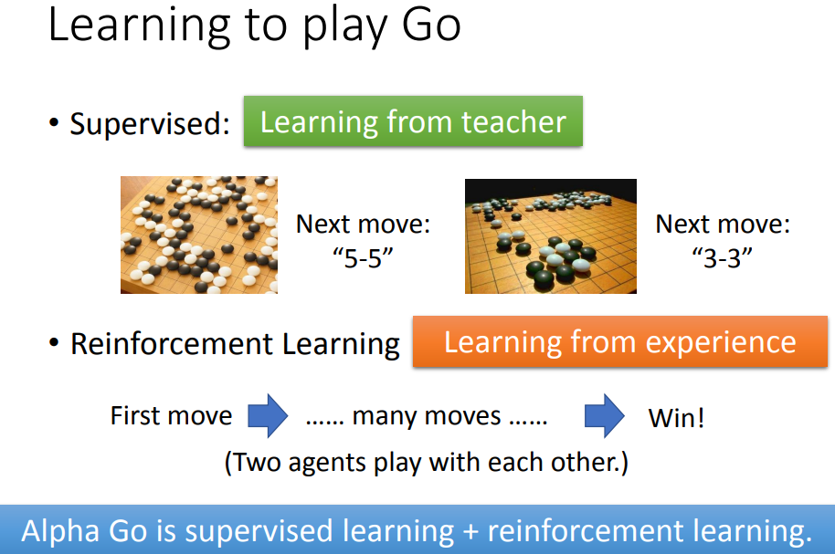
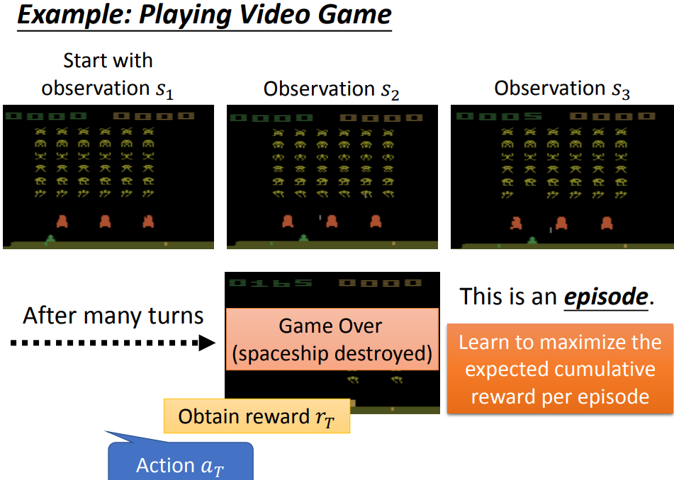
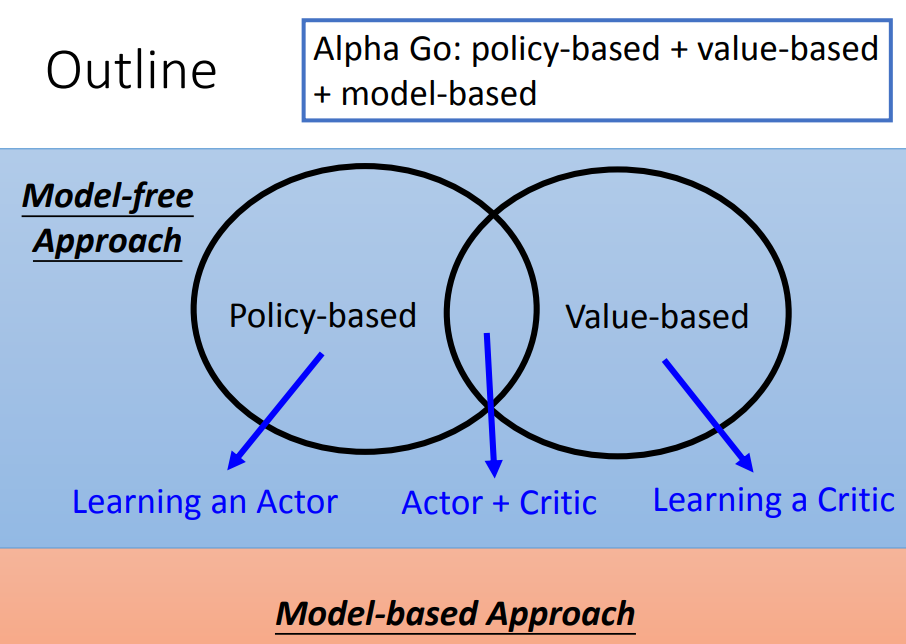
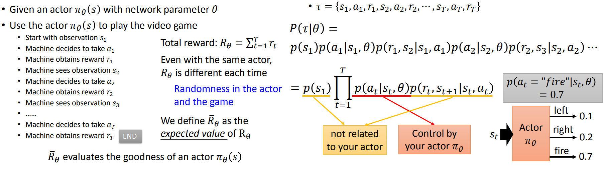
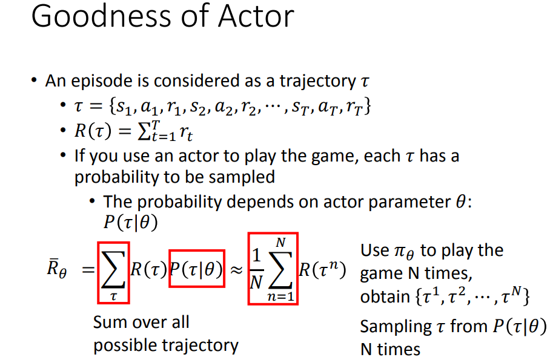
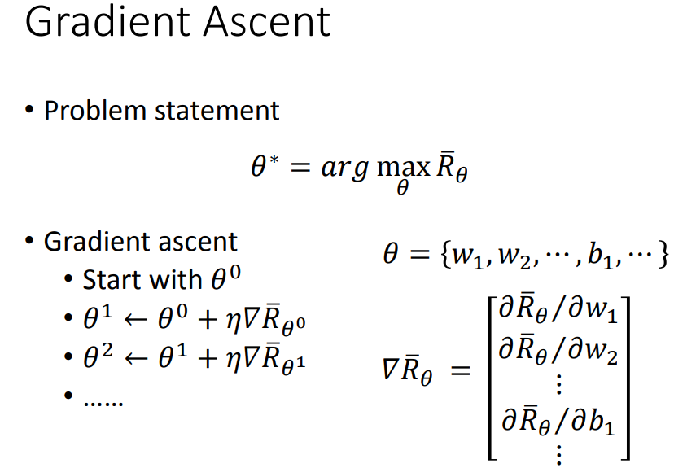

# lec1-前置课程-(2017)ML Lecture 23-1

[[TOC]]

Links:

- [本笔记README](./README.md)
- [video](https://www.youtube.com/watch?v=W8XF3ME8G2I)
- [slide](https://speech.ee.ntu.edu.tw/~tlkagk/courses/ML_2017/Lecture/RL%20(v4).pdf)

---

## 一些前置的大杂烩

课程列举的参考资料：

- Textbook: [Reinforcement Learning: An Introduction](http://incompleteideas.net/sutton/book/the-book.html) 
- [Lectures of David Silver](http://www0.cs.ucl.ac.uk/staff/D.Silver/web/Teaching.html)
  - [Deep Reinforcement Learning](http://videolectures.net/rldm2015_silver_reinforcemen)
- [Lectures of John Schulma](https://youtu.be/aUrX-rP_ss4) 

- RL其中一个难点就是reward可能是很稀疏的。

- 一个episode应该是指一次完整的采样流程。

- 课程提到了DQN的方法，以及课程当时最新的A3C方法
  - DQN
    - [Playing Atari with Deep Reinforcement Learning](https://arxiv.org/abs/1312.5602)
  - A3C
    - [Asynchronous Methods for Deep Reinforcement Learning](https://proceedings.mlr.press/v48/mniha16.html)

## policy-based简述--学习一个actor

这里的阐述遵循三步走策略：

1. 对想要学习的东西or function作出一定的假设--此处选了神经网络
2. 确定评估function好坏的标准
3. 选出最好的function/根据好坏的标准去学一个较好的function

### actor是什么

可以使用NN作为一个actor

- 输入是观察到的东西

- 输出是需要采取什么动作

  

### 如何衡量actor的好坏

- 对概率化的策略来说，一个episode是需要被采样出来的。而采样出来的一个episode被叫做一个轨迹或者一条路径。
- 我们可以定义一条轨迹$$\tau$$的return $$R(\tau)$$。
- 因为一个actor可以采样出多个不同的$$\tau$$​；因此，多个不同的轨迹的return的期望，就是衡量这个actor好坏的标准。

### 如何选出最好的actor

- 因为已经有了目标函数，我们只需要调整可学习参数最大化即可。

## value-based简述

