# lec1

[[TOC]]

Links:

- video：
  - 【强化学习纲要 第一课 概括与基础 下】 https://www.bilibili.com/video/BV1g7411Z7SJ/?share_source=copy_web&vd_source=09dacd0c6d3992d8c9216969b74b1197
  - 
- slides: https://github.com/zhoubolei/introRL/blob/master/lecture1.pdf

---

# 什么是强化学习

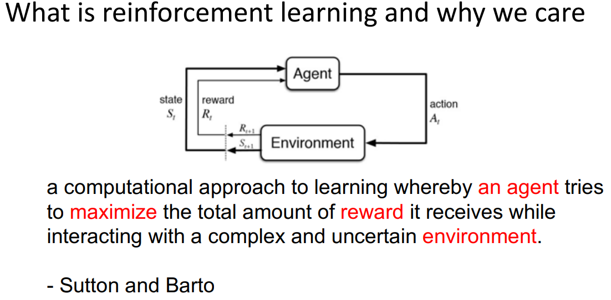

- agent在跟复杂环境的交互时，最大化获得reward

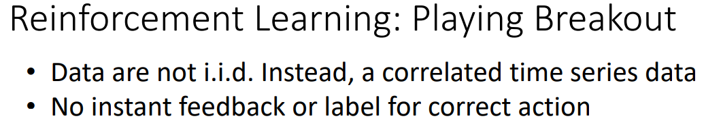

强化学习和监督学习的区别：

- 监督学习假设获取的数据是独立同分布的；而强化学习；获取的数据可能是时序的数据
- 监督学习是有标签的，强化学习可能是没有即时反馈的。
  - 强化学习存在delay reward

# 强化学习的特性

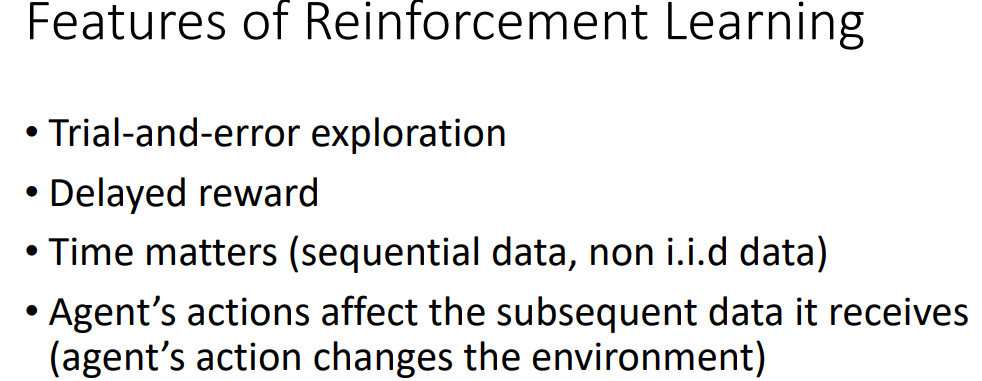

> 因为训练的样本是在训练过程中产生的，因此如何让模型的行为产出的样本能够使得模型能够在训练的过程中效果稳定提升。

# 序列决策

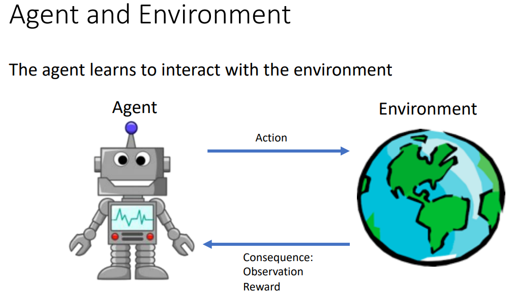

## reward

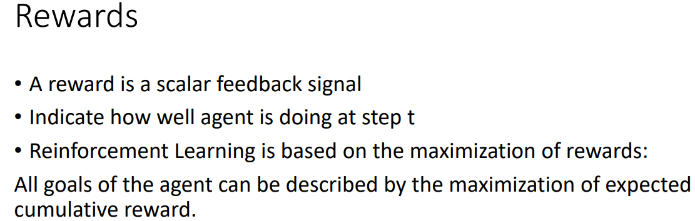

- 是一个函数，输出是一个数值量，表示agent在$t$时刻的表现。
- 强化学习是要极大化期望累积reward
  - 奖励的稀疏程度会影响学习的难度

## 序列决策的特点

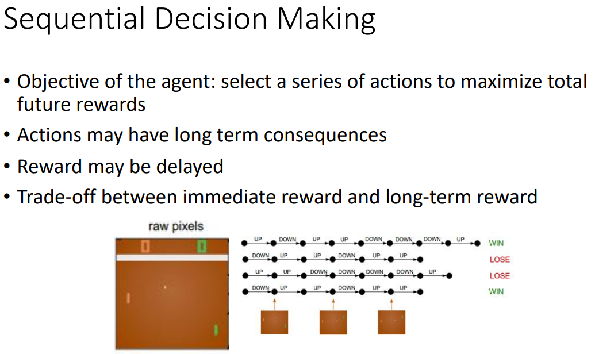

- reward是延后的
- 当前的action会造成长期的影响
- 如何平衡即时的reward和长期reward
  - 如何在当前状态判断长期reward

## Basic--基本变量

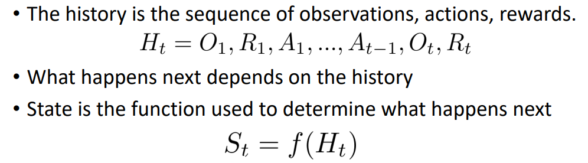

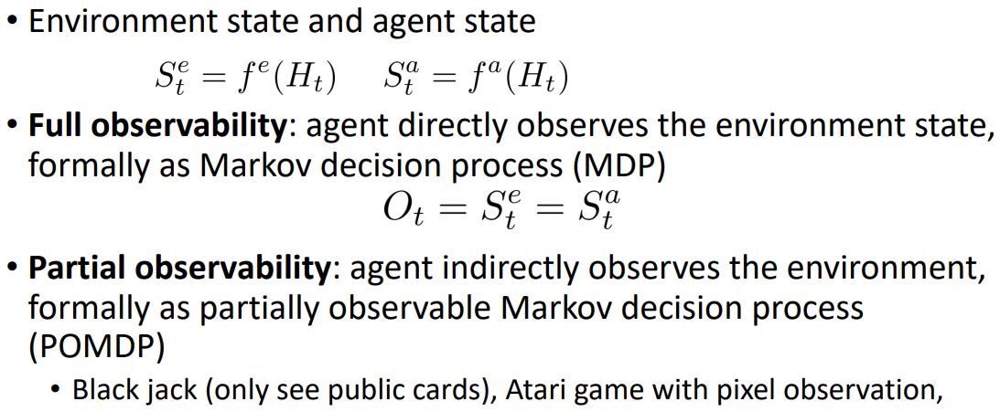

- state $S_t = f(H_t)$表征的是，在已有历史$H_t$的情况下，当前的状态是什么样的。

  - $S_t^e$表示经过历史后，当前的环境状态。同理表示agent状态、
  - 即当前状态由历史通过一个函数

- $S_t^e$和$S_t^a$这两个之间的关系，代表不同的observability。

  - $=$代表MDP
  - $\supsetneq$代表POMDP，agent不能完全观测到环境

  

  

  

## Basic--RL三个component

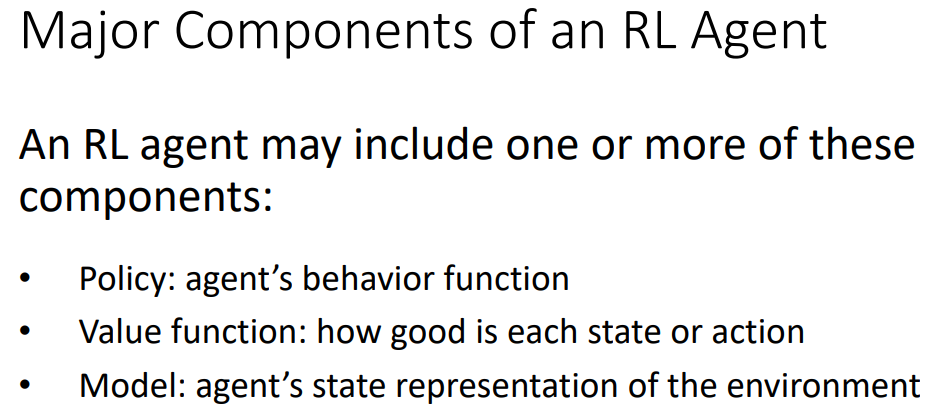

- Policy：决策函数，agent根据这个来选取下一步动作
- Value function：价值函数，agent使用这个对当前状态进行评价
- Model：agent对环境的理解？？【TBD】

### policy

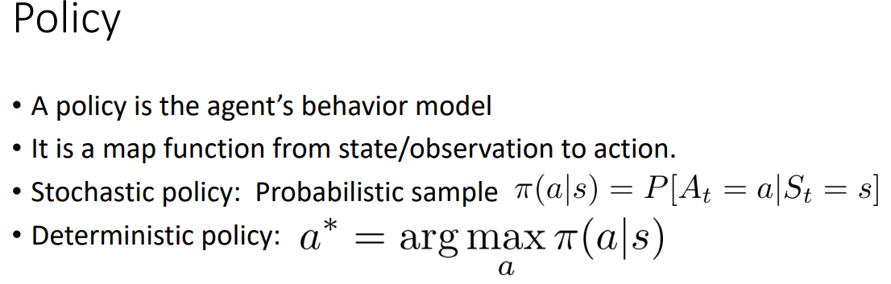

- agent根据状态，决定下一步的动作是什么
- policy也分两种：概率的和确定性的

### value function

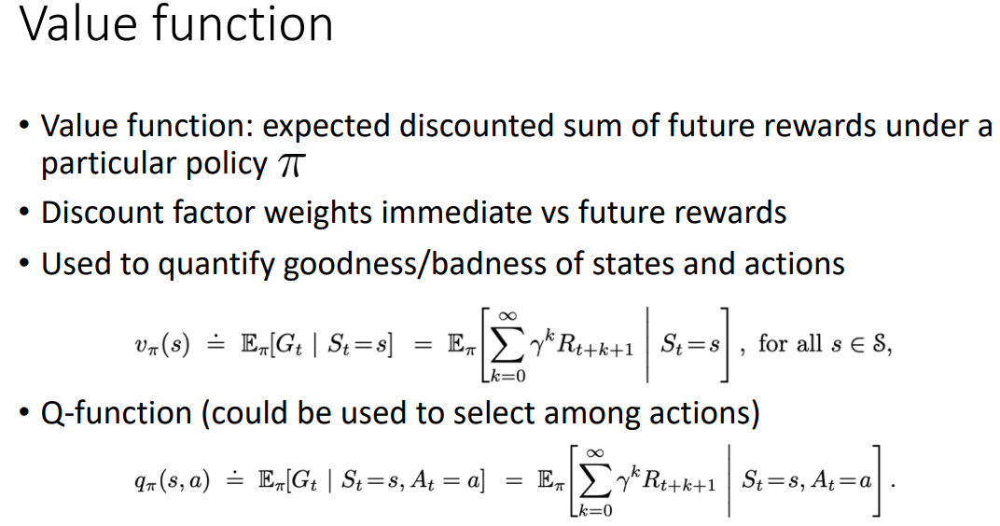

- value function是：给定某个policy，在当前状态下？对未来可能获得的奖励的dicount加权的期望
  - vaule function是从reward的角度，评估policy的好坏
- Q-function：在state和action已知的情况下，未来reward的discount加权期望
  - 知道Q函数的话，==当agent进入某个状态时，agent在这个状态的最优action可以通过最大化Q函数得到==

### model

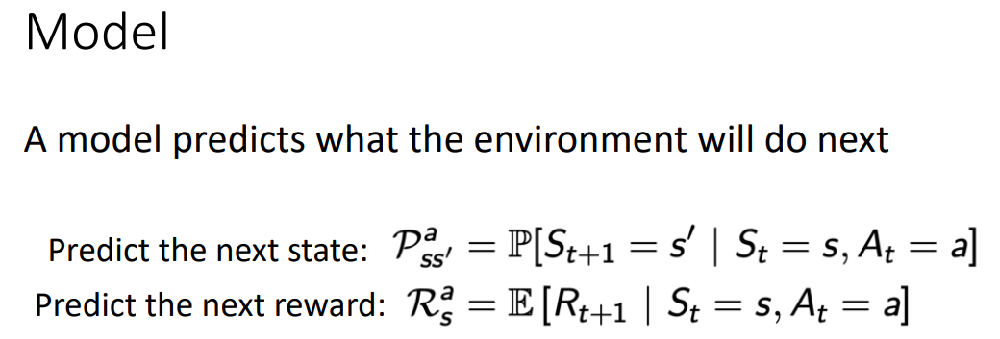

- 理解为环境模型？

- 预估当前state和action的情况下，下一个state是啥
- 预估当前state和action的情况下，下一个reward是啥
- ？用于在当前state和action计算未来？？【TBD】

## Basic--不同类型的RLagent

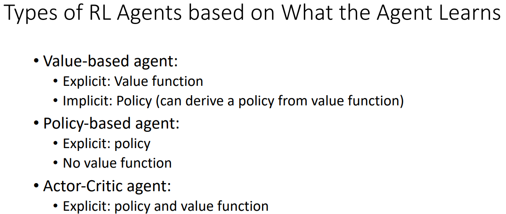

- value-based：显式学习value function，间接学习了policy
- policy-based：显式学习了policy，不需要学习value function

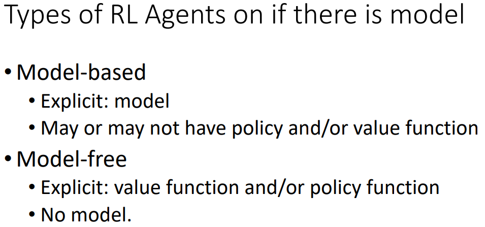

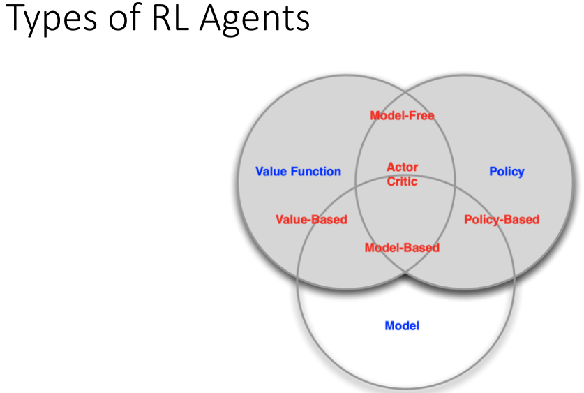

## Exploration and Exploitation·

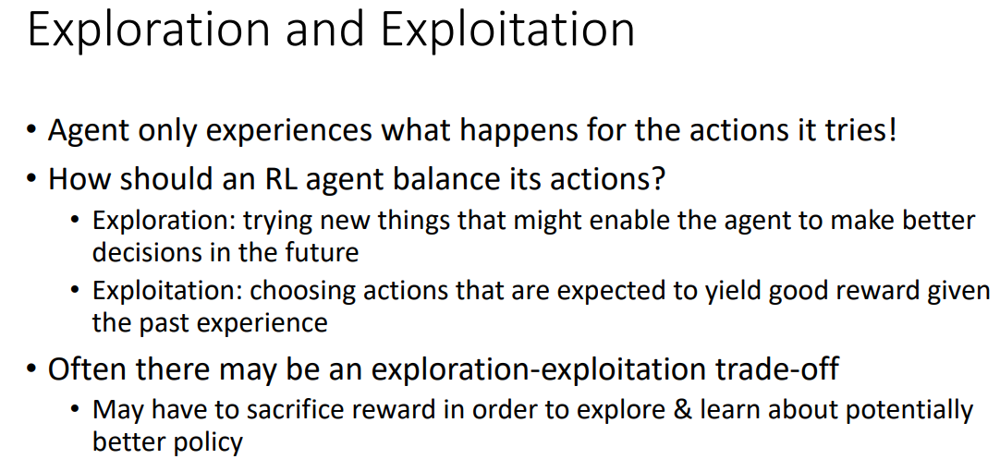
