# lec2

[[TOC]]

Links:

- video：
  - 
  - 
- slides: 

---

本课讲述：

> [!tip]
>
> - 马尔科夫基础
> - 马尔科夫链
> - 从马尔科夫链->马尔科夫奖励过程
> - 从马尔科夫奖励过程->马尔科夫决策过程

## MDP

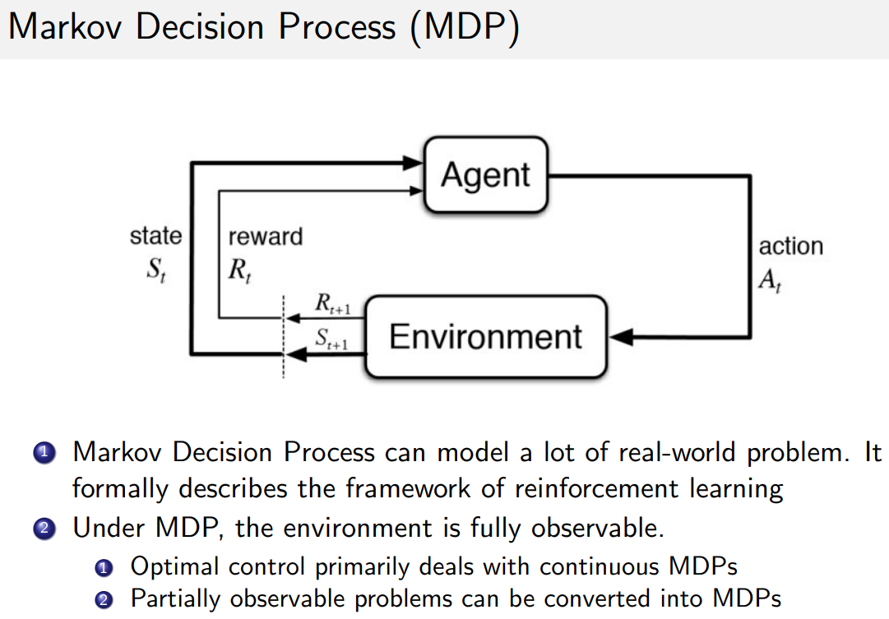

- 马尔科夫决策过程是强化学习的基础模型。
- MDP问题中，环境是完全可观测的。

## 马尔科夫相关基础

### 马尔科夫性质

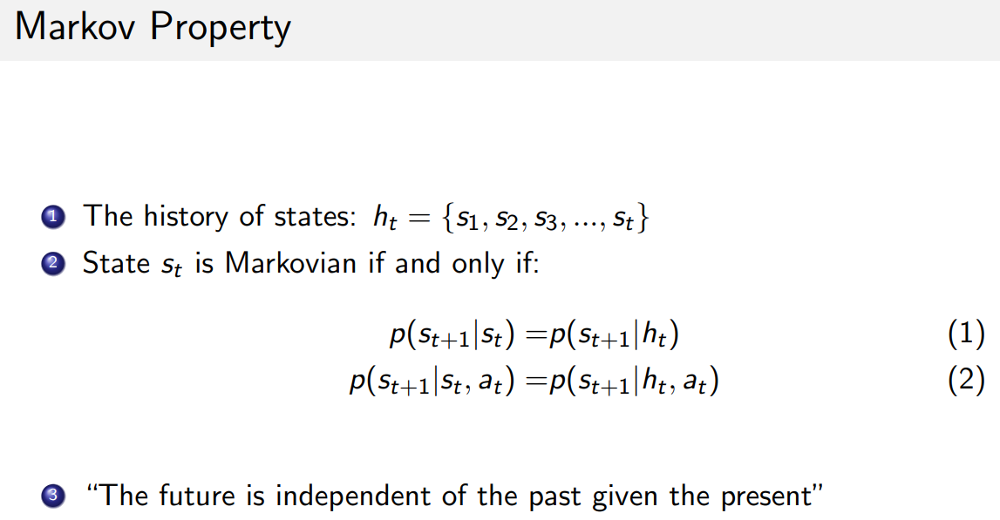

- 下一状态只取决于当前状态
- 当说某个过程具备markov property时，即意味着，下一状态与过去（除当前时刻状态之外）的所有状态独立

### 马尔科夫链和马尔科夫过程的例子

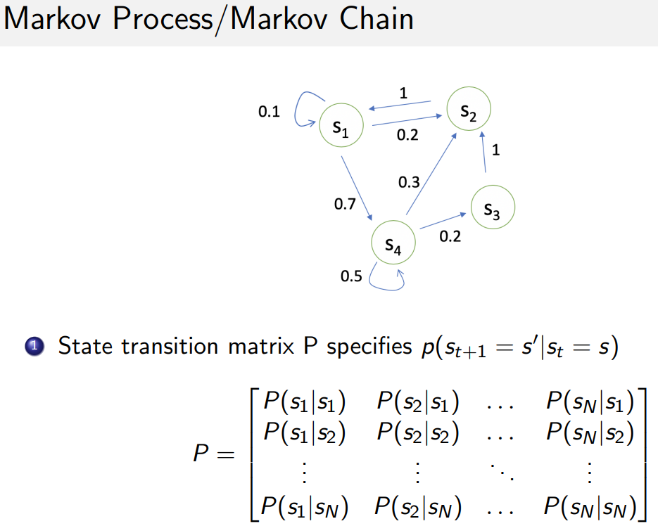

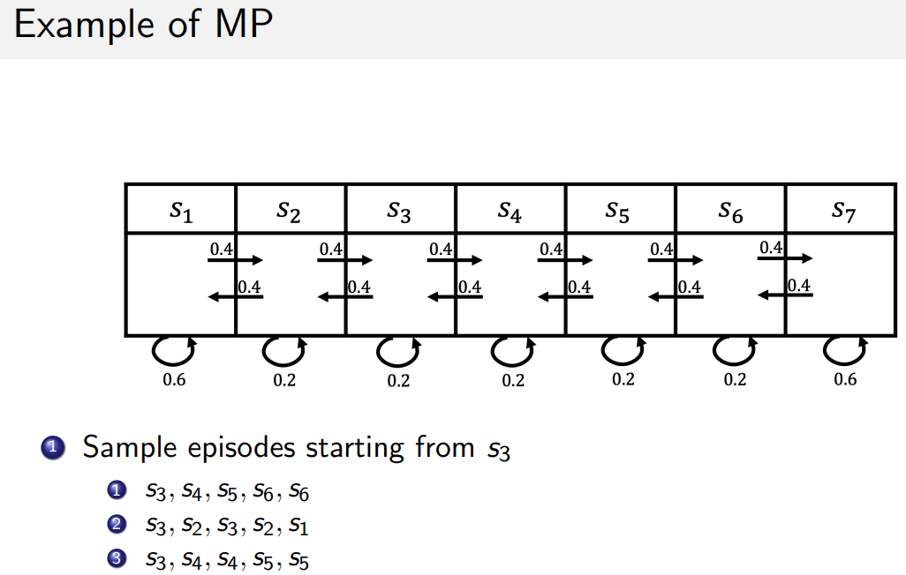

- sample episode就是从这个链上采样，可能发生的状况

## 马尔科夫奖励过程（MRP）

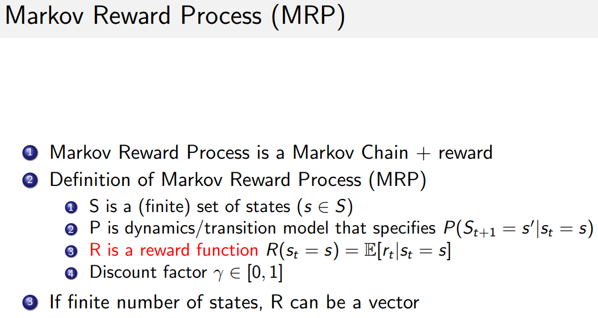

- 相比马尔科夫链多了奖励函数
  - 有限的状态
  - 定义了状态转移矩阵
  - 存在奖励函数
- 奖励函数表示：到达当前状态可以获得的奖励。
  - ？存在两种定义形式？
    - 无论从哪个状态到达该状态，奖励都是固定的
    - 奖励会根据从不同状态到达此状态而不同
- 例子
  - 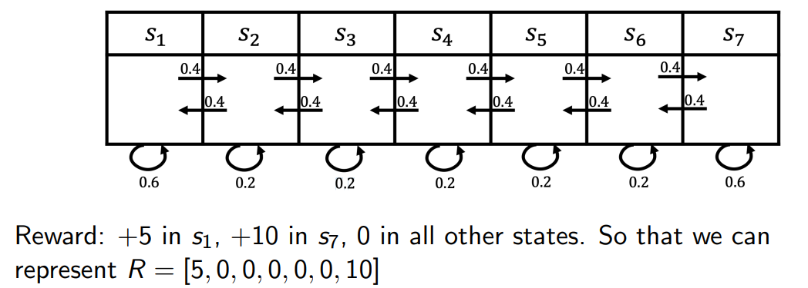

### reward Rt、return Gt、state value func Vt(s)

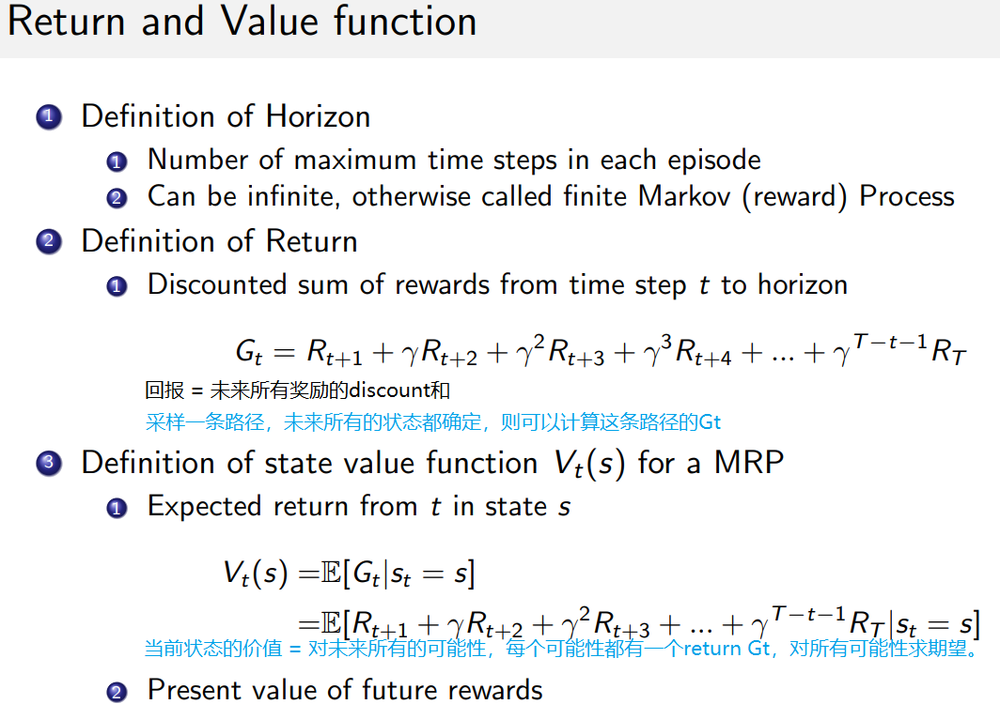

- horizion：常量，采样一次的最大步数
- return: 回报，未来所有reward的discount和
  - $G_t = \sum_{i=t+1}^{T}\gamma^{i - t - 1}R_{i}$
- state value function $V_t(s)$
  - 当前状态的期望return

### discount factor

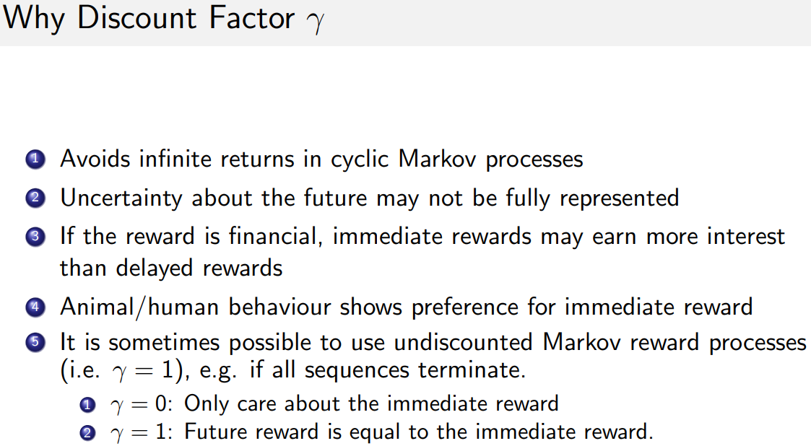

- 调和即时奖励和未来的奖励。

### 计算MRP的V(s)

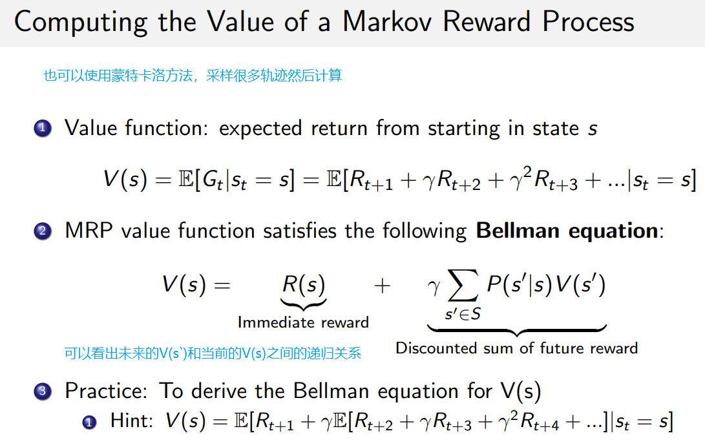

- 贝尔曼方程相关：
  - https://zh.wikipedia.org/wiki/%E8%B2%9D%E7%88%BE%E6%9B%BC%E6%96%B9%E7%A8%8B
  - 也称为动态规划方程，是DP问题能达到最优的必要条件。将最优化问题表现为一系列子问题的最优。
  

上述推导练习：

- >  [!note]
  >
  >  - 如何导出Hint?【TBD】？ 可能$R_{t + 2}$及之后和$s_t = s$无关，因此被视为常数？ 
  >
  >  -  上述展开的$$V(s)$$进行一定的变形
  >    - $$\begin{aligned}V(s) & = \mathbb{E}[R_{t+1} + \gamma(R_{t+2} + \gamma R_{t+3} + \cdots)|s_t=s] \\ & =  \mathbb{E}[R_{t+1}|s_t=s] + \gamma\mathbb{E}[(R_{t+2} + \gamma R_{t+3} + \cdots)|s_t=s]  \\ & = R(s) + \gamma\mathbb{E}[G_{t+1}|s_t=s] \end{aligned}$$
  >
  >  - 而因为$s'$实际上就是$t+1$​时刻的state:
  >    - 又由原始公式:$$V(s)=\mathbb{E}[G_t|s_t=s]$$
  >    - 得出$$\begin{aligned}V(s') & = \mathbb{E}[G_{t+1}|s_t=s'] \end{aligned}$$
  >
  >  - 因此：
  >    - $$\begin{aligned}V(s) & = R(s) + \gamma\mathbb{E}[G_{t+1}|s_t=s] \\ & = R(s) + \gamma\sum_{s'\in S}\mathbb{E}[G_{t+1}|s_t=s']p(s\rightarrow s') \\ & = R(s) + \gamma\sum_{s'\in S}p(s\rightarrow s')V(s')\end{aligned}$$

矩阵形式：

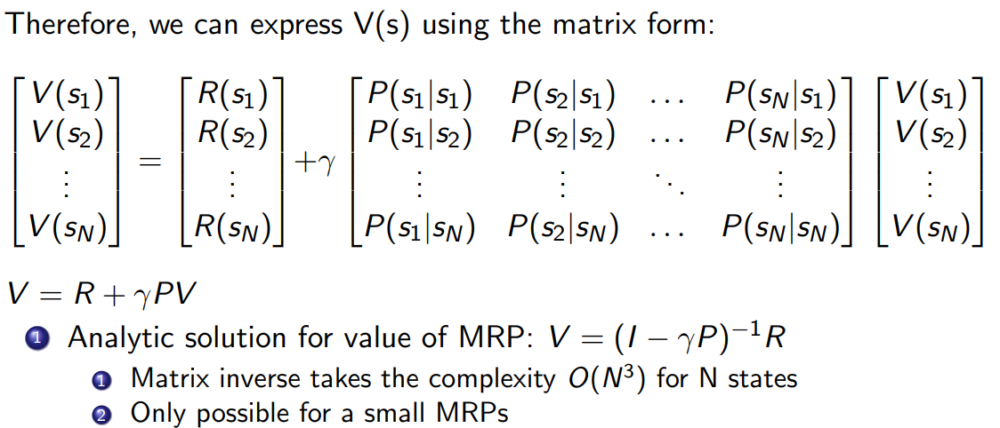

### 求解的三种方法

- 动态规划
- 蒙特卡洛
- Temporal-Difference learning

## 马尔科夫决策过程（MDP）

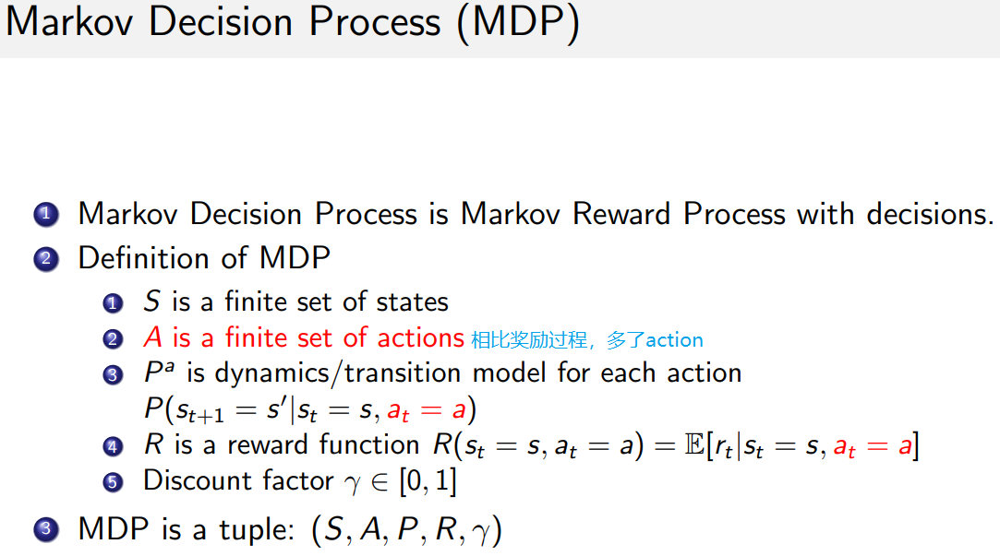

### policy

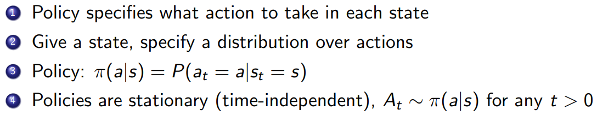

- policy决定了在给定状态下，采取什么行动
  - 可能是确定性的，也可能是概率的
  - ==重要假设==：policy是稳定的(stationary)

### MDP->MRP

- 给定policy时，MDP可以转换成MRP
  - 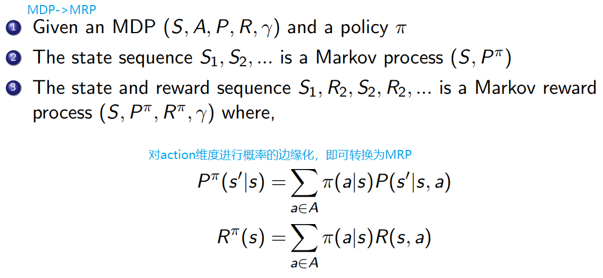

- MDR和MRP对比：
  - 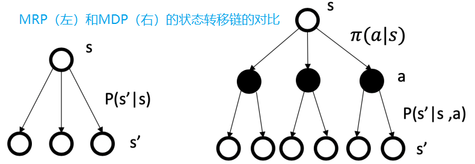

### value func和action-value func

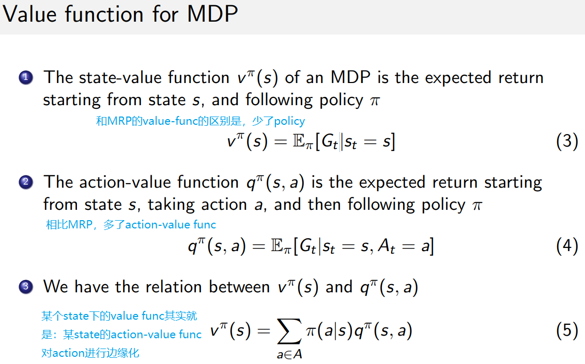
