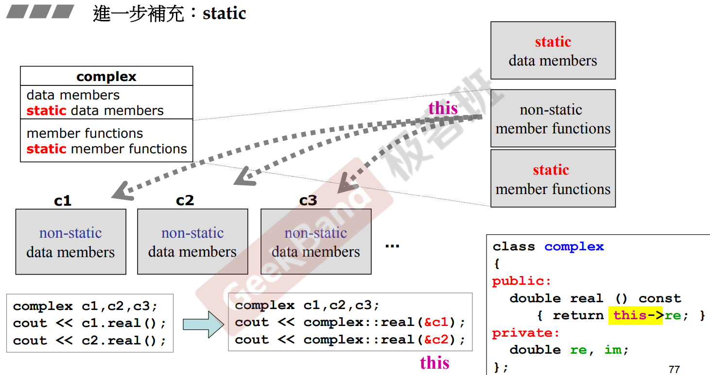
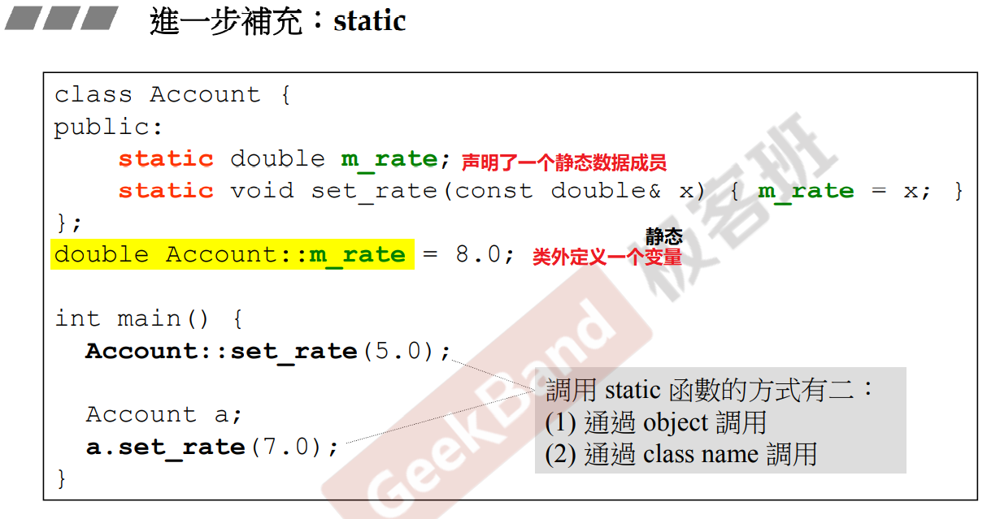
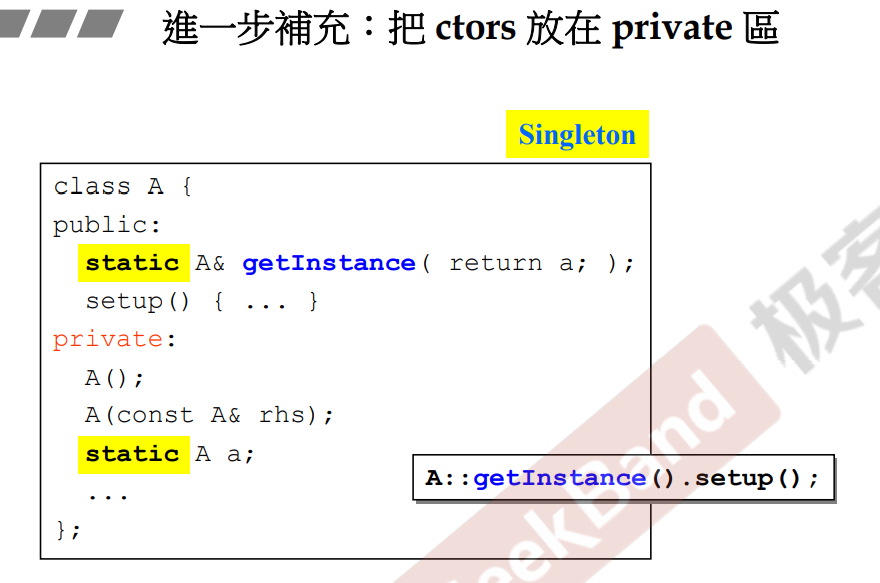
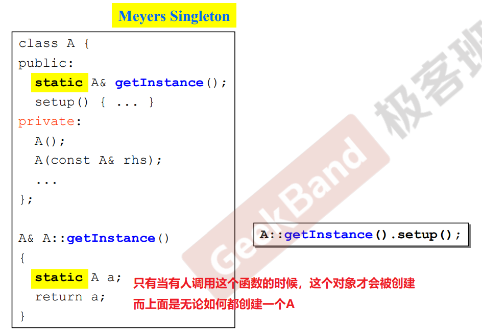
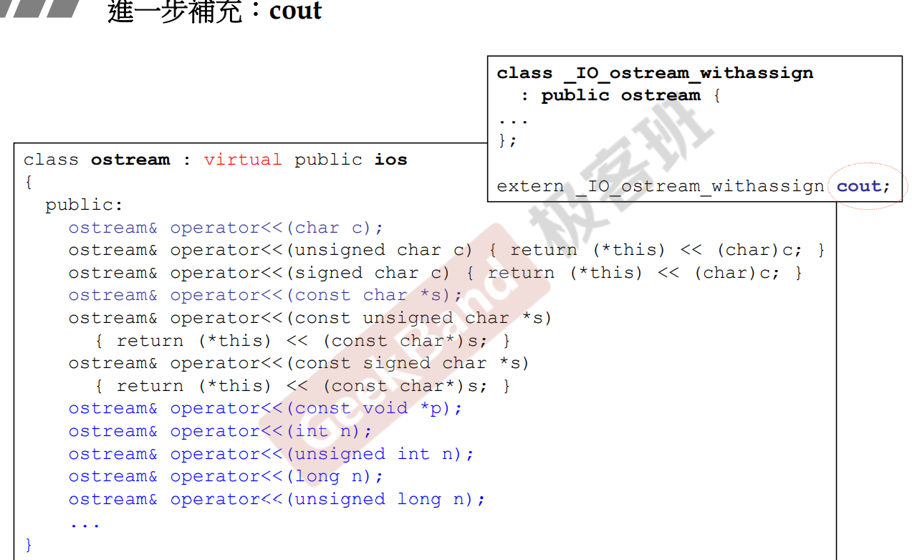
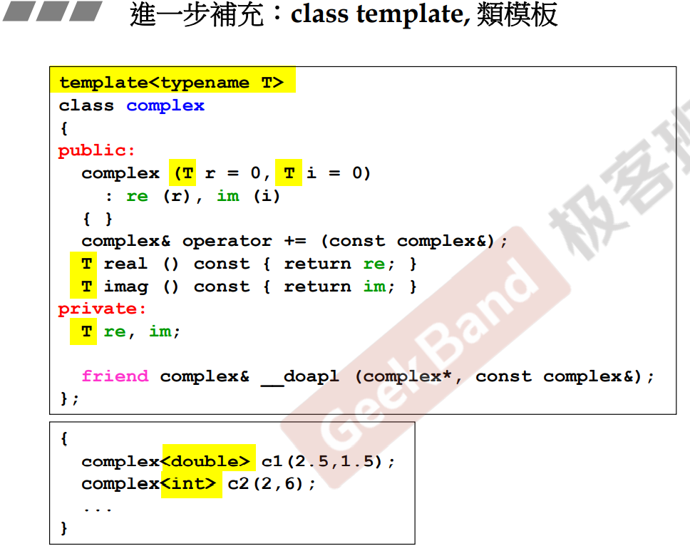
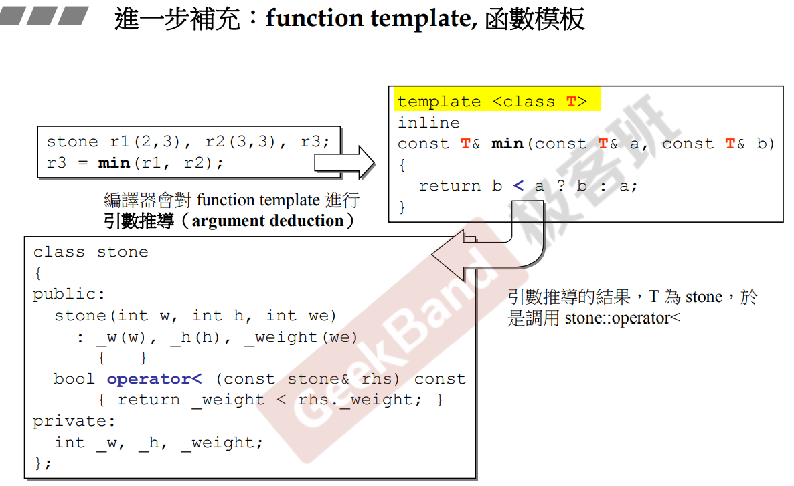
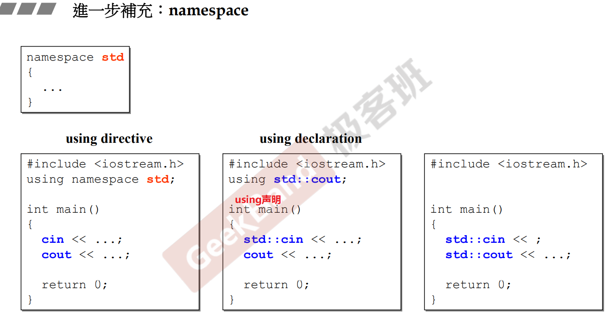

# 补充：类模板、函数模板及其他

[[TOC]]

## 1.静态

- static的数据成员是不属于对象的
- static的数据成员只能被静态的成员函数访问
  - 静态的成员函数没有this指针

### 单例与静态

- 外界只能通过getinstance来访问a

  

## 2. cout可接收的数据

## 3. 类模板和函数模板

- 使用函数模板的话，编译器会进行参数的推导

## 4.命名空间

