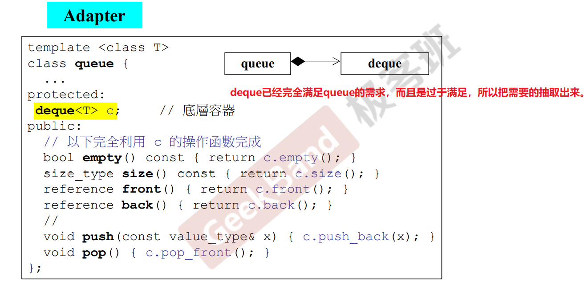
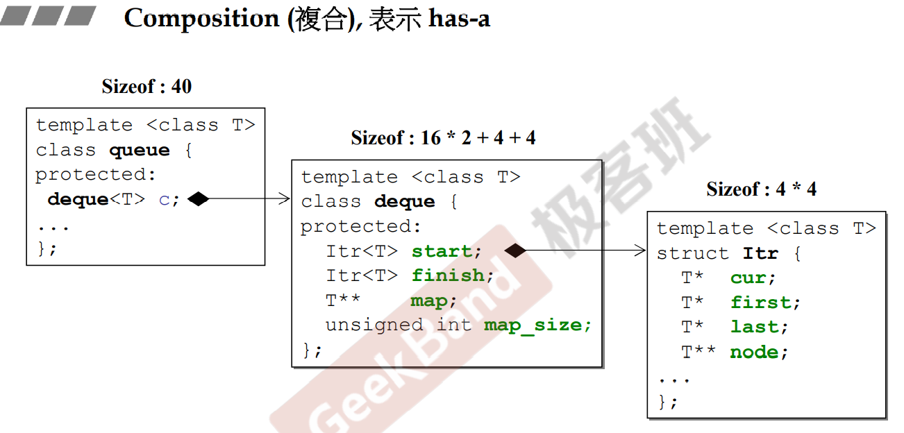
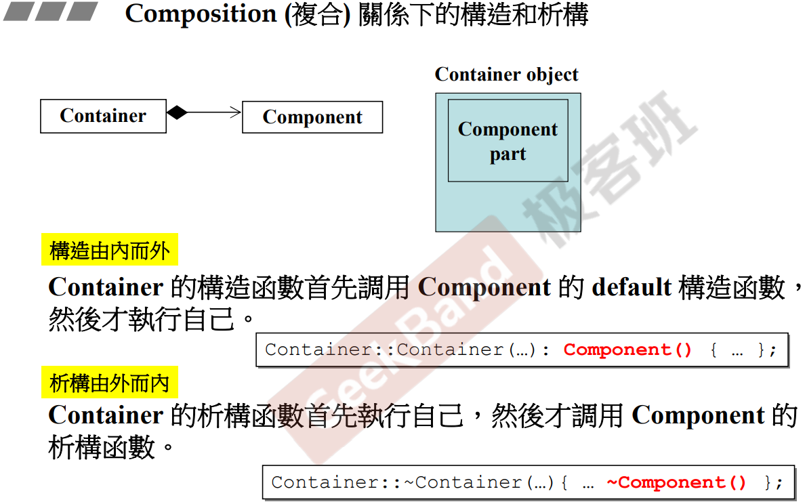
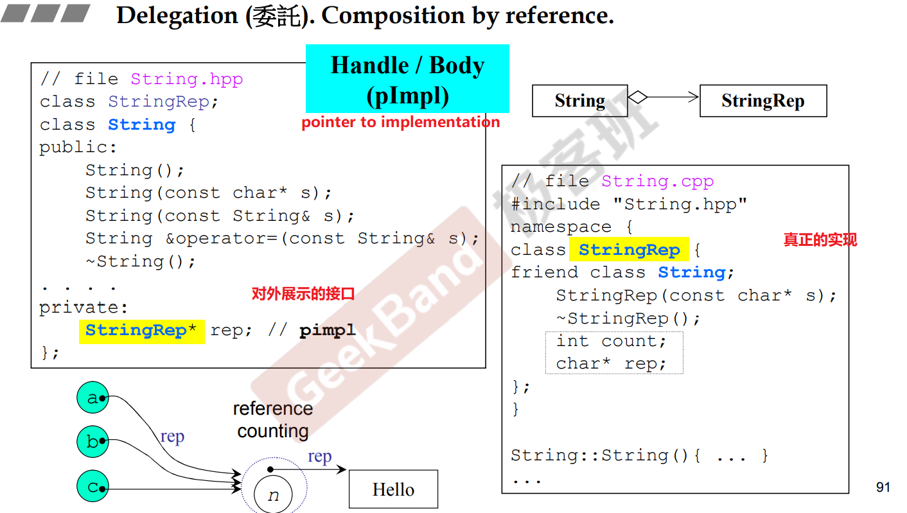
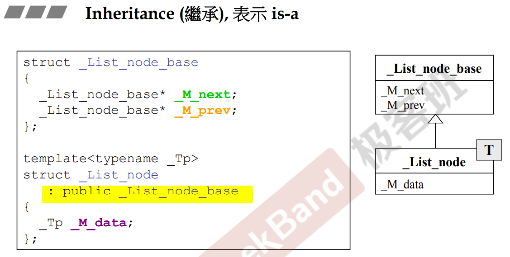
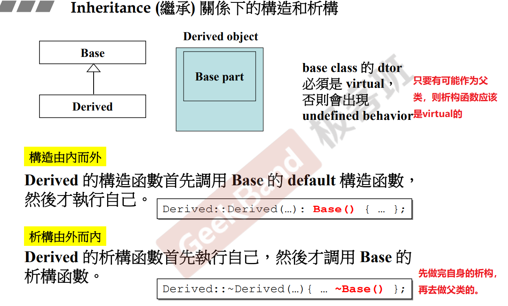

# 组合与继承

[[TOC]]

## 0.类之间的三种关系

- Inheritance (繼承) 
- Composition (複合) 
- Delegation (委託)

## 1. Composition -- has - a的关系

其实普通的class里面存在别的class就是has-a。无论是自定义的class还是语言已经定义好的class。因此，复合关系是非常普遍的。

- 从内存的角度

- 默认构造，由内而外。如果不显式写出初始值列，则初始值列其实就是调用默认构造函数。

## 2. Delegation 委托

- Composition by reference
- 委托的双方生命周期是不同步的

- 编译防火墙：
  - 哪怕改动，只有右边是需要编译的，左边是不需要的

- 上面的例子还展示出了一种共享的特性，方便使用reference counting。
  - 如果只是拷贝一个内存完全一样的string。那么完全可以使用引用计数去进行共享，节省内存。
  - 如果想改动内容则copy on write。即当改动的时候，才真正拷贝一个副本去进行变动。

## 3. inheritance 继承

