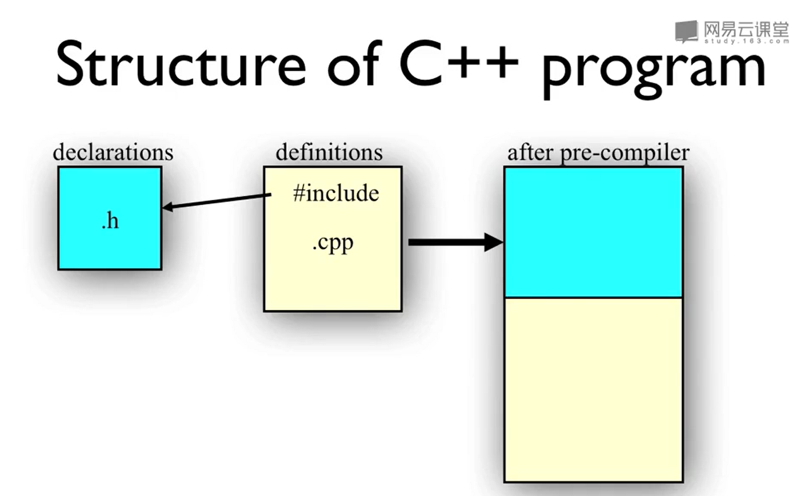
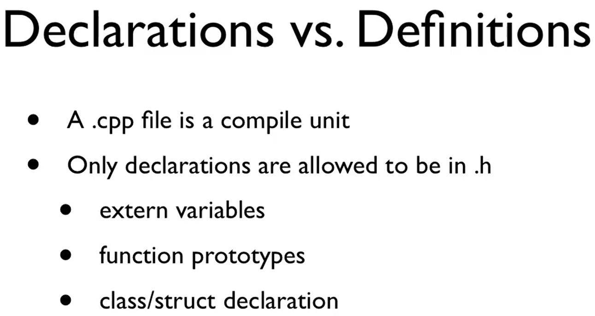

# C++头文件

[[TOC]]




## .h 和 .cpp

- 在头文件中声明类以及类的成员函数
  - 声明就是向编译器承诺，在某个地方我会定义这个东西。
- 在CPP的文件中定义类以及成员函数



- 必须要在定义以及使用类/函数的CPP文件中，include这个头文件


## include 

### 作用

- #代表编译预处理指令，在编译预处理阶段，#include会把需要被include中的代码以及当前的代码合并成一个大的代码文件。
- 因此，include的作用就是把需要的代码插入到需要的地方

### <>和“”的区别

- “”首先到当前的目录(cpp所在的目录)去寻找文件
- #include<.h>首先到编译器认定的系统存放头文件的目录去找。比如可能是/user/include/
- #include<> 和上面那个一样，但是iostream是有两个版本的，一个有.h一个没有

### 条件编译--头文件的防卫式声明

不进行条件编译容易产生重复定义。

```c++
#ifndef
#define 宏名字
...
#endif
```


## 编译生成文件

- .ii 合并后的代码文件，给编译器做编译
- .s 汇编代码
- .o 目标代码
- .out 生成的可执行文件


编译的时候是单元编译，也就是每个CPP是单独编译的。每个cpp会形成单独的.ii .s .o输出文件。
