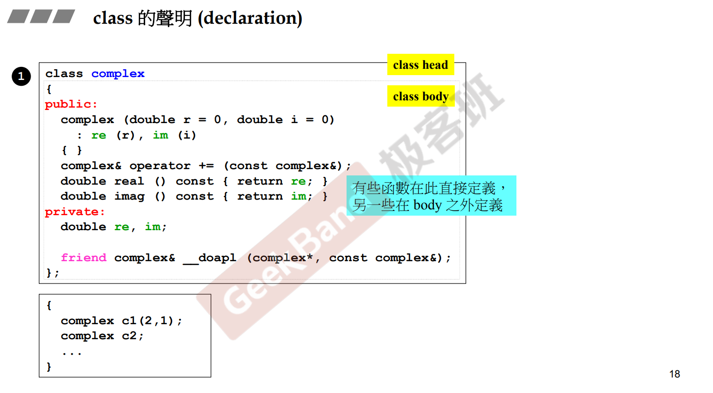
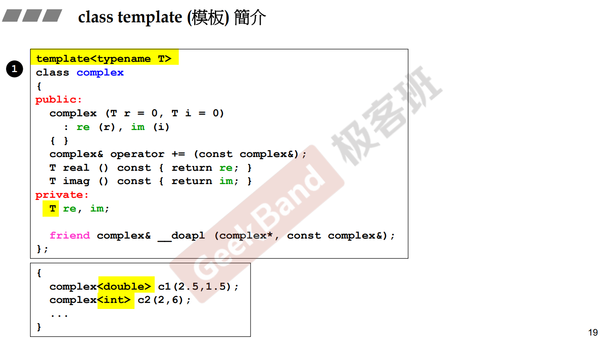
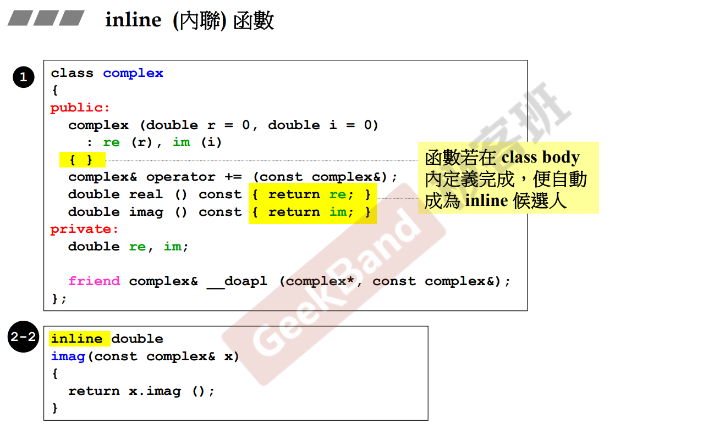
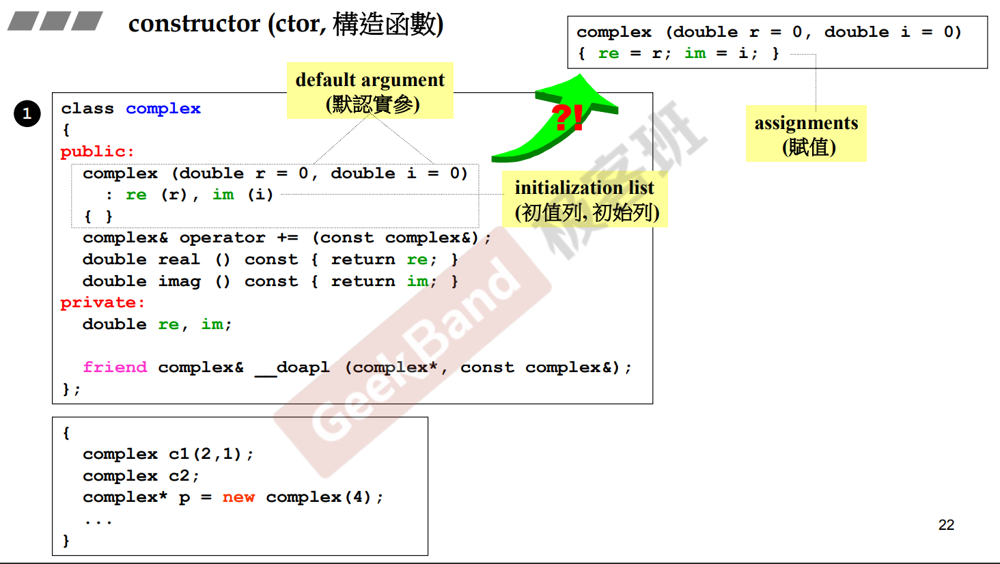

# 构造函数

[[TOC]]

## 类的声明

## class的内联函数

- 本体内定义会建议编辑器这个是inline
- 类外定义加入inline也是建议编译器进行内联

## 构造函数

- 函数名和类名一样的，没有返回值的函数，是构造函数。
- 构造函数推荐使用 **成员初值列(member initialization list)**，对所有的类成员进行初始化。
  - 使用成员初始值列，是对成员进行初始化
  - 如果在构造函数体内用等号进行赋值，则是赋值，而非初始化
