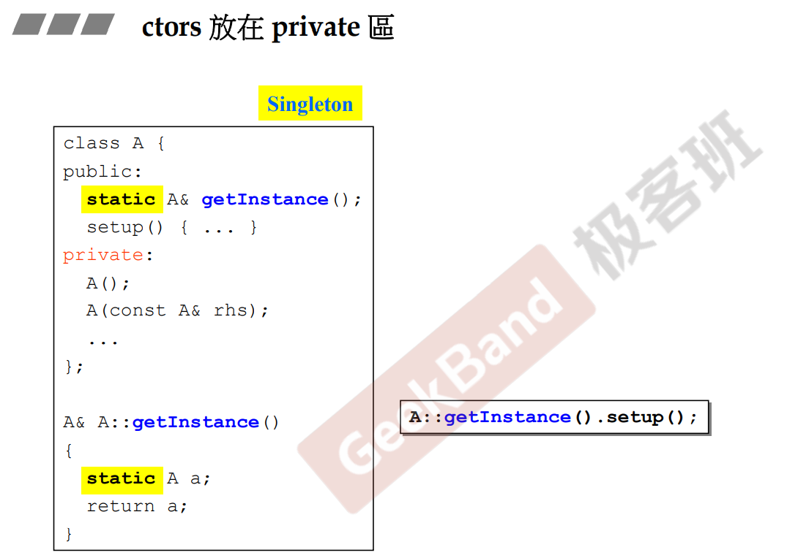
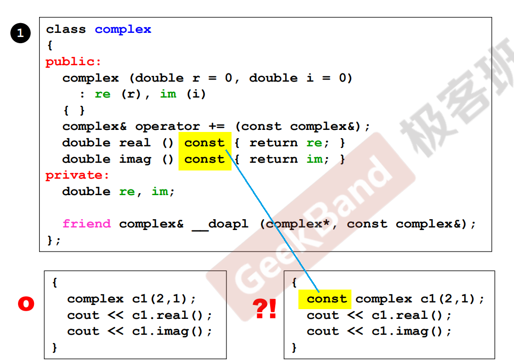
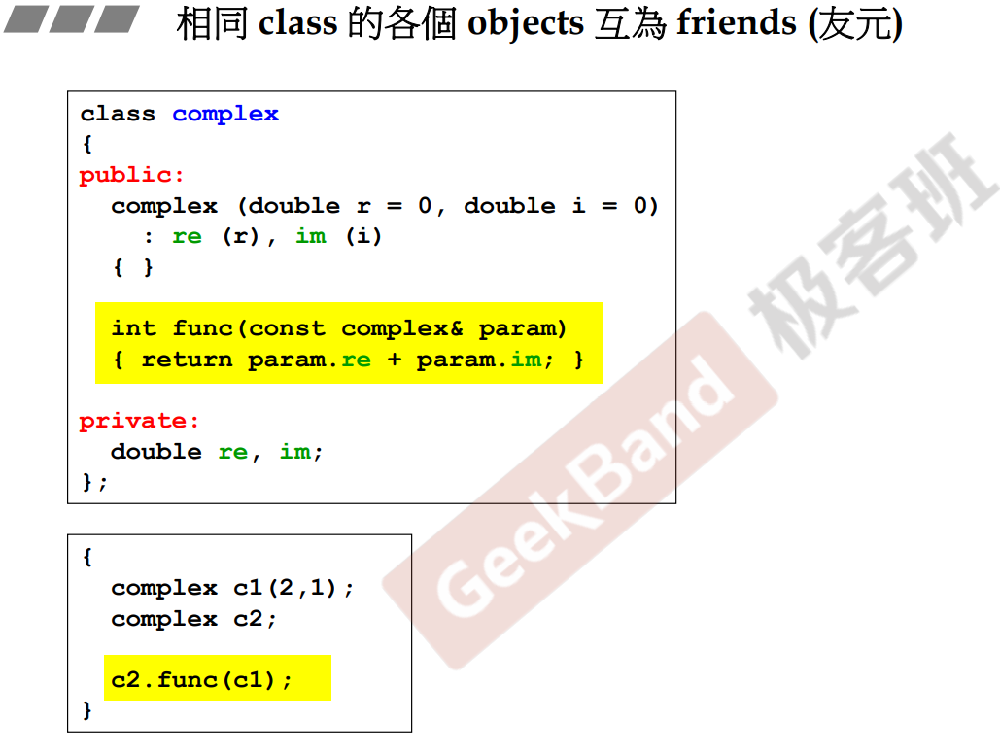

# 参数传递与返回值

[[TOC]]

## 构造函数是否能放在private区

- 当不想被外界创建这个类的对象的时候，可以将构造函数放在private区域
- 常在单例模式下使用

## 常成员函数

- const member function
- 类的成员分为两种
  - const: 不改变类对象的数据
  - 非const：会改变
- 如果只是访问类的数据成员，最好加上const
  - 否则，当定义了一个const的类对象；而后想访问它，如果访问的函数不是常成员函数，则会出错。

## 参数的传递

- 可以的情况下尽可能传递引用
- 如果不改变记得传递常引用

## 返回值的传递

- 可以的情况下尽可能传递引用
- 如果返回的是局部变量，则不应返回该局部变量的引用或者指针

## 友元

- 被friend的函数，函数可以自由取得friend它的对象的private成员
  - friend是对函数还是对对象的？
- 相同class的各个对象互为friend

