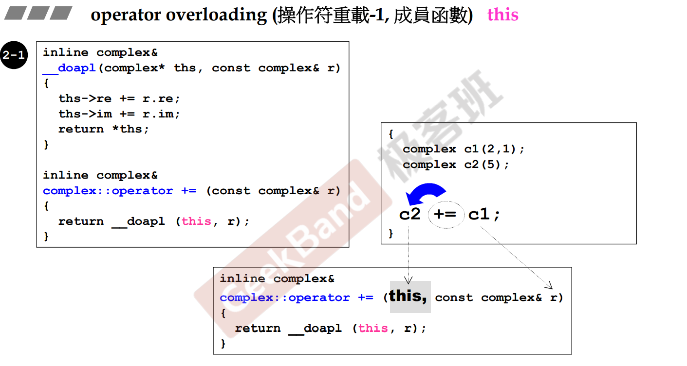
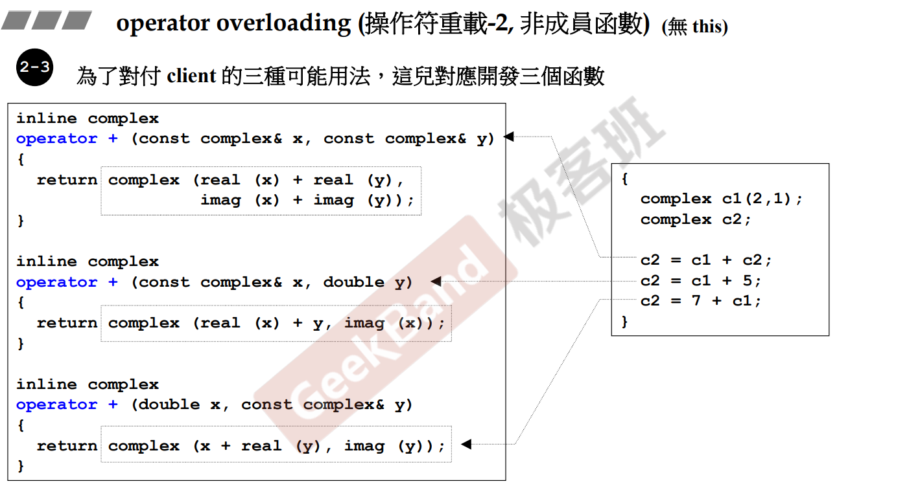
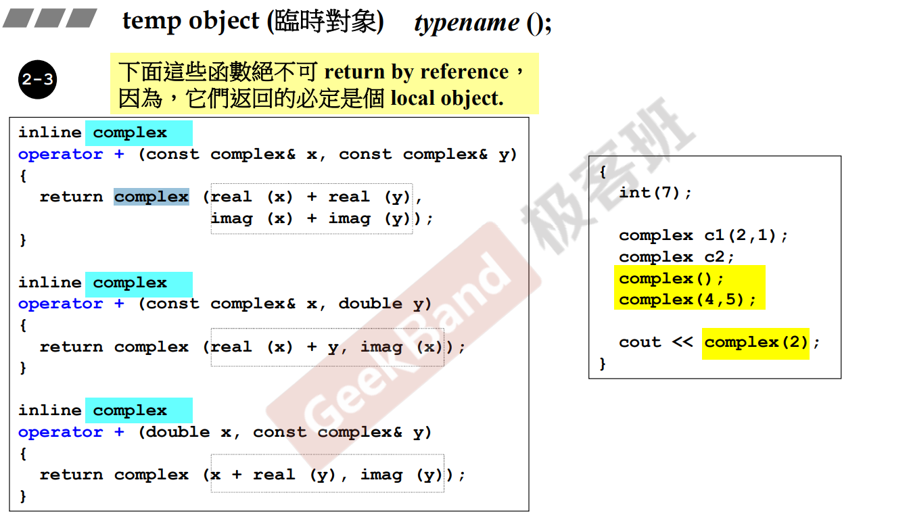
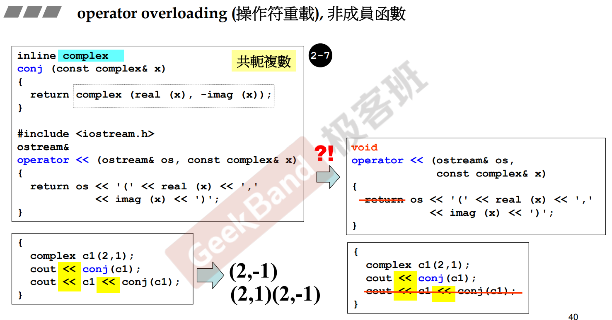

# 操作符重载与临时对象

[[TOC]]

- 在C++中，操作符就是函数

## 操作符重载--操作符为成员函数

- 所有成员函数隐式的带着this这个参数
- this参数指向调用这个函数的对象
- 如果是二目运算符，编译器会寻找操作符左边的对象的成员函数，并调用左边对象的成员函数，作用于左边的对象

## 操作符重载--操作符不是成员函数

- 创建了临时对象就不能返回临时对象的引用
- **typename() 为创建临时对象，如int(1)创建一个为1的临时int类型的对象**

## 重载<<

- << 其实是把右边的东西写入标准输出流
  - 如果没有返回值，则不支持连续调用<<了
