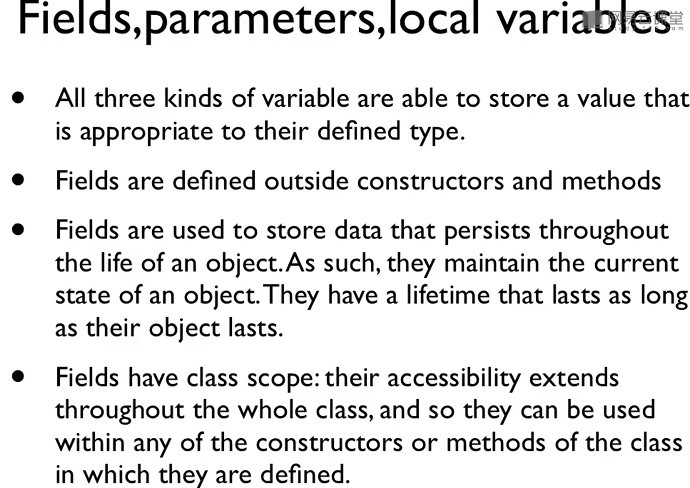
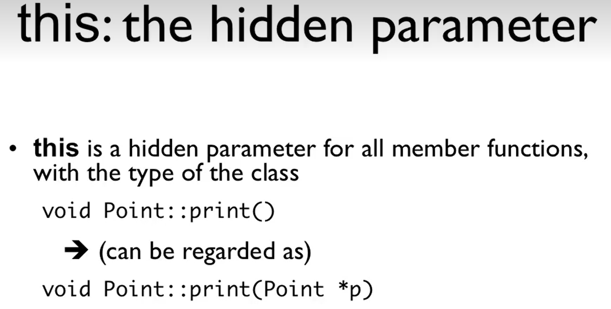
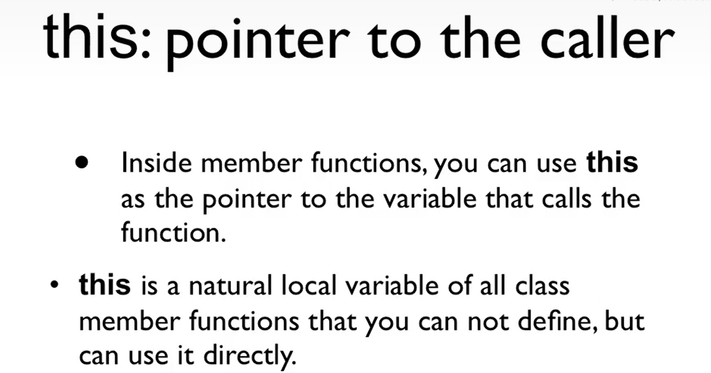

# 类的成员变量

[[TOC]]


## 成员变量、函数参数、局部变量

- 函数参数和局部变量是相同的
  - 只是他们存在于堆栈的地方不同（？？）
  - 在进入函数之前，这些变量都不存在。
  - 进入函数之后，函数参数和局部变量就存在了。
  - 他们作用域相同，声明周期相同。

- 若函数中存在和成员变量重名的局部变量，则当前访问的其实是局部变量，而非成员变量。

  - 即变量的就近原则

- 成员变量：

  - 在类的声明时被声明，但是那个不是定义。（看下面的代码）
    - 成员变量不属于类，而是属于对象的。即这个成员变量是定义给对象的。
    - 在用这个类去定义变量的时候，这个成员变量就定义为了那个变量的成员变量了。

  - 作用域：在类的所有成员函数中可被访问。



```C++
class A{
    private:
    	int i; // 这里只是声明了一个成员变量i，但不是定义。
    public:
    	void f();
}

A a; //这里定义了一个A的对象a，也定义了a.i
```

## 成员函数

- 成员函数是属于类的，而不是属于对象的。
  - 其实就是要阐述一个概念，对于每个对象来说，他们的成员函数都是类的那些成员函数。
  - 而对于成员变量来说，每个成员变量都是不同的。
  - 那成员函数怎么知道它在操作哪个对象呢？其实就是this指针了。




