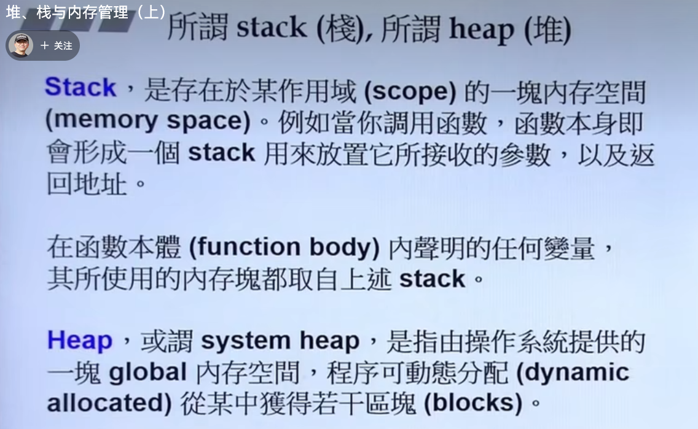
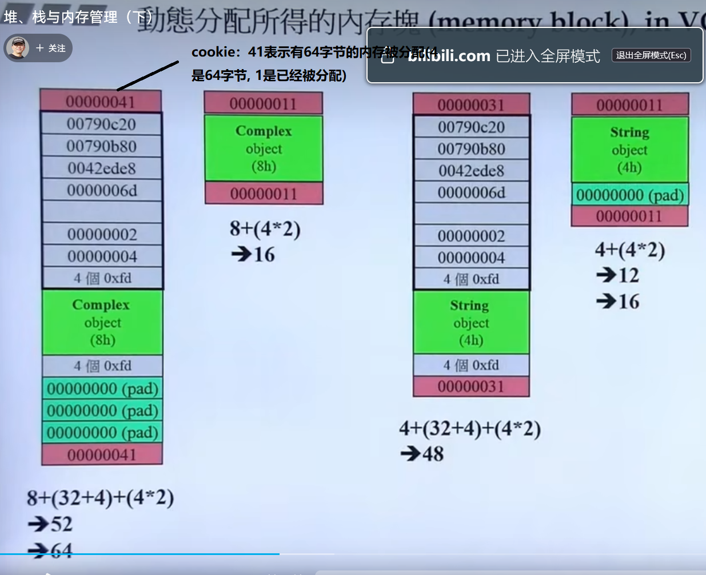
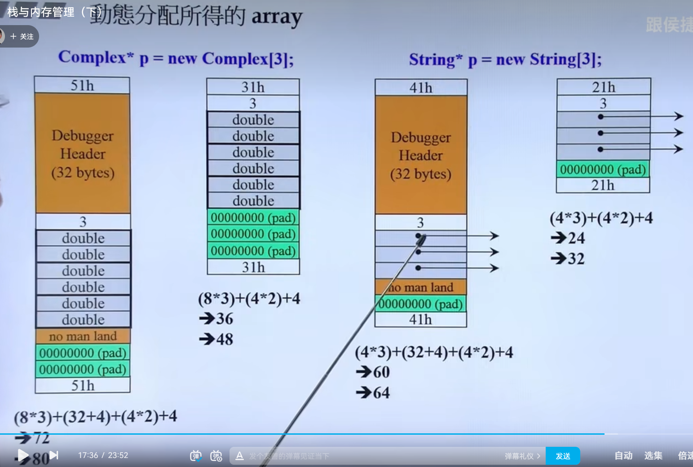

# 堆和栈

[[TOC]]



## stack object

- 在作用域结束的时候，对象的析构函数被调用，内存被释放。
- static local object 声明在作用域结束的时候还存在，直到整个程序结束的才会结束。
- global object，不再任何一个大括号内，生命周期是直到整个程序结束的才会结束。

## heap object

- 其生命从内存分配开始，到手动内存回收为止
- 如果不手动进行回收，则会发生内存泄露。
  - 即指向某个内存的指针的生命周期结束了，但是内存所存储的对象的生命周期没有结束。内存所存储的数据依然存在。
  - 但是我们再也没有机会释放指针指向的内存了，因为指针不存在了。


## new的一种分解

- 分配内存
  - operator new(sizeof(对象))
  - operator new 内部调用的是malloc()
- 类型转换
- 构造函数


```c++
Complex * pc = new Complex(1, 2) //调用new
//等价于以下
Complex * pc;
void * mem = operator new(sizeof(Complex)); //分解1 分配内存
pc = static_cast<Complex*>(mem); // 类型转换
pc->Complex::Complex(1,2); // 调用构造函数
```


## delete的分解

- 先调用析构函数
- 再释放内存
  - 内部调用的是free

```c++
某个对象的指针ps
调用析构函数(ps);
调用operator delete(ps);
```


## array new与array delete

不搭配使用会出现泄露，看内存分配那一节

```c++
object *ptr= new object[n];
delete [] ptr;
```


## 内存的分配





- 左边是调试模式右边是relase模式
- 如果array new和array delete不搭配使用的话，会存在什么问题呢？
  - 如果不使用array delete，系统不知道分配的内存是数组，也就不知道存在多少个对象。
  - 调用array delete，会对数组的每个对象都调用一次delete；否则只调用一次。
- 内存泄露在哪里？
  - 比如string，其实内部是有指针的。
  - **没有调用array delete，如果对象有指针，会使得指针指向的内存没有被安全释放；泄露的是指针指向的那些内存。**

